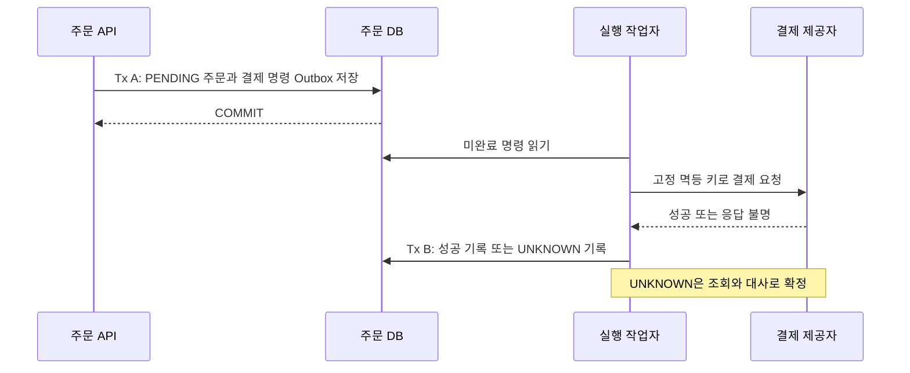

## 1. 먼저 보장 범위를 정한다

이 카드는 **Spring Framework 6.2의 기본 Proxy(프록시) 모드, JDBC 기반 로컬 트랜잭션, MySQL 8.4 InnoDB, PostgreSQL 17**을 기준으로 한다. 기본값은 연결 설정으로 바뀔 수 있다. 아래 주문·결제 흐름은 학습용 설계다.

ACID는 Atomicity(원자성), Consistency(일관성), Isolation(격리성), Durability(지속성)다. 원자성은 참여한 DB 변경에 적용되며 HTTP 결제까지 되돌리지 않는다. 일관성은 업무 불변식을 올바른 제약과 로직으로 표현해야 얻는다. 지속성도 로그 동기화·복제·저장 장치와 장애 범위의 전제가 있다. Undo Log(실행 취소 로그)만을 모든 DB의 원자성 구현으로 단정하지 않는다.

예를 들어 `qty >= 0` 제약은 음수 재고를 막지만 같은 주문을 두 번 차감하는 것은 막지 못한다. 주문별 고유 예약 키와 조건부 재고 변경을 같은 트랜잭션으로 묶어야 한다.

## 2. 격리수준 이름보다 읽기와 쓰기를 구분한다

| 구분 | MySQL InnoDB | PostgreSQL |
|---|---|---|
| 기본 격리수준 | REPEATABLE READ | READ COMMITTED |
| READ COMMITTED 일반 SELECT | 문장별 새 스냅샷 | 문장별 새 스냅샷 |
| REPEATABLE READ 일반 SELECT | 첫 일관 읽기의 스냅샷을 재사용 | 첫 비제어 문장의 스냅샷을 재사용 |
| REPEATABLE READ 잠금 읽기·갱신 | 최신 상태를 다루므로 일반 읽기와 섞으면 관측이 다를 수 있음 | 스냅샷 이후 변경된 행을 갱신하려 하면 직렬화 실패 가능 |
| SERIALIZABLE | 더 강한 잠금 규칙과 대기·교착 가능 | 직렬성 위반을 감지하고 일부 트랜잭션 중단 |

Dirty Read(미커밋 읽기)는 남이 아직 커밋하지 않은 값을 읽는 것이다. Non-repeatable Read(반복 불가 읽기)는 같은 행의 값이, Phantom Read(팬텀 읽기)는 같은 조건의 결과 집합이 다른 커밋으로 바뀌는 것이다. PostgreSQL의 READ UNCOMMITTED는 READ COMMITTED처럼 동작한다. 표준상 RR이 팬텀을 허용한다는 말과 특정 DB가 실제로 팬텀을 허용한다는 말은 다르다.

```mermaid
sequenceDiagram
    participant A as 세션 A
    participant DB as PostgreSQL RC
    participant B as 세션 B
    A->>DB: BEGIN; SELECT qty (10)
    B->>DB: UPDATE qty = 9; COMMIT
    A->>DB: SELECT qty (9)
    Note over A,DB: RC는 문장마다 새 스냅샷
    A->>DB: COMMIT
```

> **면접 포인트 — SERIALIZABLE도 안 된다는 답은 잘못이다**
>
> 필요한 읽기·조건 검사·쓰기를 모두 같은 직렬화 가능한 트랜잭션에 넣고 중단 시 전체를 재시도하면, 직렬 실행에서 보존되는 DB 불변식을 지킬 수 있다. 원격 결제나 트랜잭션 밖에서 읽은 값은 보장 밖이다. 단일 재고 행은 조건부 UPDATE가 더 단순할 수 있으며 두 방식의 처리량은 경합을 측정해 비교한다.

```sql
-- qty는 양수인 요청만 허용한다. :qty는 바인딩 매개변수 표기다.
UPDATE stock SET available = available - :qty
WHERE sku_id = :sku_id AND :qty > 0 AND available >= :qty;
-- 영향 행 수 1: 차감 성공, 0: 수량 오류/재고 부족/행 없음 구분
-- 중복 주문 방지는 같은 트랜잭션의 UNIQUE 예약 키로 별도 처리한다.
```

## 3. 전파는 물리적 트랜잭션과 예외 경로를 함께 본다

Propagation(전파)은 이미 진행 중인 트랜잭션과 새 메서드 경계를 연결하는 규칙이다.

| 속성 | 기존 트랜잭션이 있을 때 | 실패 경계 |
|---|---|---|
| REQUIRED | 동일한 물리적 트랜잭션에 참여 | 내부 rollback-only가 전체 커밋을 막을 수 있음 |
| REQUIRES_NEW | 외부 자원을 유지한 채 독립 트랜잭션 시작 | 독립 롤백이지만 예외가 외부로 전파되면 외부도 롤백 가능 |
| NESTED | 지원되는 JDBC 관리자의 Savepoint(저장점) 사용 | 내부 부분 롤백 가능, 외부 롤백이면 모두 취소 |
| SUPPORTS | 있으면 참여, 없으면 비트랜잭션 | 단독 호출의 원자성을 기대하면 안 됨 |
| MANDATORY | 기존 트랜잭션 필수 | 없으면 예외 |

내부 REQUIRED 메서드에서 롤백 대상으로 판정된 예외를 외부가 잡아도 rollback-only 표시가 사라지지 않는다. 외부 커밋에서 `UnexpectedRollbackException`이 날 수 있다. 반면 REQUIRES_NEW 감사 기록은 주문이 롤백돼도 남을 수 있지만, 감사 실패 예외를 그대로 던지면 주문도 실패할 수 있다. 감사 실패를 허용할지는 업무 정책으로 결정한다.

외부가 미커밋 주문 행을 잠근 상태에서 내부 감사 트랜잭션이 그 행을 변경하거나 참조 무결성 확인을 기다리면 서로 진행할 수 없다. 독립 커밋이 필요한 시도 기록은 미커밋 주문에 의존하지 않는 요청 식별자로 설계한다.

가상의 동시 요청 20개가 각각 외부 연결 1개를 보유한 채 내부 연결을 기다리고 풀 크기도 20이면 추가 연결이 없다. 풀을 무조건 키우기보다 독립 트랜잭션 수·중첩 깊이·DB 수용량을 함께 조절한다.

## 4. 자기 호출·롤백·readOnly의 함정

기본 프록시 모드에서 같은 객체의 `outer()`가 `inner()`를 직접 부르면 inner의 트랜잭션 조언을 거치지 않는다. outer에 이미 트랜잭션이 있으면 그 경계는 유지되지만 inner의 REQUIRES_NEW는 적용되지 않는다.

해법은 별도 빈의 메서드를 프록시를 통해 호출하거나 `TransactionTemplate`으로 필요한 경계를 명시하는 것이다. 아래는 후자다. 이 템플릿의 기본 REQUIRED는 기존 트랜잭션이 있으면 참여한다.

```kotlin
@Service
class StockService(
    transactionManager: PlatformTransactionManager,
    private val jdbc: JdbcTemplate,
) {
    private val tx = TransactionTemplate(transactionManager)

    fun decrement(skuId: Long, qty: Int) {
        require(qty > 0)
        tx.executeWithoutResult {
            val changed = jdbc.update(
                "UPDATE stock SET available = available - ? " +
                    "WHERE sku_id = ? AND available >= ?",
                qty, skuId, qty,
            )
            check(changed == 1) { "Insufficient stock or unknown SKU" }
        }
    }
}
```

이 코드는 한 번의 차감 경계만 보여준다. 중복 주문 검사는 포함하지 않는다. 클래스 프록시를 쓰는 Kotlin 애너테이션 방식에서는 `kotlin-spring` 플러그인 등 프록시 가능한 클래스 구성도 확인한다.

- 기본 롤백 규칙은 RuntimeException과 Error다. Checked Exception(검사 예외)은 별도 규칙 없이는 자동 롤백 대상이 아니다. Kotlin이 검사 예외 선언을 강제하지 않는 것과 Spring의 판단은 별개다. 프로젝트의 전역 롤백 설정도 확인한다.
- `readOnly=true`는 최적화를 위한 힌트다. 모든 쓰기 차단·더티 체킹 제거·읽기 복제본 라우팅을 자동 보장하지 않는다. 적용 효과는 관리자·드라이버·ORM·라우팅 구성에 달린다.
- 일반적인 스레드 기반 트랜잭션은 새 비동기 스레드로 전파되지 않는다. 비동기 작업이 프록시를 거쳐 자체 트랜잭션을 시작할 수는 있다. 예약 실행도 호출자 트랜잭션의 연장으로 생각하지 않는다.

## 5. 외부 결제는 명령 저장과 결과 확정으로 나눈다

DB 트랜잭션 안의 원격 호출에는 두 문제가 있다. 지연 중 연결과 이미 획득한 잠금을 오래 점유하고, 원격 성공 뒤 DB 롤백 또는 응답 유실로 결과가 어긋난다. 단순히 호출을 커밋 뒤로 옮기면 커밋 직후 프로세스 종료 시 요청이 사라질 수 있다.


```mermaid
sequenceDiagram
    participant API as 주문 API
    participant DB as 주문 DB
    participant W as 실행 작업자
    participant PG as 결제 제공자
    API->>DB: Tx A: PENDING 주문과 결제 명령 Outbox 저장
    DB-->>API: COMMIT
    W->>DB: 미완료 명령 읽기
    W->>PG: 고정 멱등 키로 결제 요청
    PG-->>W: 성공 또는 응답 불명
    W->>DB: Tx B: 성공 기록 또는 UNKNOWN 기록
    Note over W,PG: UNKNOWN은 조회와 대사로 확정
```

Transactional Outbox(트랜잭션 아웃박스)는 같은 DB의 주문과 실행 의도를 원자적으로 남긴다. 작업자 재시작·중복 실행을 전제로 같은 결제 멱등 키를 사용하고 결과 불명은 실패로 단정하지 않는다. 제공자의 멱등성·조회 기능이 없다면 안전한 자동 재시도의 범위가 제한된다. 발행 성공 직후 작업자가 죽으면 재발행할 수 있으므로 소비자도 중복을 처리해야 한다.

| 기법 | 해결하는 경계 | 남는 과제 |
|---|---|---|
| 2PC, Two-Phase Commit(2단계 커밋) | 참여 자원의 원자적 커밋 결정 | 격리성은 별도 문제; 준비 상태 대기·복구·지원 자원 제약 |
| Saga(사가) | 여러 로컬 트랜잭션의 진행과 업무 보상 | 중간 상태 노출·보상 실패·재시도·수동 대사 |
| Outbox | DB 변경과 발행 의도 기록 | 반복 전달·운영 복구·외부 효과 멱등성 |

2PC가 전역 직렬성을 자동 보장하거나 모든 구현의 코디네이터가 단일 장애점인 것은 아니다. Saga도 가용성을 무조건 높이는 정답이 아니다. 환불은 과거 결제 기록을 지우는 롤백이 아니라 실패할 수도 있는 새 업무다. `CANCEL_REQUESTED`에서 취소 결과를 확인한 뒤 `CANCELED`로 전이해야 한다.

## 6. 검증할 실패 시나리오

일반 SELECT 두 번 사이에 다른 세션이 커밋하는 경우, 같은 행을 두 세션이 갱신하는 경우, 내부 REQUIRED가 rollback-only를 표시한 경우를 각각 재현한다. 외부 결제 성공 후 응답 유실과 Outbox 처리 완료 표시 전 종료도 주입한다. 확인할 것은 예외 발생 자체가 아니라 최종 재고·주문 상태·외부 결제 횟수·미완료 명령 복구다.

## 참고 자료

- [PostgreSQL 17 격리수준](https://www.postgresql.org/docs/17/transaction-iso.html)
- [MySQL 8.4 일관 읽기](https://dev.mysql.com/doc/refman/8.4/en/innodb-consistent-read.html)
- [Spring 6.2 트랜잭션 전파](https://docs.spring.io/spring-framework/reference/6.2/data-access/transaction/declarative/tx-propagation.html)
- [Spring 6.2 애너테이션과 프록시](https://docs.spring.io/spring-framework/reference/6.2/data-access/transaction/declarative/annotations.html)
- [Spring 6.2 Transactional API](https://docs.spring.io/spring-framework/docs/6.2.x/javadoc-api/org/springframework/transaction/annotation/Transactional.html)
- [Transactional Outbox](https://microservices.io/patterns/data/transactional-outbox.html), [Saga](https://microservices.io/patterns/data/saga.html)
