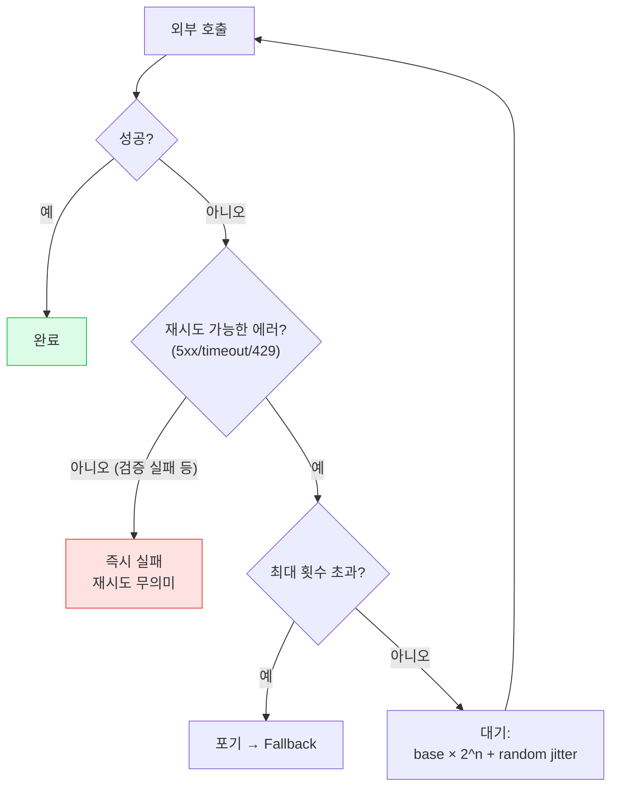
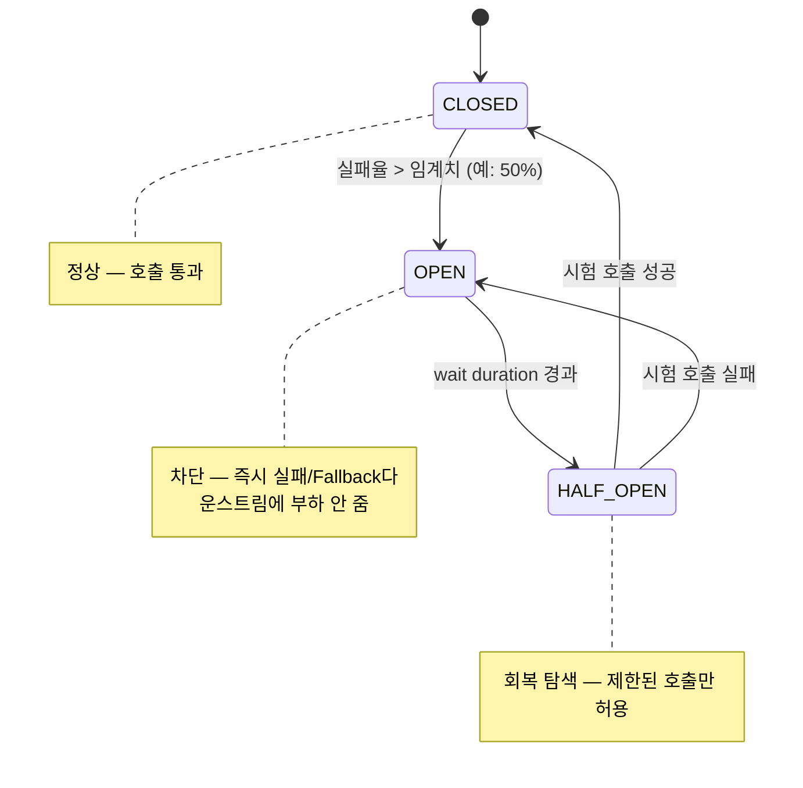
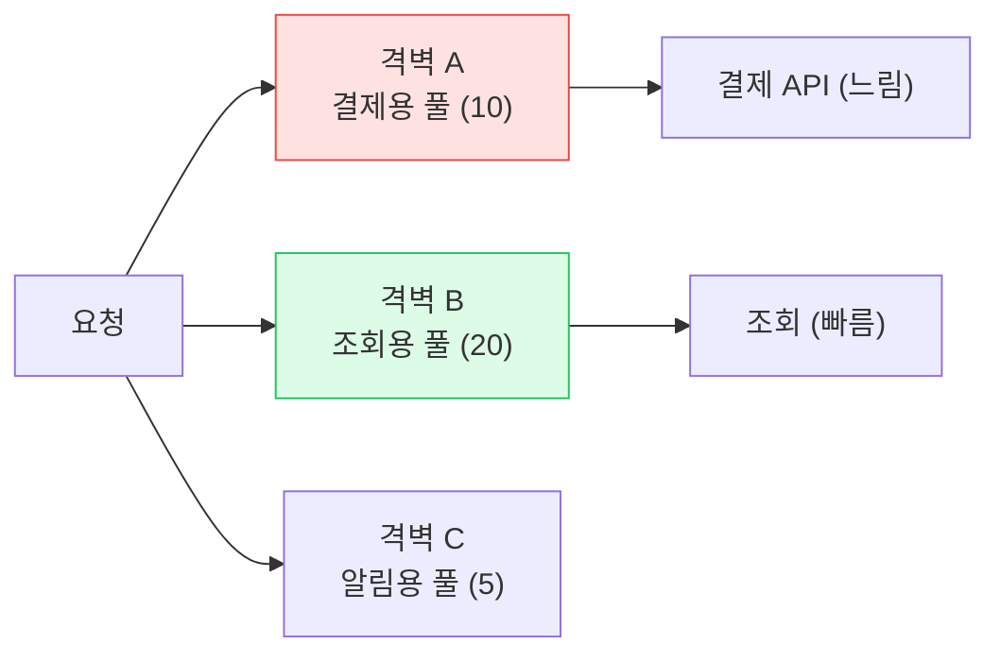
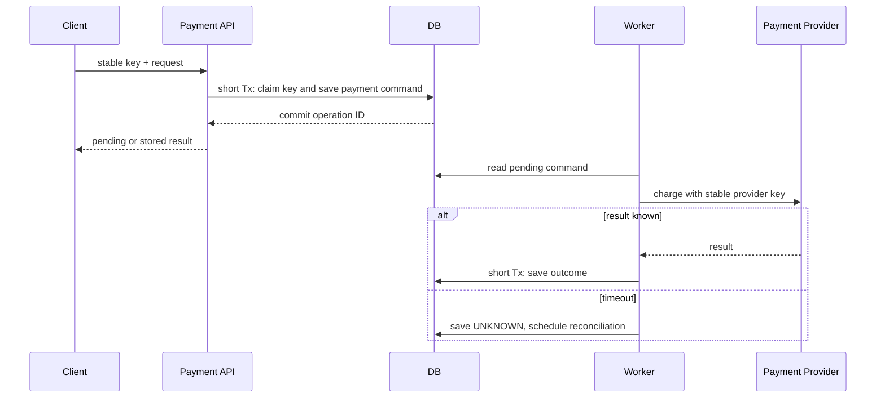

## 1. Timeout — 모든 복원력의 출발점

Timeout이 없으면 다른 모든 패턴이 의미 없다. 응답 없는 호출이 스레드를 무한 점유하면 **스레드풀 고갈 → 캐스케이딩 장애(Cascading Failure)**로 번진다.

> **⚠️ 실무 함정 — 기본 타임아웃 무한대**
>
> 기본 타임아웃은 HTTP 클라이언트·RequestFactory·버전에 따라 다르므로 명시적으로 확인한다. 연결·풀 획득·응답·전체 요청 Deadline(마감 시간)을 구분하고 재시도·대기를 포함해 남은 예산 안에서 실행한다. 클라이언트 타임아웃은 상대의 작업 취소나 롤백을 보장하지 않는다.

```kotlin
// WebClient — connect/response 타임아웃 명시
val client = WebClient.builder()
    .clientConnector(ReactorClientHttpConnector(
        HttpClient.create()
            .responseTimeout(Duration.ofSeconds(2))          // 응답 읽기 간격 제한; 전체 요청 Deadline과는 다름
            .option(ChannelOption.CONNECT_TIMEOUT_MILLIS, 500) // 연결 타임아웃
    )).build()
```

## 2. Retry · Backoff · Jitter

일시적(transient) 장애는 재시도로 회복된다. 단 **(1) 멱등 연산만, (2) 지수 백오프 + 지터, (3) 최대 횟수** 세 조건을 지켜야 한다.


```mermaid
flowchart TD
    Call["외부 호출"] --> R{"성공?"}
    R -->|"예"| Done["완료"]
    R -->|"아니오"| C{"재시도 가능한 에러?\n(5xx/timeout/429)"}
    C -->|"아니오 (검증 실패 등)"| Fail["즉시 실패\n재시도 무의미"]
    C -->|"예"| M{"최대 횟수 초과?"}
    M -->|"예"| Fail2["포기 → Fallback"]
    M -->|"아니오"| W["대기:\nbase × 2^n + random jitter"]
    W --> Call
    style Done fill:#dcfce7,stroke:#22c55e
    style Fail fill:#fee2e2,stroke:#ef4444
```

*HTTP 상태 계열만으로 결정하지 않는다. 예를 들어 429는 Retry-After와 예산을 고려하고, 5xx도 비멱등 외부 효과의 결과가 불명확하면 무조건 재호출하지 않는다.*

#### 왜 Jitter(지터)가 필요한가

장애 후 모든 클라이언트가 *정확히 같은 간격*으로 재시도하면 **Thundering Herd(동시 재시도 폭주)**가 발생해 막 회복한 서버를 다시 죽인다. 각 클라이언트의 대기 시간에 랜덤성을 더해 분산시킨다.

```kotlin
// Resilience4j — 지수 백오프 + 지터 + 재시도 대상 한정
val config = RetryConfig.custom<Any>()
    .maxAttempts(3)
    .intervalFunction(IntervalFunction.ofExponentialRandomBackoff(
        Duration.ofMillis(100),  // initial
        2.0,                     // multiplier
        0.5))                    // jitter factor (±50%)
    .retryExceptions(IOException::class.java, TimeoutException::class.java)
    .ignoreExceptions(BadRequestException::class.java)  // 재시도 불가한 검증 오류 예시
    .build()
```

> **⚠️ 실무 함정 — 다층 재시도 곱셈**
>
> 클라이언트 3회 × 게이트웨이 3회 × 서비스 3회 = **최대 27배 트래픽** . 재시도는 **한 레이어에서만** 하거나, 안쪽 레이어는 재시도하지 않도록 설계해야 한다. 멱등성 계약이 없는 POST를 재시도하면 중복 생성 가능 — 그래서 멱등성(5절)이 필수.

## 3. Circuit Breaker — 회로 차단기

다운스트림이 계속 실패하는데 재시도를 반복하면 자원만 낭비한다. `Circuit Breaker(회로 차단기)`는 실패율이 임계치를 넘으면 **회로를 열어 즉시 실패(Fail-fast)**시키고, 일정 시간 후 시험 호출로 회복을 탐지한다.


```mermaid
stateDiagram-v2
    [*] --> CLOSED
    CLOSED --> OPEN : 실패율 > 임계치 (예: 50%)
    OPEN --> HALF_OPEN : wait duration 경과
    HALF_OPEN --> CLOSED : 시험 호출 성공
    HALF_OPEN --> OPEN : 시험 호출 실패
    note right of CLOSED : 정상 — 호출 통과
    note right of OPEN : 차단 — 즉시 실패/Fallback다운스트림에 부하 안 줌
    note right of HALF_OPEN : 회복 탐색 — 제한된 호출만 허용
```

*Circuit Breaker 상태 머신 — OPEN 상태에서 다운스트림을 쉬게 해 회복을 돕는다*

```text
try payment attempt within deadline
if circuit is open:
    if a durable payment command already exists:
        return pending with its stable operation ID
    else:
        return retryable failure
if outcome is unknown:
    persist UNKNOWN and reconcile with the payment provider
```

`deferred` 응답만 반환하고 큐에 기록하지 않으면 나중에 실행할 작업이 없다. Fallback(대체 처리)은 실제 저장된 작업·상태와 연결되어야 하며, 예외가 모두 회로 열림을 뜻하지도 않는다.

Resilience4j Spring 기본 조합은 `Retry(CircuitBreaker(...))` 형태다. 이 경우 CircuitBreaker는 각 재시도 호출을 관측할 수 있다. 순서·Fallback 위치·설정에 따라 관측되는 실패가 달라지므로 실제 버전에서 검증한다. “재시도 전체 실패가 무조건 1회로 집계된다”고 외우지 않는다.

## 4. Bulkhead — 격벽 격리

배의 격벽처럼, 한 다운스트림 호출이 **전체 스레드풀을 독점**하지 못하게 자원을 칸막이로 나눈다. 느린 결제 API가 주문 조회 스레드까지 잡아먹는 사태를 막는다.


```mermaid
flowchart LR
    In["요청"] --> B1["격벽 A\n결제용 풀 (10)"]
    In --> B2["격벽 B\n조회용 풀 (20)"]
    In --> B3["격벽 C\n알림용 풀 (5)"]
    B1 --> Pay["결제 API (느림)"]
    B2 --> Query["조회 (빠름)"]
    style B1 fill:#fee2e2,stroke:#ef4444
    style B2 fill:#dcfce7,stroke:#22c55e
```

*Bulkhead — 결제용 풀이 고갈돼도 조회용 풀은 멀쩡 → 장애 격리*

| 패턴 | 막는 문제 | 핵심 파라미터 |
| --- | --- | --- |
| Timeout | 무한 대기 | connect / read timeout |
| Retry | 일시적 실패 | maxAttempts, backoff, jitter |
| Circuit Breaker | 지속 실패에 자원 낭비 | failureRate, waitDuration |
| Bulkhead | 한 호출의 자원 독점 | maxConcurrentCalls |
| Rate Limiter | 과부하·다운스트림 보호 | limitForPeriod |

## 5. Idempotency-Key와 외부 결제 상태를 분리한다

Idempotency-Key(멱등성 키)는 **하나의 논리 요청**의 재시도에서 유지한다. 클라이언트가 만들거나 서버가 사전에 발급한 작업 ID를 사용할 수 있다. 매 HTTP 시도마다 새 키를 발급하는 것이 문제다. 키 범위에는 사용자·가맹점과 작업 종류도 포함한다.

동일 키와 다른 본문은 계약에 따른 오류로 거부한다. 해시는 금액·통화·주문·사용자 등 의미 있는 필드를 정규화해 계산한다. 단순 객체 `hashCode()`를 영속 요청 지문으로 사용하지 않는다.


```mermaid
sequenceDiagram
    participant C as Client
    participant A as Payment API
    participant D as DB
    participant W as Worker
    participant P as Payment Provider
    C->>A: stable key + request
    A->>D: short Tx: claim key and save payment command
    D-->>A: commit operation ID
    A-->>C: pending or stored result
    W->>D: read pending command
    W->>P: charge with stable provider key
    alt result known
        P-->>W: result
        W->>D: short Tx: save outcome
    else timeout
        W->>D: save UNKNOWN, schedule reconciliation
    end
```

```text
short DB transaction:
    insert (actor, operation, key, request_hash, status=PENDING)
        ON CONFLICT DO NOTHING
    if existing:
        verify same request_hash
        return stored result or current operation status
    save durable payment command with stable provider idempotency key
commit

worker outside DB transaction:
    call provider with the SAME provider key
    persist known outcome in a new short transaction
    on uncertain timeout, query/reconcile instead of marking definite failure
```

DB UNIQUE는 동시 요청의 선점을 제어할 뿐 원격 결제를 롤백하지 않는다. 로컬 `@Transactional` 안에서 PG를 호출한 뒤 DB 커밋에 실패하면, 키 기록은 없어져도 실제 청구는 남을 수 있다. 위와 같이 의도를 먼저 내구성 있게 저장하고 불명확한 결과를 복구한다.

| 상태 | 같은 키 재요청 | 운영 책임 |
|---|---|---|
| PENDING / PROCESSING | 진행 중 작업 ID 반환 또는 계약상 충돌 응답 | 오래된 작업 재확인 |
| SUCCEEDED | 저장된 결과 반환 | 결과 일관성 유지 |
| FAILED | 확정된 실패 반환·새 시도 정책 적용 | 실패 원인 분류 |
| UNKNOWN | 성공·실패 단정 금지 | 상대 조회·같은 키 재시도 가능 여부 확인 |

TTL은 공급자의 중복 제거 기간, 클라이언트 재시도 기간, 업무 기록 보존과 맞춰 정한다. Stripe의 키 보존 정책을 모든 결제사에 적용하거나 “24시간 후엔 무조건 삭제”로 구현하지 않는다. 오래된 키를 삭제한 뒤 같은 결제를 새로 실행하지 않도록 결제 의도 ID 등 장기 업무 키도 검토한다.

> **면접 포인트** — 유일 키·본문 비교뿐 아니라 **선점 후 프로세스 종료**, **PG 성공 후 DB 결과 저장 실패**, **키 보존 기간 경과**를 차례로 설명해야 한다.

## 6. Kafka 소비와 DB 커밋을 연결한다

이벤트 중복 판별을 `existsById → 업무 처리 → 처리 기록 저장`으로 분리하면 동시 소비자가 함께 통과할 수 있다. 아래는 독립된 빈의 짧은 DB 트랜잭션으로 처리하는 예시다. Repository의 `tryInsert`는 고유 키를 가진 `INSERT ... ON CONFLICT DO NOTHING`의 영향 행 수를 반환한다고 가정한다.

```kotlin
// Listener와 별도 Spring Bean. 아래 반환 전에 DB 커밋이 완료된다.
@Transactional
fun applyOnce(event: TrackingEvent) {
    val inserted = inboxRepo.tryInsert("tracking", event.eventId)
    if (inserted == 0) return
    shipmentRepo.applyVersionedTracking(event) // 업무 버전·상태 전이 검사
    // 실패하면 Inbox도 롤백한다.
}

// Listener: 수동 ACK 모드로 구성하고, 동기 처리를 가정한다.
fun onEvent(event: TrackingEvent, ack: Acknowledgment) {
    trackingTxService.applyOnce(event)
    ack.acknowledge()
}
```

Kafka 클라이언트의 자동 Offset 커밋과 Spring Kafka 컨테이너의 AckMode(확인 모드)는 구분한다. `enable.auto.commit=false`만으로 DB와 소비 위치가 원자적이 되는 것은 아니다. DB 커밋 뒤 ACK 전에 종료되는 경우는 재전달과 Inbox로 흡수한다. 병렬 처리는 앞선 미완료 Offset을 넘어 커밋하지 않도록 구성해야 한다.

> **실무 함정** — 모든 5xx 재시도, PROCESSING 키 영구 방치, 저장 없는 Fallback, DB 커밋 전 ACK는 서로 다른 실패다. 재시도 횟수 하나를 늘려서 해결하지 않는다.

## 참고

- [Stripe: Idempotent requests](https://docs.stripe.com/api/idempotent_requests)
- [Resilience4j: Spring Boot integration](https://resilience4j.readme.io/docs/getting-started-3)
- [Spring Kafka: Message Listener Containers](https://docs.spring.io/spring-kafka/reference/kafka/receiving-messages/message-listener-container.html)
- [Spring: Programmatic Transaction Management](https://docs.spring.io/spring-framework/reference/data-access/transaction/programmatic.html)

> **검수 기준 — 2026-09-12**: 요청 타임아웃과 결과 불명, 영속 작업 없는 Fallback, DB 선점과 외부 결제의 보장 경계, ACK 시점을 검수했다. 코드 조각은 버전·Repository 계약을 맞춰 구현해야 하는 학습 예제다.
