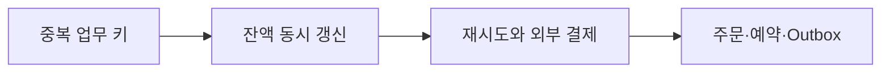
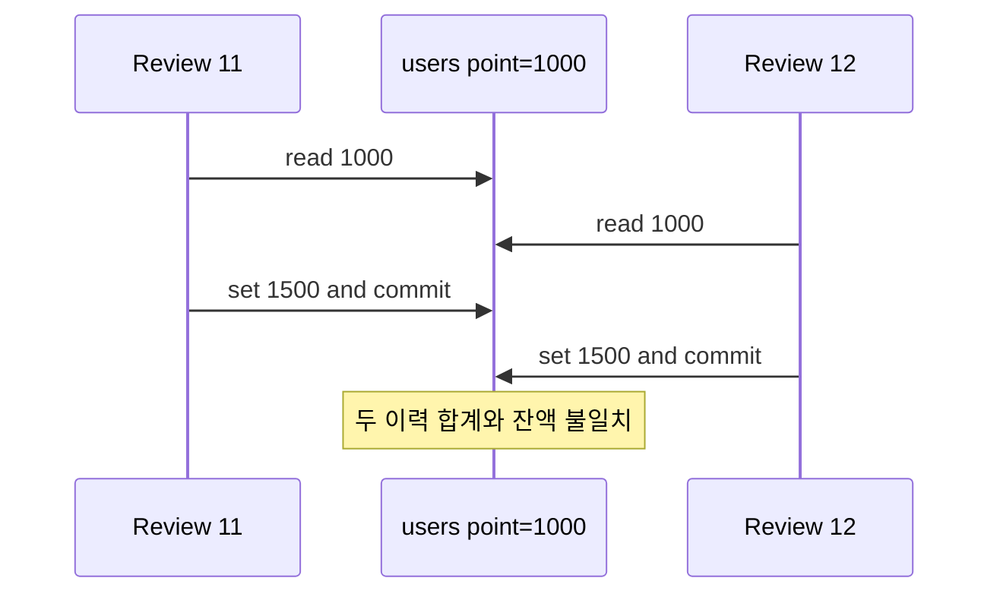
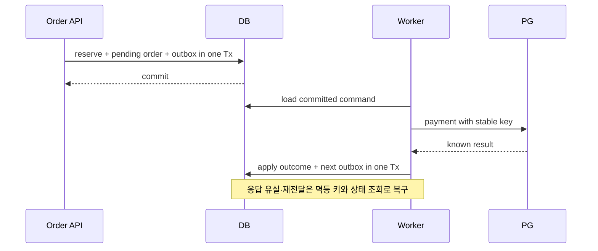

> **검수 기준 — 2026-09-12**
>
> 가상의 포인트·주문 서비스 코드 리뷰다. PostgreSQL 17, Spring의 프록시 기반 트랜잭션을 가정한다. 아래 결함 코드와 수정 의사코드는 구분해서 읽는다. 특정 기업의 실제 코드는 아니다.

## 면접 진행 — 30분, 네 가지 실패 경계

첫 5분은 요구사항을 확인한다. 같은 리뷰의 포인트는 한 번만 지급하고, 다른 리뷰는 각각 지급해야 한다. 결제는 응답이 사라져도 중복 청구하지 않아야 하며, 주문과 외부 결제의 상태 불일치는 복구 가능해야 한다.


```mermaid
flowchart LR
    R1[중복 업무 키] --> R2[잔액 동시 갱신]
    R2 --> R3[재시도와 외부 결제]
    R3 --> R4[주문·예약·Outbox]
```

라운드별로 결함 → 구체적 실행 순서 → 최소 수정 → 수정 뒤 남는 장애를 말한다. 특정 기술을 골랐다는 이유만으로 정답·오답을 판정하지 않는다.

## R1 — 같은 리뷰가 동시에 두 번 적립된다

```kotlin
// 결함 코드: exists 검사와 INSERT 사이가 보호되지 않는다.
@Transactional
fun earnReviewPoint(userId: Long, reviewId: Long) {
    if (pointHistoryRepo.existsByUserIdAndReviewId(userId, reviewId)) return
    val user = userRepo.findById(userId).orElseThrow()
    user.point += 500
    pointHistoryRepo.save(PointHistory(userId, reviewId, 500))
}
```

두 요청이 모두 “기록 없음”을 읽으면 두 적립 이력이 저장될 수 있다. 잔액은 실행 순서에 따라 500만 늘어 이력 합계와 어긋나거나 1,000이 늘어 중복 적립될 수 있다. **중복 업무 처리**와 **갱신 유실**을 하나의 현상으로 섞지 않는다.

수정에는 `(user_id, review_id)` 고유 제약과 원자적 잔액 증가를 함께 쓴다. 아래 예시는 Repository가 영향 행 수를 반환한다고 가정한다.

```kotlin
@Transactional
fun earnReviewPoint(userId: Long, reviewId: Long) {
    // INSERT ... ON CONFLICT (user_id, review_id) DO NOTHING
    val inserted = pointHistoryRepo.insertIfAbsent(userId, reviewId, 500)
    if (inserted == 0) return
    // UPDATE users SET point = point + :amount WHERE id = :id
    val updated = userRepo.addPoint(userId, 500)
    check(updated == 1) // 계정 변경 실패면 이력도 롤백
}
```

> **실무 함정** — JPA `save()` 직후 UNIQUE 예외를 catch하고 같은 트랜잭션을 계속 쓰는 방식은 안전한 기본 예제가 아니다. INSERT가 Flush(변경 전송)·커밋까지 지연될 수 있고, 예외 이후 트랜잭션이 롤백 전용일 수 있다. 충돌을 정상적인 영향 행 결과로 다루거나, 실패한 트랜잭션 밖에서 중복을 판정한다.

**후속 질문:** 같은 리뷰인데 적립 금액이 다른 재요청은? 고정 500 정책이면 서버가 계산한다. 금액이 입력이라면 기존 기록과 비교해 불일치를 거절해야 한다.

## R2 — 서로 다른 리뷰인데 포인트가 하나 사라진다

리뷰 ID가 다르면 두 INSERT 모두 정상이다. 하지만 두 요청이 잔액 1,000을 읽고 1,500으로 덮어쓰면 한 적립이 사라진다. READ COMMITTED(커밋된 데이터 읽기)에서 상수 덮어쓰기는 이런 실행이 가능하다.


```mermaid
sequenceDiagram
    participant A as Review 11
    participant D as users point=1000
    participant B as Review 12
    A->>D: read 1000
    B->>D: read 1000
    A->>D: set 1500 and commit
    B->>D: set 1500 and commit
    Note over D: 두 이력 합계와 잔액 불일치
```

`UPDATE users SET point = point + 500`은 현재 행을 기준으로 증가시켜 이 경합을 제어한다. 이력 INSERT와 같은 트랜잭션에서 실행해야 이력만 남거나 잔액만 증가하지 않는다. UPDATE도 잠금을 사용하고 트랜잭션이 길면 대기가 길어진다.

`@Transactional`은 선언된 트랜잭션 경계를 제공할 뿐, 모든 애플리케이션 조건 검사를 자동으로 직렬화하지 않는다. 반대로 “트랜잭션은 어떤 락도 쓰지 않는다”는 뜻도 아니다. PostgreSQL REPEATABLE READ는 같은 행의 동시 갱신에서 중단될 수 있고, SERIALIZABLE은 여러 행에 걸친 규칙을 지키는 선택지가 될 수 있다. DBMS·규칙·재시도 비용으로 비교한다.

**후속 질문:** 서버가 두 대면? 같은 JVM 모니터를 공유하지 않으므로 각 서버의 `synchronized`는 서로를 막지 못한다. DB 제약·갱신 규칙은 두 서버뿐 아니라 배치·운영 도구에도 적용되어야 한다.

## R3 — 타임아웃 뒤 재시도했더니 이중 결제다

```kotlin
// 결함 코드: 원격 결제 결과와 로컬 기록이 함께 롤백되지 않는다.
@Transactional
fun pay(req: PayRequest): PayResponse {
    val result = pgClient.charge(req.amount)
    paymentRepo.save(Payment(req.orderId, result.txId))
    return PayResponse(result.txId)
}
```

PG(Payment Gateway, 결제 대행 시스템)가 승인했는데 응답이 유실되면 서버에는 실패처럼 보인다. 타임아웃은 **결과 불명**이지 확정 실패가 아니다. 그대로 새 요청을 만들면 다른 결제가 수행될 수 있다.

Idempotency-Key(멱등성 키)는 논리 결제 의도별로 유지한다. 클라이언트 생성 키나 서버가 미리 발급해 저장한 결제 의도 ID 모두 가능하다. 생성 위치보다 모든 재시도에서 동일한 의도에 동일한 키를 쓰는 것이 중요하다.

```text
short DB transaction:
    claim unique (merchant, operation, idempotency_key)
    compare normalized request fingerprint on duplicate
    persist payment intent and delivery command
commit

worker:
    call PG using persisted provider key, outside DB transaction
    save confirmed result in another short DB transaction
    if uncertain: retain UNKNOWN and reconcile with provider
```

| 실패 지점 | 필요한 복구 |
|---|---|
| 선점 후 Worker 실행 전 종료 | 저장된 대기 명령 재개 |
| PG 성공 후 로컬 결과 저장 실패 | 같은 PG 키·상태 조회로 결과 확인 |
| 같은 키에 다른 금액·통화 | 의미 있는 요청 필드 비교 후 거절 |
| 오래된 PROCESSING | 작업 진행·PG 결과 대사, 무조건 새 결제 금지 |
| 키 보존 기간 경과 | 장기 결제 의도 키와 공급자 재시도 계약 검토 |

**후속 질문:** PG가 멱등 키·상태 조회를 모두 제공하지 않는다면? 결과 불명 상태를 자동으로 재청구해서 해결할 수 없다. 수동 대사나 다른 결제 연동 방식이 필요하다는 한계를 명시한다.

## R4 — 주문·재고·결제를 어디서 나눈다

다음 초기 코드는 외부 호출 동안 DB 연결과 잠금을 붙잡고, PG 승인 뒤 DB 롤백 또는 커밋 전 이벤트 발행의 불일치를 만든다.

```kotlin
// 결함 코드
@Transactional
fun placeOrder(cmd: OrderCommand): Order {
    stockRepo.decrease(cmd.productId, cmd.qty)
    val pay = pgClient.charge(cmd.amount)
    val order = orderRepo.save(Order(cmd, pay.txId))
    kafkaTemplate.send("order-created", order)
    return order
}
```

가상 설계에서는 예약을 먼저 하고 결제를 비동기로 확정한다. 결제 승인·매입 정책이 다르면 순서와 보상도 달라질 수 있다.

```text
transaction A:
    claim order request with UNIQUE business key
    reserve inventory with positive-quantity conditional updates
    require all items succeeded
    save order PAYMENT_PENDING + payment command in Outbox
commit A

worker outside transaction:
    execute/reconcile payment with stable provider key

transaction B:
    claim outcome event once
    transition reservation/order only from allowed previous state
    save confirmation or compensation command to Outbox
commit B
```


```mermaid
sequenceDiagram
    participant A as Order API
    participant D as DB
    participant W as Worker
    participant P as PG
    A->>D: reserve + pending order + outbox in one Tx
    D-->>A: commit
    W->>D: load committed command
    W->>P: payment with stable key
    P-->>W: known result
    W->>D: apply outcome + next outbox in one Tx
    Note over W,D: 응답 유실·재전달은 멱등 키와 상태 조회로 복구
```

Outbox(발행 대기 기록)는 **로컬 업무 변경과 전달 의도**를 함께 커밋한다. PG 청구를 같은 트랜잭션으로 묶거나, 릴레이 중복을 제거하거나, 보상 정책을 자동 생성하지 않는다. 예약 만료가 결제 성공보다 먼저 확정됐다면 재예약·환불 중 업무 정책에 맞는 경로로 대사한다.

> **실무 함정** — 같은 객체 내부에서 `saveOrderTx()`를 호출하면 기본 Spring 프록시 기반 `@Transactional`이 적용되지 않을 수 있다. 별도 트랜잭션 빈 또는 `TransactionTemplate`으로 경계를 명시한다. “호출을 메서드로 나눴다”만으로 해결되지 않는다.

## 검증 시나리오와 평가 기준

가정: 초당 100건이 평균 2초씩 DB 연결을 붙잡으면 평균 약 200개의 연결 점유 수요가 생긴다. 풀을 늘리기 전에 외부 대기를 트랜잭션 밖으로 옮기고 DB 처리 시간·대기열·재시도 증폭을 측정한다. 평균 계산은 p99나 최대 동시성 보장이 아니다.

| 시나리오 | 확인할 결과 |
|---|---|
| 동일 리뷰 동시 100회 | 이력 1개·잔액 500 증가 |
| 다른 리뷰 100개 동시 요청 | 이력 100개·잔액 50,000 증가 |
| 이력 저장 뒤 강제 실패 | 이력과 잔액 모두 미반영 |
| PG 승인 뒤 로컬 종료 | 새 청구 없이 결과 대사 |
| Outbox 발행 후 표시 전 종료 | 재전달되어도 업무 효과 중복 없음 |
| 예약 만료와 승인 동시 처리 | 허용된 상태 전이 하나만 성공·늦은 결과 보상 |

좋은 답변은 기술 이름보다 이 결과를 어떻게 보장하는지 설명한다. SERIALIZABLE·분산락을 사용했다는 이유만으로 감점하지 않고, 더 단순한 제약과 비교한 근거·충돌 비용·실패 복구를 평가한다.

## 참고

- [PostgreSQL 17 Transaction Isolation](https://www.postgresql.org/docs/17/transaction-iso.html), [INSERT](https://www.postgresql.org/docs/17/sql-insert.html)
- [Spring Programmatic Transactions](https://docs.spring.io/spring-framework/reference/data-access/transaction/programmatic.html)
- [Stripe Idempotent Requests](https://docs.stripe.com/api/idempotent_requests)
- [Transactional Outbox](https://microservices.io/patterns/data/transactional-outbox.html)
