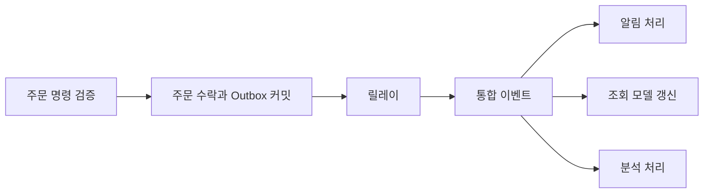

## 1. 비동기는 시간 결합을 줄이지만 계약은 남는다

가상 주문 서비스가 주문 수락을 저장하고 알림·분석에 이벤트를 보내면 후속 처리 완료를 매번 기다릴 필요가 없다. 대신 고객에게 보여주는 상태와 실패 복구를 정의해야 한다. `OrderAccepted`가 결제·재고까지 확정됐다는 뜻인지 계약에 명시한다. 이벤트를 보냈다는 사실만으로 주문 전체가 성공한 것은 아니다.

동기 API도 로컬 DB 트랜잭션 하나와 같지 않으며, 비동기 시스템 안에서도 잔액 차감 같은 불변 조건은 로컬 트랜잭션으로 지킬 수 있다. “동기면 강한 일관성, 이벤트면 무조건 안전한 장애 격리”로 분류하지 않는다. 느린 소비자는 적체와 보존 한도를 통해 결국 생산 측과 운영에 영향을 준다.


```mermaid
flowchart LR
    A[주문 명령 검증] --> B[주문 수락과 Outbox 커밋]
    B --> R[릴레이]
    R --> E[통합 이벤트]
    E --> N[알림 처리]
    E --> P[조회 모델 갱신]
    E --> M[분석 처리]
```

새 소비자를 붙일 때 기존 이벤트로 필요한 의미·권한·데이터가 충족되면 생산자 수정 없이 확장할 수 있다. 필요한 정보가 없거나 새 공개 계약이 필요하면 생산자 변경도 발생한다.

## 2. 이벤트와 명령, 내부와 외부를 구분한다

| 구분 | 의미 | 처리 실패의 해석 |
|---|---|---|
| Command | 특정 책임 주체에게 수행 요청 | 검증·업무 조건으로 거절 가능 |
| Event | 이미 확정된 사실의 알림 | 소비는 실패·보류할 수 있으나 과거 사실 자체를 거절하는 것은 아님 |
| Query | 현재 계약에 따른 정보 조회 | 조회 시점·가시성 범위를 명시 |

Domain Event는 도메인 내부 협력을 표현하고 Integration Event는 경계 밖 소비자와의 계약을 표현한다. 메모리 디스패처와 브로커는 흔한 구현 선택이지 용어 자체의 필수 조건은 아니다. 내부 이벤트 처리 시점이 커밋 전인지 후인지에 따라 실패 의미도 달라진다.

내부 객체를 그대로 직렬화하면 ORM 필드, 내부 이름, 개인정보가 외부 계약이 될 수 있다. 필요한 의미를 안정된 외부 스키마로 변환하고, 공개할 사건은 업무 커밋과 Outbox 기록을 연결한다. ID만 보내 추가 조회하게 할지, 당시 필요한 값을 함께 보낼지는 데이터 신선도·생산자 장애·페이로드 크기를 비교한다.

## 3. 스키마 호환은 방향과 의미를 함께 검사한다

“필드 추가는 항상 안전”하지 않다. 예를 들어 Avro 1.12에서 새 Reader가 옛 Writer의 데이터를 읽는데 새 필드에 기본값이 없으면 해석이 실패할 수 있다. 새 소비자가 과거 데이터를 읽는 방향과 기존 소비자가 새 데이터를 읽는 방향을 나눠 검사한다. 실제 직렬화 형식과 Registry 호환 설정을 기준으로 판단한다.

가상 `quantity` 필드를 그대로 두고 단위를 개에서 박스로 바꾸면 문법 검사는 통과해도 업무 계약은 깨진다. 필드 이름·타입 검사 외에 단위·시간대·null 의미·상태 전이를 예제 데이터로 확인한다. 버전 이름만 붙여도 구독 전환과 과거 이벤트 재생이 자동 해결되지는 않는다.

| 변경 | 확인할 대상 |
|---|---|
| 선택 필드 추가 | 기본값·알 수 없는 필드 처리·구형 소비자 |
| 필드 제거·타입 변경 | 신구 Reader/Writer 조합·저장된 과거 데이터 |
| 단위·상태 의미 변경 | 업무 계약·계산·재처리 결과 |
| 개인정보 추가 | 공개 범위·보존·삭제 요구 |

## 4. Choreography와 Orchestration의 선택

Choreography에서는 각 참여자가 사건에 반응하고, Orchestration에서는 조정자가 단계·명령·결과를 관리한다. 단계가 3개인지 4개인지로 선택하지 않는다. 보상·기한·상태 조회·담당 조직의 책임이 얼마나 얽혀 있는지가 중요하다.

가상 주문 흐름에서 재고 예약 실패 시 결제를 취소하고, 취소 응답이 늦으면 결과를 조회해야 한다면 영속 상태 머신에 복구 정책을 모으는 방식이 유용하다. 조정자도 재시작·중복 응답·타이머 재실행을 견디게 설계해야 한다. 논리적으로 중앙인 조정자가 반드시 단일 프로세스일 필요는 없다.

| 선택 관점 | Choreography | Orchestration |
|---|---|---|
| 후속 알림·분석처럼 독립 반응 | 구독으로 확장하기 쉬움 | 중앙 흐름에 불필요한 지식이 모일 수 있음 |
| 긴 기한·분기·보상 순서 | 여러 서비스에 상태가 흩어짐 | 상태·재시도·담당 지점을 모으기 쉬움 |
| 장애 의존성 | 브로커·공유 계약·순환 흐름 점검 | 조정자 저장소·복구·병목 점검 |

보상은 과거 커밋을 지우는 DB 롤백이 아니라 새로운 업무 동작이다. 이미 고객에게 전달된 알림이나 출고된 실물은 단순 역연산으로 복원되지 않는다. 반품·정정·수동 처리 상태를 구분한다.

## 5. TrackingEvent의 중복과 순서 역전

아래는 특정 기업의 구현이 아닌 가상 이벤트 계약이다. `aggregateVersion`은 해당 운송장의 권위 있는 기록 주체가 할당한다. 여러 오프라인 단말의 로컬 시각을 전체 순서로 사용하지 않는다.

```json
{
  "eventId": "tracking-42-v17",
  "aggregateId": "waybill-42",
  "aggregateVersion": 17,
  "type": "Delivered",
  "schemaVersion": 1,
  "occurredAt": "2026-09-13T01:00:00Z"
}
```

가상 소비자가 모든 버전의 **상태 변화 이벤트**를 구독하고 현재 버전이 15라고 가정한다.

| 도착 이벤트 | 처리 |
|---|---|
| 이미 처리한 eventId | Inbox로 업무 재실행 차단 |
| 버전 17이 먼저 도착 | 16의 누락을 기록하고 보류·재조회 |
| 버전 16 도착 | 허용된 상태 전이 확인 후 적용하고 17 재개 |
| 같은 버전, 다른 내용 | 충돌·정정 계약 확인, 조용히 덮어쓰지 않음 |

> **면접에서 짚을 전제**
>
> 모든 이벤트를 구독하지 않는 소비자에게 연속 버전을 강제하면 정상적인 필터링도 누락으로 보인다. 완전한 상태 Snapshot을 받는 계약이라면 최신 버전으로 교체하는 정책이 가능하다. 반대로 “수량 1 증가” 같은 Delta는 버전이 크다는 이유로 중간 이벤트를 버리면 안 된다.

Inbox 선점과 상태 변경은 같은 소비 DB 트랜잭션으로 묶고 실패하면 함께 롤백한다. 외부 알림·운송장 발급은 별도 의도 기록과 외부 멱등 계약이 필요하다. Kafka의 같은 Aggregate 키는 파티션 순서를 돕지만 생산 전 역전, 파티션 변경, 소비자의 병렬 완료 순서까지 자동 해결하지 않는다.

## 6. 재처리 가능한 흐름으로 운영한다

재시도할 일시 오류와 스키마·업무 충돌을 구분한다. DLQ로 옮겼다는 이유로 해결 완료가 되지는 않는다. 원문 식별자, 실패 이유, 재생 범위와 담당자를 남기고 복구 후 업무 상태를 대조한다. 보류 이벤트를 저장했다면 그 보관과 재개 역시 내구성 있는 작업으로 관리한다.

전달 시도는 반복될 수 있다. Kafka 트랜잭션은 정의된 Kafka 입출력 경계에서 한 번 반영한 결과를 제공할 수 있지만 임의 외부 효과를 자동 포함하지 않는다. 면접 답변에서는 중복 키·트랜잭션·소비 위치·재생 기간·순서 정책을 함께 설명한다.

유입률·처리율·최고 지연·가장 오래된 미처리 시각·상태별 미완료 건수를 본다. 이 문서의 예제는 설계 검수이며 실제 브로커 장애나 기업 운영 실적을 재현한 결과가 아니다.

## 참고 자료

- [Microsoft: 도메인 이벤트 설계와 통합 이벤트 구분](https://learn.microsoft.com/en-us/dotnet/architecture/microservices/microservice-ddd-cqrs-patterns/domain-events-design-implementation)
- [Apache Avro 1.12 명세: Schema Resolution](https://avro.apache.org/docs/1.12.0/specification/)
- [Saga 패턴과 조정 방식](https://microservices.io/patterns/data/saga.html)
- [Kafka 4.1 전달·트랜잭션 설계](https://kafka.apache.org/41/design/design/)
