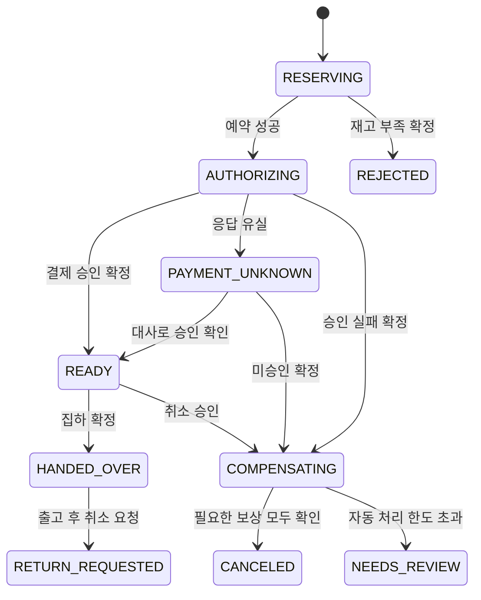
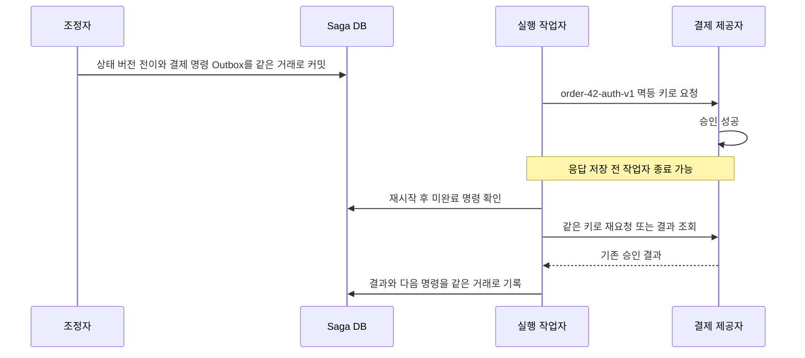

## 1. Saga가 책임지는 범위

Saga(사가)는 여러 로컬 트랜잭션을 연결하고 실패 시 업무 보상을 수행하는 패턴이다. 각 로컬 커밋은 보이므로 전체 작업이 하나의 ACID 트랜잭션처럼 원자적으로 관측되는 것은 아니다. 보상이 격리성을 복원하지도 않는다. 아래 주문 흐름은 특정 기업의 구현이 아닌 학습용 설계다.

모놀리스라도 외부 결제 HTTP 호출은 로컬 DB 롤백에 참여하지 않는다. 반대로 DB가 여러 개라는 이유만으로 분산 원자적 커밋이 불가능한 것도 아니다. 자원과 프로토콜의 지원 범위를 확인해야 한다.

| 관점 | 2PC, Two-Phase Commit(2단계 커밋) | Saga |
|---|---|---|
| 원자성 | 참여 자원의 커밋 결정을 조정 | 단계별 커밋과 의미적 보상 |
| 격리성 | 2PC 자체가 전역 직렬성을 보장하지 않음 | 중간 상태와 경쟁 작업을 업무 모델로 통제 |
| 장애·가용성 | 준비 후 결정 확인 불가 시 대기 가능; 복구 구현에 따라 다름 | 독립 처리 가능하지만 의존 서비스 장애 시 진행·보상도 멈출 수 있음 |
| 처리량·확장 | 참여자 지연과 잠금 보유 부담 | 짧은 로컬 거래 대신 메시지·상태 저장·대사 비용 |
| 외부 자원 | 참여 프로토콜 지원 필요 | 외부 멱등성·조회·보상 계약 필요 |

“2PC=CP, Saga=AP”로 CAP 분류를 붙이지 않는다. 서로 다른 문제의 보장을 섞는 표현이다. 지원 자원 사이 강한 원자적 커밋이 필요하면 2PC를 검토하고, 장시간 물류 과정과 외부 서비스를 조정하며 중간 상태를 허용하면 Saga가 후보가 된다.

## 2. 주문 상태와 자원 예약을 먼저 설계한다

학습용 요구는 주문별 중복 결제 방지, 재고 음수 방지, 집하 후 단순 재고 복원 금지다. 재고 예약을 결제보다 먼저 하면 재고 부족 뒤 환불을 줄일 수 있지만 결제 대기 중 재고를 점유한다. 순서는 업무 비용으로 선택한다.


```mermaid
stateDiagram-v2
    [*] --> RESERVING
    RESERVING --> AUTHORIZING: 예약 성공
    RESERVING --> REJECTED: 재고 부족 확정
    AUTHORIZING --> READY: 결제 승인 확정
    AUTHORIZING --> PAYMENT_UNKNOWN: 응답 유실
    PAYMENT_UNKNOWN --> READY: 대사로 승인 확인
    PAYMENT_UNKNOWN --> COMPENSATING: 미승인 확정
    AUTHORIZING --> COMPENSATING: 승인 실패 확정
    READY --> HANDED_OVER: 집하 확정
    READY --> COMPENSATING: 취소 승인
    COMPENSATING --> CANCELED: 필요한 보상 모두 확인
    COMPENSATING --> NEEDS_REVIEW: 자동 처리 한도 초과
    HANDED_OVER --> RETURN_REQUESTED: 출고 후 취소 요청
```

READY에서 집하와 취소가 경쟁하면 양쪽이 동시에 성공하지 않도록 같은 권위 있는 상태의 조건부 전이로 조정한다. 창고 작업자·운송사의 물리적 집하 사실이 시스템보다 늦게 도착할 수 있으므로 출고 승인과 실물 스캔의 운영 절차도 필요하다.

> **면접 포인트 — 예약은 격리성의 대안 설계 중 하나다**
>
> 예약 상태, 주문 버전, 허용 전이, 가용 재고 계산으로 다른 작업이 중간 상태를 잘못 소비하지 않게 한다. 결제 중인 예약의 만료와 늦은 결제 성공이 경쟁하면 무조건 재고를 해제하지 말고 결제 대사·취소 또는 재예약 정책으로 분기한다.

## 3. Pivot은 단순히 마지막 API 호출이 아니다

Pivot Transaction(전환점 거래)은 보상 가능한 구간에서 앞으로 완료해야 하는 구간으로 넘어가는 업무 경계다. 이후 단계를 재시도로 완료할 수 있다는 전제가 중요하며, 외부의 영구적 거절까지 “반드시 성공”한다고 가정하지 않는다. 예외 경로가 있다면 별도 해결 절차가 필요하다.

| 단계 | 취소·보상의 의미 | 주의 |
|---|---|---|
| 재고 예약 | 해당 예약을 해제 | 조건부 상태 전이와 수량 복원을 같은 거래로 처리 |
| Authorization(결제 승인·한도 확보) | 승인 취소 | Capture(매입·청구 확정)와 다르며 만료 조건 확인 |
| Capture | 환불이라는 새로운 거래 | 수수료·처리 시간·부분 환불·실패 가능 |
| 운송장 발행 | 제공자 계약에 따른 라벨 취소 | 실물 집하와 동일한 확정점이 아님 |
| 실물 집하 | 회수·반품 절차 | 원위치에 즉시 판매 가능 재고를 더하면 안 됨 |

운송장 발행을 항상 비가역이라고 부르거나 모든 비가역 작업을 맨 끝에 옮기면 해결된다고 말하지 않는다. 발행 취소 가능성, 집하 시점, 환불 정책은 외부 계약과 업무 정의에 달린다. 고객에게 보낸 알림도 지울 수 없으므로 중간 상태에 맞는 문구가 필요하다.

## 4. 조정 방식 선택

Choreography(이벤트 안무 방식)는 서비스들이 이벤트에 반응하며 흐름을 이어간다. Orchestration(중앙 조정 방식)은 조정자가 상태와 명령을 관리한다. 단계 수 4개를 기계적인 선택 기준으로 삼지 않는다.

| 기준 | Choreography | Orchestration |
|---|---|---|
| 변경 | 이벤트 계약과 구독자 영향 분석 | 조정 흐름과 각 서비스 명령 계약 변경 |
| 관측 | 분산된 실행을 Saga ID로 연결 | 중앙 진행 상태를 기준으로 추적 |
| 복구 | 각 서비스의 진행 의도와 중복 처리 필요 | 조정 상태·명령의 영속성과 다중 작업자 경쟁 제어 필요 |
| 비용 | 순환 이벤트·암묵적 순서 위험 | 조정 계층의 운영·버전 변경 비용 |

중앙 조정자는 복제된 영속 저장소와 여러 작업자로 구현할 수 있으므로 항상 단일 프로세스 장애점은 아니다. 반대로 중앙화 자체가 보상 로직의 정확성을 보장하지 않는다.

## 5. 결제 승인 직후 조정자가 죽으면

`결제 호출 → 성공 응답 → 상태 저장` 사이에는 장애 간격이 있다. 상태만 저장해도 다음 단계부터 정확히 재개할 수 있다는 주장은 이 간격을 놓친다. 호출 전에 안정적인 명령 식별자와 실행 의도를 저장한다.


```mermaid
sequenceDiagram
    participant O as 조정자
    participant DB as Saga DB
    participant W as 실행 작업자
    participant P as 결제 제공자
    O->>DB: 상태 버전 전이와 결제 명령 Outbox를 같은 거래로 커밋
    W->>P: order-42-auth-v1 멱등 키로 요청
    P->>P: 승인 성공
    Note over W,P: 응답 저장 전 작업자 종료 가능
    W->>DB: 재시작 후 미완료 명령 확인
    W->>P: 같은 키로 재요청 또는 결과 조회
    P-->>W: 기존 승인 결과
    W->>DB: 결과와 다음 명령을 같은 거래로 기록
```

멱등 키는 네트워크 시도마다 바꾸지 않는다. 명령의 업무 개정판과 함께 고정하고 요청 본문 해시로 같은 키·다른 내용 충돌을 거절한다. 결제 제공자의 보존 기간을 넘긴 재요청은 원래 결과를 보장하지 않을 수 있다. 멱등 재요청·조회가 지원되지 않으면 불명 결과를 자동 실패로 처리하지 않고 대사로 넘긴다.

아래 PostgreSQL 예시는 결과 수신 뒤 **상태 전이와 다음 명령 저장**을 하나의 트랜잭션으로 묶는 핵심만 보인다. `:...`는 바인딩 표기이며 상태 행은 Saga별 하나, Outbox 명령 ID는 UNIQUE라고 가정한다.

```sql
BEGIN;
WITH advanced AS (
  UPDATE saga_state
  SET state = 'READY', version = version + 1
  WHERE saga_id = :saga_id AND state = 'AUTHORIZING'
    AND version = :expected_version
  RETURNING saga_id, version
)
INSERT INTO outbox(command_id, saga_id, command_type)
SELECT :next_command_id, saga_id, 'PREPARE_SHIPMENT'
FROM advanced;
-- 영향 행 수 0이면 이미 처리/다른 전이/버전 충돌을 조회해 분기한다.
-- UNIQUE 충돌 등 오류가 나면 전체 롤백한다.
COMMIT;
```

이 SQL에 PAYMENT_UNKNOWN 분기나 외부 호출 멱등성까지 포함된 것은 아니다. 결과 메시지 식별자, 현재 명령 ID, 공급자 결과의 진위를 검증한 뒤 허용 전이를 선택해야 한다. 상태를 바꾼 뒤 다음 명령을 별도로 발행하면 다시 이중 쓰기 간격이 생긴다.

## 6. 보상 실패는 해결할 업무 부채로 남긴다

보상은 원래 데이터 전체를 과거 값으로 덮어쓰지 않는다. 다른 주문의 정상 변경을 지우지 않도록 원래 예약·결제 거래를 참조해 필요한 효과만 상쇄한다. 순서는 보통 의존성을 역으로 따르지만 독립 보상은 병렬 실행하거나 위험한 자원부터 해제할 수 있다.

재시도 가능한 오류는 횟수·총 기한·무작위 지연을 두고 반복한다. 비재시도 오류나 기한 초과는 `NEEDS_REVIEW`에 사유, 외부 거래 ID, 담당자, 다음 확인 시각을 영속화한다. DLQ(Dead Letter Queue, 자동 처리가 중단된 메시지 보관 큐)와 알림은 탐지 수단이며 해결 완료가 아니다. 알림 전 프로세스가 죽어도 다시 발견할 주기적 스캔이 필요하다.

가상의 주문 유입 100건/초, 전체 처리 평균 3초라면 안정 상태 진행 중 주문은 약 300개다. 외부 장애로 평균 60초가 되면 약 6,000개다. 단순한 Little의 법칙 예시이며 실제 재시도 폭주·긴 꼬리·유입 제어에 따라 달라진다. 오래된 미완료 주문 수, 보상 체류 시간, 외부 결과 불명 수를 핵심 운영 지표로 둔다.

## 참고 자료

- [Saga 패턴과 격리성 대응](https://microservices.io/patterns/data/saga.html)
- [Pivot과 Saga 구성](https://learn.microsoft.com/en-us/azure/architecture/patterns/saga)
- [보상의 순서와 실패 처리](https://learn.microsoft.com/en-us/azure/architecture/patterns/compensating-transaction)
- [원자적 커밋과 복구 논문](https://lamport.azurewebsites.net/video/consensus-on-transaction-commit.pdf)
- [Transactional Outbox](https://microservices.io/patterns/data/transactional-outbox.html)
- [Stripe 멱등 요청](https://docs.stripe.com/api/idempotent_requests), [승인과 Capture 분리](https://docs.stripe.com/payments/place-a-hold-on-a-payment-method)
