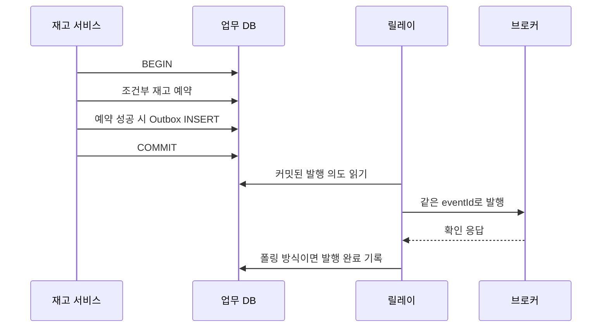

## 1. 원자성의 경계를 먼저 그린다

DB 변경과 브로커 발행을 별개로 수행하면 순서를 바꿔도 장애 구간이 남는다. DB 커밋 뒤 발행 전에 죽으면 후속 처리가 누락되고, 발행 뒤 DB가 롤백되면 실제로 확정되지 않은 사실을 소비할 수 있다. 분산 트랜잭션을 지원하는 조합도 있지만, 여기서는 DB와 브로커를 묶는 2PC를 사용하지 않는 설계를 다룬다.

Transactional Outbox는 업무 변경과 발행 의도를 **같은 로컬 DB 트랜잭션**에 기록한다. 이것은 브로커 전달까지 한 번에 커밋한다는 뜻이 아니다.


```mermaid
sequenceDiagram
    participant App as 재고 서비스
    participant DB as 업무 DB
    participant Relay as 릴레이
    participant Broker as 브로커
    App->>DB: BEGIN
    App->>DB: 조건부 재고 예약
    App->>DB: 예약 성공 시 Outbox INSERT
    App->>DB: COMMIT
    Relay->>DB: 커밋된 발행 의도 읽기
    Relay->>Broker: 같은 eventId로 발행
    Broker-->>Relay: 확인 응답
    Relay->>DB: 폴링 방식이면 발행 완료 기록
```

가상 설계의 예약 명령에는 안정된 reservationId를 둔다. 같은 예약의 재시도는 저장된 결과를 반환하고 다시 차감하지 않는다. 재고 UPDATE의 영향 행 수가 0이면 예약 성공 이벤트를 만들지 않는다. Outbox INSERT가 실패하면 재고 변경도 롤백한다. 이 세 분기를 빼면 Outbox를 설치해도 잘못된 업무 이벤트가 만들어진다.

## 2. 장애 시점별로 복구를 설명한다

| 장애 시점 | 남은 상태 | 복구 |
|---|---|---|
| DB 커밋 전 | 업무와 Outbox 모두 미확정 | 전체 트랜잭션 재시도 |
| DB 커밋 후, 발행 전 | 발행 의도가 DB에 남음 | 릴레이가 재개 |
| 브로커 저장 후 응답 유실 | 발행자는 성공 여부 불명 | 같은 eventId로 재시도 가능 |
| 발행 확인 후 완료 표시 전 | 브로커에는 있고 DB에는 미완료 | 중복 발행을 소비자가 흡수 |
| 소비 DB 커밋 후 Offset 커밋 전 | 효과는 반영됐지만 재수신 가능 | Inbox로 재실행 차단 |

> **면접에서 짚을 전제**
>
> 기존 두 번째 질문의 **“유실 0”은 조건을 생략한 표현**이다. 로컬 원자성과 종단 전달을 구분해서 답한다. DB 내구성·복구, 릴레이 재시도, 로그/메시지 보존, 소비 복구가 필요하다. 미발행 행을 삭제하거나 복구 전에 로그가 사라지면 패턴 이름만으로 전달을 보장할 수 없다.

## 3. 폴링과 CDC는 운영 비용이 다르다

| 관점 | 폴링 릴레이 | CDC 릴레이 |
|---|---|---|
| 읽기 | 미발행 행 조회·선점 | 커밋 변경 로그와 커넥터 위치 |
| 복구 상태 | 완료 표시·임대 만료·재시도 | 커넥터 Offset·로그 보존·재개 |
| 부담 | 인덱스·쿼리·경합·정리 | 로그 보관량·커넥터 운영·스냅샷 |
| 지연 | 주기·배치·적체에 영향받음 | 캡처·전송·적체에 영향받음 |

CDC도 지연이나 DB 부하가 없어지는 것은 아니다. Debezium Outbox Event Router는 캡처된 Outbox 이벤트를 메시지 형태로 변환한다. 모든 DB 테이블 변경을 업무 이벤트와 동일하게 취급하지 않는다. 설치 버전의 커넥터·변환기 설정과 테이블 변경 규약을 함께 확인한다.

**eventId와 파티션 키를 분리한다.** eventId는 같은 이벤트 재전달을 식별한다. aggregateId는 같은 주문/운송장의 순서 범위를 묶는 Kafka 키 후보다. Debezium 기본 매핑도 이벤트 ID와 aggregateid의 역할을 나눈다. 임의 eventId를 키로 쓰면 같은 주문의 이벤트가 다른 파티션으로 갈 수 있다. 같은 Kafka 키를 쓴다는 사실은 중복 제거 기능이 아니다.

가상 주문 O-7의 버전 8과 9를 서로 다른 폴링 작업자가 발행하면 9가 먼저 도착할 수 있다. 같은 키는 브로커에 도착하기 전 뒤집힌 순서를 복원하지 않는다. 동일 Aggregate의 선점·발행 순서를 직렬화하거나, 소비자에서 버전 누락을 탐지해 보류·복구하도록 설계한다. SKIP LOCKED로 처리량을 늘리는 것만으로 순서 보장이 완성되지는 않는다.

## 4. Inbox는 삽입 성공 여부로 업무를 분기한다

다음은 PostgreSQL을 사용하는 **트랜잭션 의사 코드**다. 별도 Redis에 키만 먼저 기록하는 방식과 보장 범위가 다르다.

```text
BEGIN
  INSERT inbox(consumer, event_id) ... ON CONFLICT DO NOTHING RETURNING event_id
  if 삽입된 행이 없음:
    COMMIT
    업무 재실행 없이 종료
  else:
    업무 키와 요청 내용 검증
    업무 데이터 변경
    후속 발행이 필요하면 같은 DB에 Outbox INSERT
    COMMIT
DB 커밋 성공 뒤 소비 위치 커밋
```

Inbox의 고유 키는 `(consumer, event_id)`처럼 논리적 소비자를 구분한다. 업무 실패 시 Inbox도 롤백해야 다음 재시도가 가능하다. 서로 다른 eventId가 같은 예약을 가리킬 수 있으므로 reservationId 같은 업무 고유 제약도 필요하다. 같은 키로 다른 내용이 오면 조용히 성공 처리하지 않고 충돌로 분류한다.

Inbox 보존 기간을 브로커 재생·백필 기간보다 짧게 잡으면 오래된 이벤트가 다시 적용될 수 있다. 감사와 재처리 정책에 맞춰 키 보존 또는 업무 상태의 불변 조건을 설계한다. 병렬 처리에서는 아직 완료하지 않은 앞선 Offset을 건너뛰어 커밋하지 않는다.

## 5. Kafka와 외부 API의 보장을 구분한다

Kafka 4.1의 트랜잭션은 출력 레코드와 소비 위치를 함께 커밋할 수 있다. 소비자의 read_committed 설정과 중단 후 재처리가 맞아야 해당 경계에서 결과를 한 번 반영할 수 있다. Producer 멱등성은 애플리케이션이 새 업무 메시지로 다시 발행하는 모든 중복을 제거하는 장치가 아니다.

외부 운송장 API 호출은 소비 DB 트랜잭션에 자동 포함되지 않는다. 가상 TMS는 Inbox와 운송장 발급 의도를 같은 DB에 저장하고, 별도 작업자가 안정된 업무 키로 외부 요청을 실행한다. 응답이 사라지면 결과 조회·동일 키 재시도·대사로 확인한다. 외부 업체가 멱등 키를 지원하지 않으면 결과 불명 상태와 수동 복구를 포함해야 한다.

공개 API 사례로 Stripe는 멱등 키별 결과 저장과 키 재사용 시 파라미터 검사를 문서화한다. 키 제거 이후의 재사용은 새 요청이 될 수 있으므로 영구 중복 방지로 해석하지 않는다. 이 계약을 다른 결제사나 운송사에 그대로 가정해서는 안 된다.

## 6. 운영에서 확인할 증거

가상 부하가 초당 100건이고 릴레이가 60초 멈추면 약 6,000건의 발행 의도가 쌓인다. 이는 성능 측정값이 아니라 유입이 일정하다는 가정의 계산이다. 복구 처리율이 유입보다 커야 적체가 줄어든다.

- 미발행 건수와 가장 오래된 의도의 나이, 재시도 횟수를 함께 본다.
- CDC 지연과 로그 보존 여유, 브로커 보존 기간을 점검한다.
- Inbox 중복률과 업무 키 충돌, 외부 요청 결과 불명을 구분한다.
- 완료 데이터 정리 전에 재생·감사·장애 복구 요구를 확인한다.

이 문서의 장애 표와 의사 코드는 설계 검수다. 실제 브로커·CDC 장애 주입이나 외부 API 실행 결과는 아니다.

## 참고 자료

- [Transactional Outbox 패턴](https://microservices.io/patterns/data/transactional-outbox.html)
- [Debezium Outbox Event Router](https://debezium.io/documentation/reference/stable/transformations/outbox-event-router.html)
- [Kafka 4.1 전달·트랜잭션 설계](https://kafka.apache.org/41/design/design/)
- [Kafka 4.1 Producer 설정](https://kafka.apache.org/41/configuration/producer-configs/)
- [Stripe 멱등 요청 계약](https://docs.stripe.com/api/idempotent_requests)
