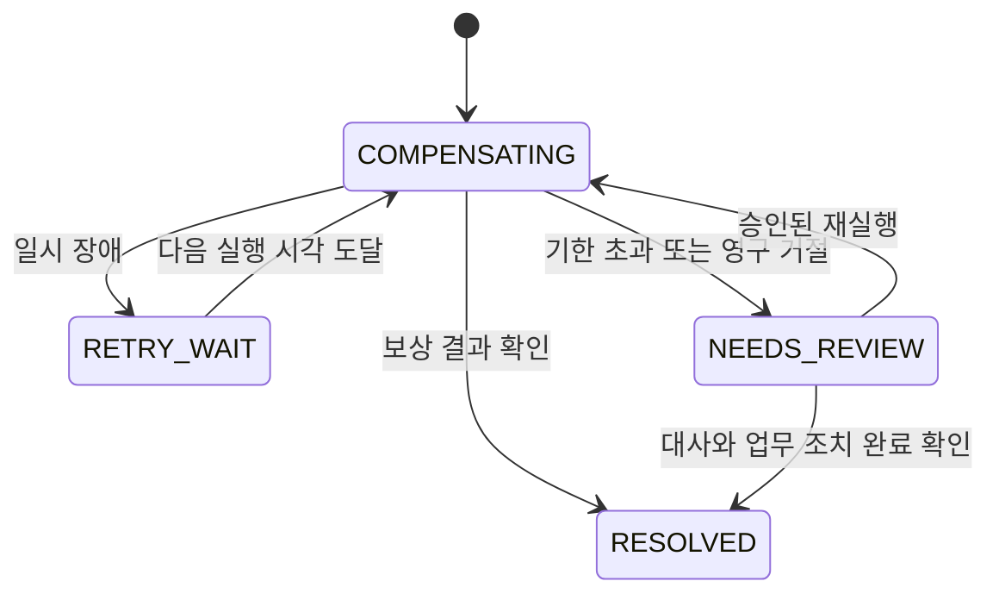
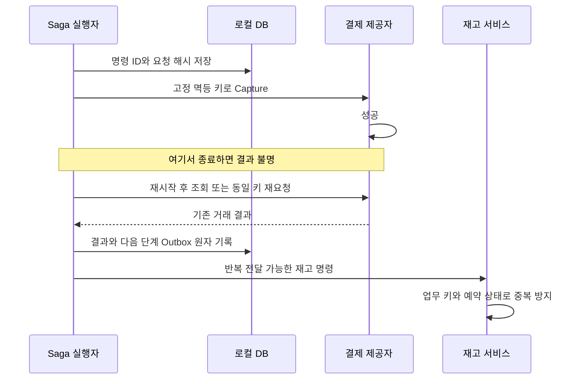

## 1. 40분 면접의 판단 기준

학습용 주문·결제·재고·배송 서비스는 각각 DB를 갖고 외부 결제와 운송사를 호출한다. 첫 답변에서는 허용 중간 상태, 취소 마감, 결제 결과 불명 처리, 자동 복구 기한을 확인한다. 이 카드는 특정 기업의 내부 설계를 주장하지 않는다.

| 라운드 | 시간 예시 | 평가할 판단 |
|---|---:|---|
| R1 선택 | 8분 | 원자적 커밋·격리성과 업무 보상의 차이 |
| R2 보상 실패 | 10분 | 반복해도 안전한 자원 전이와 미해결 업무 관리 |
| R3 결제·이벤트 간격 | 12분 | 외부 효과, 로컬 기록, 메시지 전달의 세 경계 |
| R4 집하 후 취소 | 10분 | 물리 재고와 소프트웨어 상태의 대응 |

> **면접 포인트 — 질문의 전제도 검증한다**
>
> 기존 확인 질문의 “불일치로 고착되지 않음을 증명”은 무조건적 복구 보장을 요구하는 것으로 받아들이지 않는다. 영구적인 외부 장애나 응답 없는 운영자를 전제로는 최종 해결을 보장할 수 없다. 안전성, 탐지, 복구 가능 조건을 구분하는 답을 평가한다.

## 2. R1 — “2PC로 묶으면 되지 않나요?”

**답변 예시:** “2PC(Two-Phase Commit, 2단계 커밋)는 참여 자원의 커밋 결정을 조정하지만 전역 격리성을 자동으로 만들지는 않습니다. 이번 외부 결제·운송사 API가 그 프로토콜에 참여하는지 먼저 확인합니다. 장시간 처리의 중간 상태를 허용한다면 Saga(사가)와 예약 상태를 고려하겠습니다. 모든 자원이 원자적 커밋을 지원하고 중간 노출을 허용할 수 없다면 다른 선택이 가능합니다.”

**후속 압박:** “그럼 Saga가 더 빠르다는 근거는요?”

짧은 로컬 거래로 잠금 보유를 줄일 수 있지만 단계별 메시지·영속 기록·재시도가 추가된다. 무조건적인 처리량 우위를 주장하지 않는다. 가상 유입 100건/초에 평균 체류 5초라면 진행 중 약 500건이고, 50초면 약 5,000건이다. 완료 지연·미완료 수·DB 경합·외부 제한을 같은 부하에서 비교한다.

**오답:** “2PC는 CP, Saga는 AP”, “서비스가 4개면 무조건 중앙 조정”, “보상이 격리성을 메운다.” CAP의 의미와 커밋 프로토콜을 섞거나 중간 상태 경쟁을 생략하는 답이다.

## 3. R2 — “보상도 실패하면 무한 루프 아닌가요?”

**60초 답변 예시:** “보상은 별도의 업무이므로 실패할 수 있습니다. 원래 예약이나 결제 ID를 기준으로 중복 효과를 막고, 일시 장애는 총 기한과 횟수를 제한해 재시도합니다. 초과하면 원인·외부 거래·담당자·다음 확인 시각을 NEEDS_REVIEW로 영속화합니다. DLQ와 알림만으로 복구됐다고 계산하지 않고, 미해결 상태를 주기적으로 재검색해 대사·운영 처리를 이어갑니다. 외부 서비스 복구와 실제 운영 조치라는 전제 아래 해결을 추적하며, 영구 장애에서도 반드시 완료된다고 약속하지 않습니다.”


```mermaid
stateDiagram-v2
    [*] --> COMPENSATING
    COMPENSATING --> RETRY_WAIT: 일시 장애
    RETRY_WAIT --> COMPENSATING: 다음 실행 시각 도달
    COMPENSATING --> RESOLVED: 보상 결과 확인
    COMPENSATING --> NEEDS_REVIEW: 기한 초과 또는 영구 거절
    NEEDS_REVIEW --> COMPENSATING: 승인된 재실행
    NEEDS_REVIEW --> RESOLVED: 대사와 업무 조치 완료 확인
```

**후속 압박:** “재고 해제에 성공했는데 응답 전에 죽었습니다. 다시 +1 하면요?”

그 방식은 중복 복원이다. 예약 상태 전이가 성공한 경우에만 같은 트랜잭션에서 수량을 복원한다. 아래 PostgreSQL 예시는 단일 SKU 예약이며 `reservation.id`와 `stock.sku_id`는 기본 키, 예약 수량은 양수, SKU는 유효한 외래 키라고 가정한다.

```sql
BEGIN;
WITH released AS (
  UPDATE reservation SET state = 'RELEASED'
  WHERE id = :reservation_id AND state = 'RESERVED'
  RETURNING sku_id, qty
)
UPDATE stock s SET available = s.available + r.qty
FROM released r WHERE s.sku_id = r.sku_id;
-- 영향 행 수 1이면 이번 해제 성공.
-- 0이면 예약을 조회해 이미 RELEASED인지, CONFIRMED인지, 없는지 구분한다.
COMMIT;
```

서로 다른 두 작업자가 호출해도 예약의 `RESERVED → RELEASED`는 한 번만 성공해야 한다. 결제 확정도 같은 예약 상태에서 `CONFIRMED`로 경쟁한다면 어느 전이가 이겼는지에 따라 후속 정책이 달라진다. 모든 0행 결과를 성공으로 숨기면 안 된다.

**추가 압박:** “DB에 NEEDS_REVIEW를 쓴 직후 알림 전에 죽으면요?”

미해결 레코드의 주기적 스캔 또는 같은 거래의 알림 Outbox(발행 의도 테이블)가 필요하다. 알림 수신과 담당자 확인도 해결 완료와 별도다.

## 4. R3 — “고객 돈은 빠졌는데 재고 이벤트가 없습니다”

문제를 세 구간으로 나눈다.

| 장애 위치 | 남을 수 있는 상태 | 대응 |
|---|---|---|
| 외부 Capture 성공 후 로컬 기록 전 | 외부만 결제됨 | 호출 전 명령 저장, 고정 멱등 키, 외부 결과 조회·대사 |
| 로컬 결과 기록 후 이벤트 발행 전 | DB만 성공, 후속 미진행 | 결과와 Outbox를 같은 DB 거래에 기록 |
| 발행 후 처리 완료 표시 전 | 재발행·재소비 | Inbox(수신 중복 기록)와 업무 키, 상태 전이로 반복 효과 방지 |

**답변 예시:** “Outbox는 로컬 결과와 발행 의도의 원자성을 보장합니다. 외부 결제 성공이 아직 로컬에 기록되지 않은 간격은 Outbox 하나로 해결하지 못합니다. 고정된 실행 명령을 먼저 저장하고 결과가 불명하면 조회·대사를 합니다. 이벤트가 남아도 릴레이·보관·복구가 제대로 동작해야 전달이 진행됩니다. 중복 실행도 예상합니다.”


```mermaid
sequenceDiagram
    participant S as Saga 실행자
    participant DB as 로컬 DB
    participant P as 결제 제공자
    participant I as 재고 서비스
    S->>DB: 명령 ID와 요청 해시 저장
    S->>P: 고정 멱등 키로 Capture
    P->>P: 성공
    Note over S,P: 여기서 종료하면 결과 불명
    S->>P: 재시작 후 조회 또는 동일 키 재요청
    P-->>S: 기존 거래 결과
    S->>DB: 결과와 다음 단계 Outbox 원자 기록
    S->>I: 반복 전달 가능한 재고 명령
    I->>I: 업무 키와 예약 상태로 중복 방지
```

**후속 압박:** “5분 멈췄으면 자동 환불하면 되죠?”

시간 초과는 실패 확정이 아니다. 재고 예약·출고가 이미 성공했지만 결과만 늦을 수 있다. 현재 외부 거래와 예약·출고 상태를 대조하고 권위 있는 취소 전이로 더 이상의 집하를 차단한 뒤 환불 여부를 결정한다. 무조건 환불과 늦은 출고가 동시에 진행되면 돈도 물건도 잃는다.

대사에는 주문 ID, 결제 제공자 거래 ID, 명령 ID, 예약 ID, 운송장 개정판을 연결한다. 중복·누락·상태 불일치의 종류를 기록하고, 늦게 온 이벤트를 다시 재생할 때 이미 수행한 환불·알림을 반복하지 않는다.

## 5. R4 — “이미 트럭에 실렸는데 취소하면?”

**답변 예시:** “Pivot Transaction(전환점 거래)을 집하 승인·실물 인계 절차와 연결합니다. 운송장 생성 자체가 항상 비가역인 것은 아닙니다. 집하 후에는 DB의 예약 해제처럼 원창고 판매 가능 수량을 증가시키지 않습니다. 취소 요청을 반품·배송 중지·회수라는 별도 흐름으로 처리하고, 입고와 검수 결과에 따라 판매 가능·격리·폐기로 분류합니다. 환불 시점은 재고 복원 시점과 별도의 정책입니다.”

| 관측 | 처리 방향 | 검증할 조건 |
|---|---|---|
| 집하 전 취소가 권위 있는 상태 전이에서 승리 | 예약 해제·승인 취소 등 | 창고 집하 권한도 취소됐는지 |
| 집하 완료 뒤 취소 | Reverse Logistics(역물류) 생성 | 이동 중·반품 중 재고로 추적 |
| 취소 뒤 늦은 집하 스캔 | 물리 사실 대사와 예외 처리 | 단순히 늦었다고 사실을 버리지 않기 |
| 반품 입고 | 검수 뒤 재분류 | 중복 입고 이벤트가 수량을 중복 증가시키지 않기 |

**후속 압박:** “Pivot 뒤는 재시도로 반드시 성공해야 한다면서 영구 실패는요?”

재시도 가능한 후속 단계라는 설계 전제를 설명하되, 현실의 분실·영구 거절은 별도 예외 업무로 해결한다. 패턴의 이상적 전제를 현실에 무조건 적용하지 않는다.

## 6. 평가와 실패 주입

시니어 답변은 패턴 이름의 개수보다 **불변식과 장애 간격을 연결하는지**로 평가한다. 보상 완료, 운영 개입 대기, 외부 결과 불명을 구분하고 담당자 알림을 정합성 회복으로 계산하지 않는다.

검증할 시나리오는 재고 해제 중복 호출, 결제 성공 뒤 로컬 저장 전 종료, Outbox 발행 뒤 완료 표시 전 종료, 취소와 집하 경쟁, 반품 입고 중복이다. 기대 결과는 각각 수량 1회 복원, 중복 청구 없는 결과 회수, 중복 후속 효과 방지, 물리 상태에 맞는 취소 분기, 검수 수량 1회 반영이다. 이 카드의 모든 외부 장애를 실제 제공자에 주입한 것은 아니며, 구현 시 계약 테스트와 상태 전이 테스트로 확인한다.

## 참고 자료

- [Saga와 격리성](https://microservices.io/patterns/data/saga.html)
- [보상 실패·순서](https://learn.microsoft.com/en-us/azure/architecture/patterns/compensating-transaction)
- [Pivot과 단계 분류](https://learn.microsoft.com/en-us/azure/architecture/patterns/saga)
- [Transactional Outbox](https://microservices.io/patterns/data/transactional-outbox.html)
- [Stripe 멱등 요청](https://docs.stripe.com/api/idempotent_requests)
