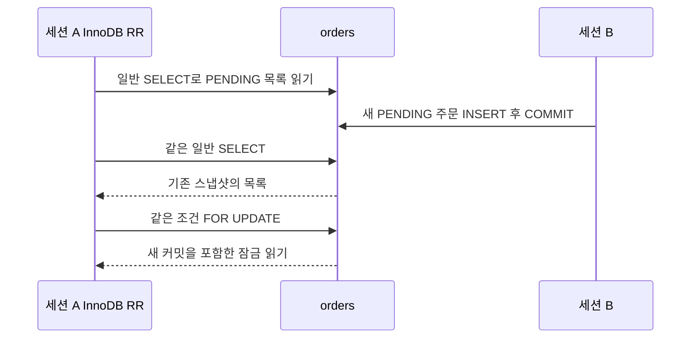
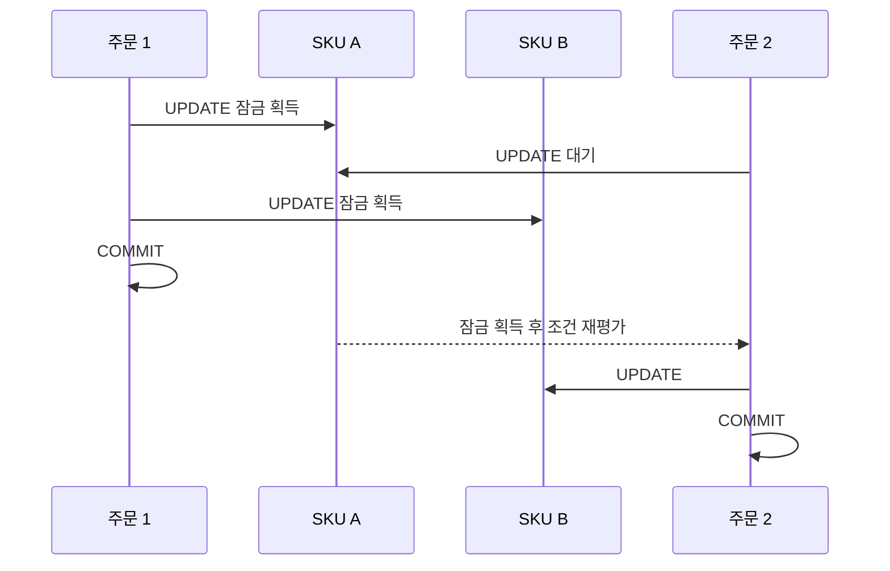

## 1. 격리수준은 제품·문장·트랜잭션 경계로 설명한다

기준은 **MySQL 8.4 InnoDB와 PostgreSQL 17**이다. Dirty Read(미커밋 읽기), Non-repeatable Read(반복 불가 읽기), Phantom Read(팬텀 읽기)는 각각 남의 미커밋 값, 같은 행의 값 변화, 같은 조건의 결과 집합 변화를 뜻한다. 팬텀이 없다는 사실만으로 모든 실행이 직렬화 가능하다고 결론 내리지 않는다.

| 격리수준 | 표준의 최소 허용 범위 | 제품에서 확인할 점 |
|---|---|---|
| READ UNCOMMITTED | 세 이상현상 허용 | PostgreSQL은 RC처럼 동작 |
| READ COMMITTED, RC | 미커밋 읽기 방지 | 두 DB의 일반 읽기는 문장별 스냅샷 |
| REPEATABLE READ, RR | 미커밋·반복 불가 읽기 방지, 팬텀 허용 가능 | 두 DB의 일반 스냅샷 읽기는 팬텀을 방지; 쓰기 의미는 다름 |
| SERIALIZABLE | 직렬 실행과 동등한 결과 | 대기·교착·직렬화 실패의 처리까지 설계 |

MySQL 기본은 RR, PostgreSQL 기본은 RC이지만 세션 설정을 직접 확인한다. PostgreSQL RR도 서로 다른 행을 바꾸는 Write Skew(쓰기 편향)를 허용할 수 있다. SERIALIZABLE에서 올바른 업무 판단을 같은 트랜잭션에 넣고 실패한 전체 작업을 재시도하면 이런 비직렬 실행을 배제할 수 있다.

```sql
SELECT @@transaction_isolation; -- MySQL
SHOW transaction_isolation;    -- PostgreSQL
```

## 2. InnoDB RR: 스냅샷 읽기와 잠금 읽기는 다르다

일반 SELECT는 MVCC(Multi-Version Concurrency Control, 다중 버전 동시성 제어)의 스냅샷을 사용한다. RR에서 첫 일관 읽기가 기준을 만들고 이후 재사용한다. 다른 세션의 INSERT를 막아서 같은 결과를 얻는 것이 아니다. 자기 트랜잭션의 변경은 보일 수 있으므로 단순히 모든 읽기가 과거 DB 전체의 사진이라는 설명도 부족하다.

`SELECT ... FOR UPDATE`는 현재 잠글 수 있는 상태를 읽는다. 범위 검색은 실행계획에 따라 레코드와 갭을 잠가 해당 범위의 INSERT를 대기시킬 수 있다. 같은 트랜잭션에서 일반 읽기와 잠금 읽기를 섞으면 서로 다른 상태를 관측할 수 있다.


```mermaid
sequenceDiagram
    participant A as 세션 A InnoDB RR
    participant DB as orders
    participant B as 세션 B
    A->>DB: 일반 SELECT로 PENDING 목록 읽기
    B->>DB: 새 PENDING 주문 INSERT 후 COMMIT
    A->>DB: 같은 일반 SELECT
    DB-->>A: 기존 스냅샷의 목록
    A->>DB: 같은 조건 FOR UPDATE
    DB-->>A: 새 커밋을 포함한 잠금 읽기
```

PostgreSQL RR의 잠금 읽기는 InnoDB의 최신 읽기와 같지 않다. 스냅샷 이후 바뀐 행을 잠그거나 갱신하려 하면 직렬화 실패가 날 수 있다. PostgreSQL SERIALIZABLE의 SSI(Serializable Snapshot Isolation, 직렬화 가능 스냅샷 격리)는 읽기·쓰기 의존성을 감시하지만 기존 쓰기 락을 없애지 않는다.

> **면접 포인트**
>
> “InnoDB RR은 팬텀을 막는다” 다음에 읽기 종류를 붙인다. 일반 SELECT의 스냅샷 유지와 범위 잠금의 INSERT 차단은 다른 메커니즘이다. `FOR UPDATE`를 트랜잭션 밖에서 실행해 문장 직후 잠금이 풀리면 뒤따르는 업무를 보호하지 못한다.

## 3. 공유·배타·갭 잠금의 범위

Shared Lock(S, 공유 잠금)끼리는 호환되며 Exclusive Lock(X, 배타 잠금)은 같은 레코드의 다른 S/X와 충돌한다. 이는 단순화한 레코드 잠금 표다. PostgreSQL은 `FOR KEY SHARE` 등 추가 행 잠금 모드를 제공하므로 모든 잠금을 이 두 가지로 환원하지 않는다.

| InnoDB 잠금 | 대상과 효과 | 주의점 |
|---|---|---|
| Record Lock | 인덱스 레코드 | 기존 행의 고유 키 동등 검색은 갭 없이 처리 가능 |
| Gap Lock(갭 잠금) | 레코드 사이 삽입 위치 | 갭 잠금끼리는 공존할 수 있으나 INSERT는 대기 가능 |
| Next-key Lock(넥스트키 잠금) | 레코드와 그 앞의 갭 | RR 범위 검색에서 잠금 범위가 논리 조건보다 넓을 수 있음 |
| Intention Lock(의도 잠금) | 테이블 수준의 하위 잠금 의도 | IX 획득 자체가 테이블 전체의 배타 잠금은 아님 |
| Metadata Lock(메타데이터 잠금) | 테이블 정의 접근 | 일반 DML도 획득하므로 오래 열린 트랜잭션이 DDL을 막을 수 있음 |

```sql
-- MySQL 8.4, 독립 실습 DB에서 준비
CREATE TABLE orders (
  id BIGINT PRIMARY KEY,
  status VARCHAR(20) NOT NULL,
  KEY ix_orders_status (status)
) ENGINE=InnoDB;
INSERT INTO orders VALUES (10, 'PENDING'), (20, 'SHIPPED');

-- 세션 A
SET SESSION TRANSACTION ISOLATION LEVEL REPEATABLE READ;
START TRANSACTION;
SELECT * FROM orders WHERE status='PENDING' FOR UPDATE;
-- A를 열린 상태로 둔다.

-- 세션 B: 별도 연결에서 실행
START TRANSACTION;
INSERT INTO orders VALUES (15, 'PENDING');
-- A가 잠근 범위에 삽입하려 하므로 대기한다.
-- 세션 A에서 COMMIT한 뒤 B도 COMMIT한다.
```

정확한 경계는 실제 인덱스·데이터·실행계획과 `performance_schema.data_locks`, `data_lock_waits`로 확인한다. 인덱스가 없으면 전체 스캔으로 잠금과 삽입 차단 범위가 크게 넓어질 수 있다. 이를 “DB가 테이블 X 락으로 승격했다”와 혼동하지 않는다. RC에서는 비일치 행 잠금 해제와 일반 검색의 갭 잠금 축소가 있지만 외래 키·중복 키 검사 등 예외가 있다.

일반 SELECT도 항상 모든 잠금과 무관하지는 않다. InnoDB SERIALIZABLE의 조건별 잠금 읽기 전환, 두 DB의 스키마 관련 잠금과 DDL 대기를 별도로 본다.

## 4. 여러 SKU 차감: 순서를 명시하고 실패는 전체 롤백한다

Deadlock(교착 상태)은 잠금을 보유한 세션들이 서로를 순환 대기하는 상태다. A→B와 B→A 순서의 주문 차감이 대표적이다. 아래는 양수 수량 검증과 중복 SKU 수량 합산을 완료한 주문이 A 2개, B 1개를 차감하는 예다. `sku_id`는 기본 키이며 모든 차감 경로가 같은 정렬 순서를 따른다.

```sql
BEGIN;
-- 애플리케이션이 정렬한 SKU마다 한 문장씩 호출한다.
UPDATE stock SET qty = qty - 2 WHERE sku_id = 'A' AND qty >= 2;
-- 영향 행 수가 0이면 즉시 ROLLBACK 후 재고 부족 처리
UPDATE stock SET qty = qty - 1 WHERE sku_id = 'B' AND qty >= 1;
-- 영향 행 수가 0이면 A 차감도 포함해 ROLLBACK
COMMIT;
```

영향 행 수 검사는 애플리케이션 책임이며 위 주석이 SQL 분기를 실행하는 것은 아니다. 조건부 UPDATE도 내부적으로 쓰기 잠금을 사용한다. `ORDER BY`가 있는 단일 범위 SELECT의 결과 순서만으로 모든 실행계획의 실제 잠금 획득 순서를 보장한다고 설명하지 않는다. 명시적인 키 순차 접근도 외래 키·보조 인덱스·다른 코드 경로에서 생기는 모든 교착을 없애지는 않는다.


```mermaid
sequenceDiagram
    participant T1 as 주문 1
    participant A as SKU A
    participant B as SKU B
    participant T2 as 주문 2
    T1->>A: UPDATE 잠금 획득
    T2->>A: UPDATE 대기
    T1->>B: UPDATE 잠금 획득
    T1->>T1: COMMIT
    A-->>T2: 잠금 획득 후 조건 재평가
    T2->>B: UPDATE
    T2->>T2: COMMIT
```

## 5. 교착과 시간 초과는 복구 단위가 다르다

InnoDB의 기본 교착 감지가 활성화돼 있으면 희생 트랜잭션을 롤백하며 보통 오류 1213을 받는다. 감지를 끈 구성은 시간 초과에 의존할 수 있다. 잠금 대기 시간 초과 1205는 기본적으로 문장만 롤백할 수 있으므로 1213과 같은 상태라고 단정하지 않는다. 애플리케이션은 실패한 주문의 전체 트랜잭션을 명시적으로 롤백한 뒤 새 경계에서 다시 시작한다.

PostgreSQL의 교착 `40P01`, 직렬화 실패 `40001`도 새 트랜잭션에서 읽기·판단부터 재시도한다. 재시도 횟수와 총 기한을 제한하고 무작위 지연을 둔다. 가상의 최대 3회 정책은 무한 재시도를 막기 위한 예시이며 서비스 지연 예산에 맞춰 정한다. 재고 부족 같은 정상 업무 거절은 교착 재시도와 분리한다.

> **실무 함정 — 성공 여부가 불명확한 커밋**
>
> DB 연결이 커밋 응답 전에 끊기면 “롤백됐겠지” 하고 무조건 다시 차감하지 않는다. 주문별 고유 예약 키로 결과를 조회하고 중복 처리를 막는다. 외부 HTTP 호출은 재시도할 DB 트랜잭션 안에 넣지 않는다.

진단은 InnoDB의 `SHOW ENGINE INNODB STATUS`와 잠금 대기 표, PostgreSQL의 `pg_locks`·`pg_stat_activity`에서 시작한다. 대기 시간뿐 아니라 실패한 전체 거래 수, 재시도 후 성공률, 최종 재고 음수·중복 예약 여부를 측정한다.

## 참고 자료

- [MySQL 8.4 일관 읽기](https://dev.mysql.com/doc/refman/8.4/en/innodb-consistent-read.html)
- [MySQL 8.4 잠금 종류](https://dev.mysql.com/doc/refman/8.4/en/innodb-locking.html)
- [MySQL 8.4 문장별 잠금](https://dev.mysql.com/doc/refman/8.4/en/innodb-locks-set.html)
- [MySQL 8.4 교착 처리](https://dev.mysql.com/doc/refman/8.4/en/innodb-deadlocks-handling.html)
- [MySQL 8.4 오류 처리](https://dev.mysql.com/doc/refman/8.4/en/innodb-error-handling.html)
- [PostgreSQL 17 격리수준](https://www.postgresql.org/docs/17/transaction-iso.html), [명시적 잠금](https://www.postgresql.org/docs/17/explicit-locking.html)
