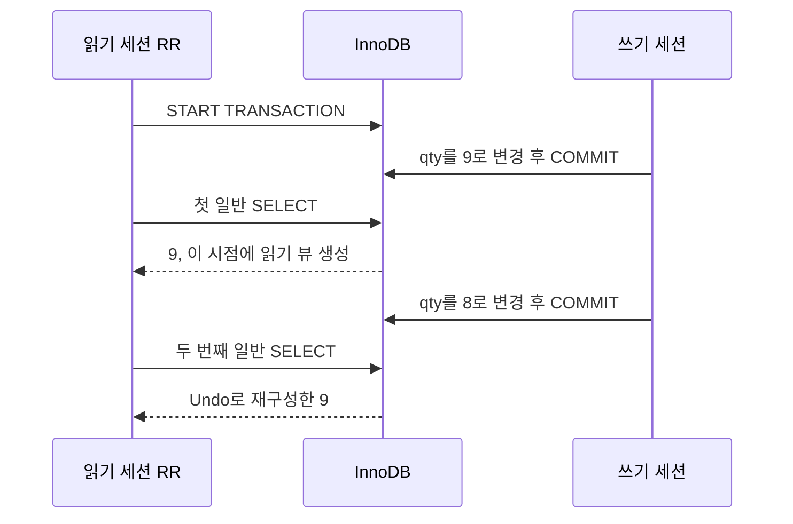
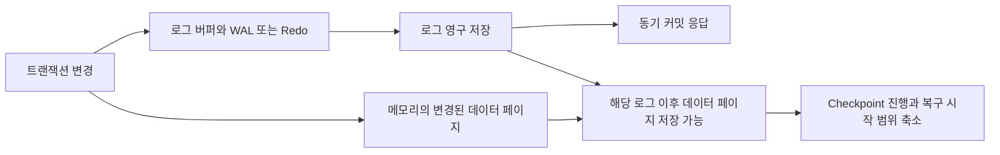

## 1. 버전의 저장 위치와 가시성은 다른 문제다

기준은 **MySQL 8.4 InnoDB와 PostgreSQL 17**이다. MVCC(Multi-Version Concurrency Control, 다중 버전 동시성 제어)는 과거 행 버전에서 자기 읽기에 보이는 값을 선택한다. 일반 스냅샷 읽기와 쓰기의 경합을 줄이지만 쓰기 잠금·잠금 읽기·DDL(데이터 정의 언어) 대기까지 없애지는 않는다.

InnoDB의 `DB_TRX_ID`는 행을 마지막으로 변경한 트랜잭션, `DB_ROLL_PTR`은 Undo Log(실행 취소 로그)를 통해 이전 상태를 재구성할 때 사용하는 정보다. 단순히 “내 트랜잭션 ID보다 작으면 보인다”로 판단할 수 없다. 먼저 시작했어도 아직 커밋하지 않은 트랜잭션이 있기 때문이다. Read View(읽기 뷰)는 경계와 당시 활성 트랜잭션 정보를 이용해 가시성을 판정한다.

| InnoDB 일반 일관 읽기 | 읽기 뷰 생성 | 결과 |
|---|---|---|
| REPEATABLE READ, RR | 보통 첫 일관 읽기 때 만들고 재사용 | 뒤에 커밋된 다른 거래를 반복 SELECT에 반영하지 않음 |
| READ COMMITTED, RC | 일관 읽기마다 새로 생성 | 두 SELECT 사이 다른 커밋이 반영될 수 있음 |
| 명시적 스냅샷 시작 | 지원 격리수준에서 WITH CONSISTENT SNAPSHOT 사용 | 일반 BEGIN과 생성 시점이 다를 수 있음 |

이 비교는 일반 SELECT 기준이다. 격리수준 전체가 읽기 뷰 생성 시점 하나만으로 구현되는 것은 아니며 범위 잠금·갱신 규칙도 다르다. 자기 트랜잭션의 변경은 이후 읽기에 보일 수 있다.


```mermaid
sequenceDiagram
    participant R as 읽기 세션 RR
    participant DB as InnoDB
    participant W as 쓰기 세션
    R->>DB: START TRANSACTION
    W->>DB: qty를 9로 변경 후 COMMIT
    R->>DB: 첫 일반 SELECT
    DB-->>R: 9, 이 시점에 읽기 뷰 생성
    W->>DB: qty를 8로 변경 후 COMMIT
    R->>DB: 두 번째 일반 SELECT
    DB-->>R: Undo로 재구성한 9
```

> **면접 포인트**
>
> RR의 기준을 무조건 BEGIN 시점이라 말하지 않는다. 첫 일관 읽기 전에 커밋된 값은 보일 수 있다. RC에서는 두 번째 읽기 뷰에 새 커밋이 포함돼 8을 읽을 수 있다.

## 2. Undo와 PostgreSQL 행 버전의 수명

InnoDB의 Update Undo는 롤백과 과거 읽기에 사용한다. 커밋된 과거 정보를 어떤 읽기 뷰도 필요로 하지 않으면 Purge(과거 버전 정리)가 회수할 수 있다. Insert Undo와 Update Undo의 수명이 같지는 않다. 보조 인덱스 키가 바뀌면 기존 항목이 삭제 표시되고 새 항목이 생길 수 있으므로 “보조 인덱스는 항상 버전당 하나뿐”도 틀리다.

PostgreSQL UPDATE는 Heap(테이블 행 저장 영역)에 새 튜플 버전을 만든다. 옛 버전은 기존 스냅샷에 여전히 필요할 수 있어서 변경 직후 곧바로 회수 가능한 Dead Tuple(죽은 튜플)이라고 부르면 부정확하다. 가시성 판단에는 생성·삭제 트랜잭션 정보와 커밋 상태, 스냅샷 등이 관여한다.

| 항목 | InnoDB | PostgreSQL |
|---|---|---|
| 과거 상태 | 주로 Undo에서 재구성 | Heap의 기존 튜플 버전 |
| 회수 지연 원인 | 필요한 읽기 뷰, Purge 처리 지연 등 | 오래된 스냅샷·복제 관련 보존 경계·정리 처리량 등 |
| 정리 | Purge | VACUUM·Autovacuum·페이지 Pruning(불필요 버전 정리) |
| 증상 | Undo 증가·긴 버전 탐색 | Heap/인덱스 팽창·불필요한 페이지 접근 |

History List Length는 Undo 바이트 수나 현재 불필요한 행 개수와 동일한 지표가 아니다. 증가 추세, 오래된 거래, Undo 공간, Purge 진행을 함께 본다. 장기 집계를 청크로 끊으면 보존 시간을 줄일 수 있지만 청크 사이 데이터가 변하므로 일관된 전체 집계가 필요한지 먼저 결정한다.

## 3. WAL은 데이터 파일 쓰기를 없애지 않는다

WAL(Write-Ahead Logging, 선행 기록)은 데이터 페이지를 영구 저장하기 전에 그 변경을 복구할 로그부터 영구 저장하는 원칙이다. 동기 커밋에서는 필요한 로그의 저장 완료를 기다리므로 변경된 모든 데이터 페이지를 커밋마다 즉시 쓰지 않아도 된다. 비동기 커밋과 저장 장치의 보장 범위는 별도다.


```mermaid
flowchart LR
    T[트랜잭션 변경] --> L[로그 버퍼와 WAL 또는 Redo]
    T --> P[메모리의 변경된 데이터 페이지]
    L --> F[로그 영구 저장]
    F --> C[동기 커밋 응답]
    F --> D[해당 로그 이후 데이터 페이지 저장 가능]
    P --> D
    D --> K[Checkpoint 진행과 복구 시작 범위 축소]
```

로그는 순차 기록과 Group Commit(여러 거래의 동기화 묶음)에 유리하다. 데이터 페이지의 랜덤 쓰기는 남아 있으며 백그라운드 쓰기와 Checkpoint(복구 기준점) 처리에서 분산된다. 페이지가 오직 Checkpoint 때만 저장되는 것도 아니다. 로그량·스토리지 지연·체크포인트 압력에 따라 병목이 달라진다.

| innodb_flush_log_at_trx_commit | 커밋 때 하는 일 | 장애 의미 |
|---|---|---|
| 1 | 로그를 기록하고 디스크 동기화 | 저장 계층이 보장을 지킨다는 전제로 내구성 강화; Group Commit 가능 |
| 2 | 로그 파일에 쓰지만 커밋마다 디스크 동기화는 하지 않음 | OS·전원 장애로 아직 동기화 안 된 커밋 유실 가능 |

값 2의 주기적 Flush(동기화)는 정확히 1초 이내 손실만 보장하는 계약이 아니다. 설정과 스케줄링에 영향을 받는다. 값 1도 원격 복제본에 반영됐음을 뜻하지 않으며, Binary Log(복제용 이진 로그)를 사용하는 복구·복제 구성은 `sync_binlog` 등도 같이 확인한다. 결제·재고는 허용 가능한 커밋 유실량을 정하고 설정을 선택한다.

## 4. 운송장 UPDATE 지연을 어떻게 진단할까

“초당 수천 번 UPDATE”만으로 VACUUM이 원인이라고 단정하지 않는다. 실행계획 변화, 잠금 대기, 저장 장치 지연, 인덱스 증가, 오래된 스냅샷을 먼저 분리한다. 다음은 PostgreSQL의 읽기 전용 진단 예다.

```sql
SELECT relname, n_live_tup, n_dead_tup,
       n_tup_upd, n_tup_hot_upd, last_autovacuum, last_autoanalyze
FROM pg_stat_user_tables
WHERE relname = 'shipment_status';

SELECT pid, state, xact_start, backend_xmin, wait_event_type, wait_event
FROM pg_stat_activity
WHERE datname = current_database()
ORDER BY xact_start NULLS LAST;

SELECT relname, age(relfrozenxid) AS xid_age
FROM pg_class
WHERE oid = 'shipment_status'::regclass;
```

튜플 수 통계는 추정치이며 누적 HOT 비율은 최근 장애 구간의 비율과 다르다. 같은 간격의 차분으로 비교한다. `backend_xmin`을 붙잡는 세션, Prepared Transaction(준비된 거래), 복제 슬롯의 `xmin`/`catalog_xmin`과 복제 피드백도 확인한다. WAL 보존만 늘어나는 문제와 Heap 정리가 막히는 문제는 구분한다.

## 5. VACUUM·HOT·fillfactor의 적용 조건

HOT(Heap-Only Tuple, 인덱스 항목 추가를 피하는 행 갱신)은 기존 행 페이지에 공간이 있고, 일반 인덱스가 참조하는 컬럼을 갱신하지 않을 때 가능하다. PostgreSQL 17의 BRIN 같은 요약 인덱스에는 별도 예외가 있다. `status`에 B-tree 인덱스가 있는데 status를 매번 바꾸면 fillfactor만 낮춰 해결되지 않는다.

가상의 1,000만 행 테이블에서 기본 예시 임계식 `50 + 0.2 × 행 수`는 약 200만 변경 튜플이다. scale factor를 0.02로 낮춘 예시는 약 20만이다. 이는 VACUUM 시작 후보를 찾는 단순 계산이며 완료 시간을 보장하지 않는다. 실제 통계·워커·I/O(입출력) 예산과 긴 스냅샷 해소를 함께 본다.

```sql
-- 운영 적용 전 쓰기 부하와 공간 증가를 측정할 학습용 설정 예
ALTER TABLE shipment_status SET (
  autovacuum_vacuum_scale_factor = 0.02,
  autovacuum_vacuum_threshold = 50,
  fillfactor = 80
);
-- 기존에 꽉 찬 모든 페이지가 이 명령만으로 다시 배치되지는 않는다.
-- VACUUM은 명시적 트랜잭션 블록 밖에서 실행한다.
VACUUM (ANALYZE) shipment_status;
```

일반 VACUUM은 주로 재사용 공간을 만들고 보통 파일 크기 전체를 OS에 반환하지 않는다. VACUUM FULL은 테이블을 재작성하고 강한 잠금과 추가 공간이 필요하다. 통계 갱신은 ANALYZE의 역할이고, VACUUM의 가시성 맵 정리는 Index-Only Scan(인덱스만 이용하는 조회)에도 영향을 준다.

XID(Transaction ID, 트랜잭션 식별자)의 순환 비교 한계 때문에 오래된 행을 Freeze(과거 거래 ID 처리)해야 한다. 갱신이 거의 없는 테이블도 대상이다. 단순히 “32비트 값이 모두 소진될 때 한 번 청소”가 아니며, 오래된 XID·Multixact 연령과 정리 진행을 지속 감시한다.

## 참고 자료

- [MySQL 8.4 다중 버전 구조](https://dev.mysql.com/doc/refman/8.4/en/innodb-multi-versioning.html)
- [MySQL 8.4 일관 읽기](https://dev.mysql.com/doc/refman/8.4/en/innodb-consistent-read.html)
- [MySQL 8.4 로그 동기화 설정](https://dev.mysql.com/doc/refman/8.4/en/innodb-parameters.html#sysvar_innodb_flush_log_at_trx_commit)
- [PostgreSQL 17 WAL](https://www.postgresql.org/docs/17/wal-intro.html)
- [PostgreSQL 17 VACUUM 운영](https://www.postgresql.org/docs/17/routine-vacuuming.html)
- [PostgreSQL 17 HOT](https://www.postgresql.org/docs/17/storage-hot.html)
