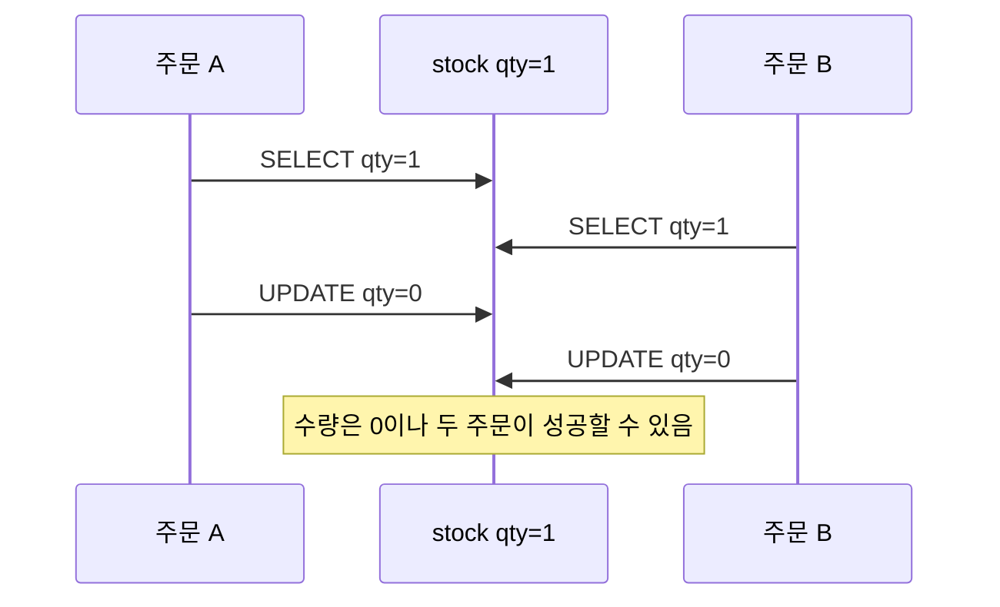
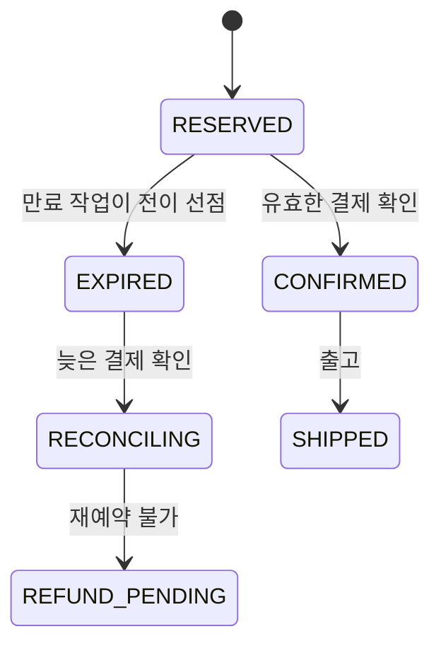

> **검수 기준 — 2026-09-12**
>
> PostgreSQL 17의 조건부 갱신과 Redis의 원자 실행·복제 경계를 구분한다. 티켓·창고 예제와 수치는 가상 설계이며 특정 기업의 실제 구현을 뜻하지 않는다.

## 1. 수량과 예약 불변식을 함께 지킨다

SKU(Stock Keeping Unit, 재고 관리 단위) A가 한 개 남았다. 요청 두 개가 각각 1을 읽고 0으로 덮어쓰면 DB에는 음수가 없지만 두 주문이 성공할 수 있다. **재고 음수 방지**와 **같은 주문의 중복 예약 방지**는 다른 조건이다.


```mermaid
sequenceDiagram
    participant A as 주문 A
    participant D as stock qty=1
    participant B as 주문 B
    A->>D: SELECT qty=1
    B->>D: SELECT qty=1
    A->>D: UPDATE qty=0
    B->>D: UPDATE qty=0
    Note over D: 수량은 0이나 두 주문이 성공할 수 있음
```

가상 모델에서는 `available = on_hand - reserved`다. 예약은 가용 수량을 점유하고, 출고는 실물 수량을 줄이며 예약 점유를 해제한다. 예약이 영원히 남으면 실제 재고가 있어도 판매하지 못하는 과소판매가 생긴다. TTL(Time To Live, 유효 기간)은 만료 판단 기준이며 자동으로 DB 보상을 실행해주지 않는다.

## 2. 조건부 UPDATE를 기본 후보로 둔다

아래에서 `qty`는 가용 수량이고 `sku`는 고유 키다. 요청 수량은 양의 정수로 검증하고 모든 차감 경로가 같은 규칙을 지킨다고 가정한다.

```sql
UPDATE stock
SET qty = qty - :requested_qty
WHERE sku = :sku
  AND :requested_qty > 0
  AND qty >= :requested_qty;
-- 영향 행 1개: 차감됨. 0개: 품절·SKU 없음·잘못된 요청 중 하나.
-- 주문 성공 응답은 관련 예약 기록까지 커밋된 다음 반환한다.
```

재고 1개에 서로 다른 주문 100개가 한 개씩 요청하면, 같은 행의 조건 검사와 변경이 직렬화되어 한 요청만 차감할 수 있다. UPDATE는 내부적으로 잠금을 사용한다. 락이 없어서 빠른 것이 아니라 `SELECT FOR UPDATE → 앱 판단 → UPDATE`의 왕복을 줄일 수 있는 것이다.

잠금은 일반적으로 트랜잭션 종료까지 유지된다. 뒤에 느린 HTTP 호출을 붙이면 한 문장 차감이라도 짧은 잠금이 아니다. DB 타임아웃·데드락·직렬화 실패는 여전히 가능하므로 업무 실패와 재시도 가능한 오류를 구분한다.

## 3. 비관적·낙관적 잠금과 비교한다

| 방식 | 적합한 조건 | 지불할 비용 |
|---|---|---|
| 조건부 UPDATE | 한 행의 단순 수량 조건 | Hot Row 경합·영향 행 검사 |
| SELECT FOR UPDATE | 읽은 값을 바탕으로 여러 규칙 판단 | 트랜잭션 동안 대기·왕복·데드락 |
| 버전 비교 UPDATE | 충돌 드문 복합 수정 | 충돌 후 재조회·재계산 |
| 키별 순차 처리 | 같은 SKU의 많은 요청을 조절 | 큐 대기·재배정·중복 방지 |

낙관적 갱신도 UPDATE 시 DB 잠금을 쓴다. “미리 잠그지 않는다”가 “락 대기가 없다”는 뜻은 아니다.

```sql
UPDATE stock
SET qty = qty - :requested_qty, version = version + 1
WHERE sku = :sku
  AND version = :read_version
  AND :requested_qty > 0
  AND qty >= :requested_qty;
```

영향 행이 0개면 품절인지 버전 충돌인지 확인한다. 충돌 재시도는 새 트랜잭션에서 재조회하고 전체 시간·시도 횟수를 제한한다. 단일 SKU 한 건 처리가 평균 2ms 동안 직렬 자원을 점유한다고 가정하면 단순 상한은 약 500건/초다. 실제로는 로그·인덱스·대기·다른 트랜잭션의 영향을 측정해야 한다. 접속자 50만 명 자체는 초당 DB 요청 수가 아니다.

## 4. 여러 SKU와 중복 예약은 하나의 커밋으로

같은 DB 안의 여러 SKU라면 한 트랜잭션으로 전부 성공하거나 전부 롤백할 수 있다. 같은 SKU가 주문에 반복되면 수량을 합치고 SKU 순서로 처리한다. 재시도마다 새로운 예약 ID를 만들지 않는다.

```text
begin transaction
claim reservation_id with UNIQUE constraint
if existing:
    verify same customer and normalized item quantities
    return existing reservation state without another decrement
for each aggregated item sorted by sku:
    conditional decrement of available quantity
    if affected rows != 1: rollback the whole transaction
save reservation items, status=RESERVED, expires_at
commit
```

다른 테이블·인덱스 잠금까지 모두 같은 순서라는 보장은 없으므로 정렬만으로 모든 데드락을 제거했다고 말하지 않는다. 여러 DB로 나뉘면 이 로컬 원자성이 사라진다. 부분 예약을 해제하는 보상과 중간 상태를 설계하거나, 함께 예약해야 할 재고의 데이터 경계를 바꾼다.

## 5. 만료와 결제 완료가 동시에 오면

예약 행은 `RESERVED → CONFIRMED` 또는 `RESERVED → EXPIRED` 중 한 번만 전이한다. 결제 완료가 늦게 도착했는데 예약을 이미 해제했다면 자동으로 다시 CONFIRMED로 바꾸지 않는다. 재예약 가능 여부를 확인하거나 결제 취소·환불 흐름으로 보낸다.


```mermaid
stateDiagram-v2
    [*] --> RESERVED
    RESERVED --> CONFIRMED: 유효한 결제 확인
    RESERVED --> EXPIRED: 만료 작업이 전이 선점
    EXPIRED --> RECONCILING: 늦은 결제 확인
    RECONCILING --> REFUND_PENDING: 재예약 불가
    CONFIRMED --> SHIPPED: 출고
```

```sql
-- 만료 처리 트랜잭션의 첫 단계. 예약 품목은 생성 후 불변이라고 가정한다.
BEGIN;
UPDATE reservations
SET status = 'EXPIRED'
WHERE id = :reservation_id
  AND status = 'RESERVED'
  AND expires_at <= CURRENT_TIMESTAMP
RETURNING id;
-- 반환된 행이 있을 때만 품목별 가용 수량 복원.
-- 위 상태 변경과 모든 수량 복원을 같은 트랜잭션으로 커밋.
COMMIT;
```

확정 처리도 `status='RESERVED'` 조건을 검사해 동일 예약 행에서 경쟁한다. 만료 처리 재실행은 이미 EXPIRED이므로 수량을 다시 더하지 않는다. 복원 중 DB 실패면 상태 전이도 롤백되어 다음 시도에서 복구할 수 있다.

Redis 만료 알림은 내구성 있는 업무 큐가 아니며 구독이 끊기면 놓칠 수 있다. DB의 `status, expires_at` 인덱스를 이용한 주기 스캔·재시도·대사로 누락된 만료도 수렴시킨다.

## 6. Redis 선차감은 별도의 실패 모델을 만든다

아래 Lua는 **한 키의 재고 검사와 감소만** 원자화하는 학습용 예제다. 실행 전 키 자료형이 문자열이고 수량 범위가 애플리케이션의 안전한 정수 범위 안이라고 가정한다. 요청 멱등성과 이벤트 내구성은 포함하지 않는다.

```lua
local requested = tonumber(ARGV[1])
if requested == nil or requested <= 0 or requested % 1 ~= 0 then
  return redis.error_reply('invalid quantity')
end
local available = tonumber(redis.call('GET', KEYS[1]))
if available == nil or available < requested then
  return -1
end
return redis.call('DECRBY', KEYS[1], requested)
```

단순 `DECRBY → 음수이면 INCRBY` 두 요청은 그 사이 종료되면 복원이 빠진다. Lua도 실행 중 다른 요청이 끼지 않는 보장과 장애 후 데이터 내구성이 별개다. **Redis 차감 성공 → Kafka 발행 전 종료**는 또 다른 Dual Write(이중 쓰기) 문제다. AOF(Append Only File, 추가 기록 파일)를 켜는 것만으로 해결되지 않는다.

| 위험 | 필요한 설계 |
|---|---|
| 응답 유실 후 같은 요청 재시도 | 예약 ID별 결과 보존·조회 |
| 복제 전 장애로 차감 기록 소실 | 내구성 기준·승격 시 검증·판매 일시 중지 정책 |
| 차감 후 이벤트 발행 실패 | 예약 기록과 전달 대기 기록을 같은 경계에서 남기고 재전달 |
| 비동기 DB 반영 지연 | 예약과 DB의 대사·오래된 미반영 감시 |
| 최종 수량 불확실 | 과판매 허용 대신 확정 지연 또는 DB 최종 검증 |

Redis는 비동기 복제로 인해 승격 시 확인받은 쓰기가 사라질 수 있다. WAIT 같은 복제 확인도 모든 장애에서 강한 일관성을 보장하지 않는다. Lua로 여러 키를 다루는 경우 Cluster의 슬롯 제약과 실행 오류·복구까지 검토한다. 이 책임을 감당하기 어렵다면 DB를 최종 진실원으로 두고 대기열·입장 제한을 먼저 적용한다.

> **면접 포인트** — “티켓팅이면 Redis”가 정답은 아니다. 유입률·허용 대기·과판매 비용·DB 측정 결과를 제시하고, 선택한 방식에서 중복·만료·장애 후 재개를 어떻게 처리하는지 설명한다.

## 참고

- [PostgreSQL 17 Transaction Isolation](https://www.postgresql.org/docs/17/transaction-iso.html)
- [Redis Lua 실행](https://redis.io/docs/latest/develop/programmability/eval-intro/)
- [Redis 복제 보장](https://redis.io/docs/latest/operate/oss_and_stack/management/replication/)
- [Redis 만료 알림](https://redis.io/docs/latest/develop/pubsub/keyspace-notifications/)
