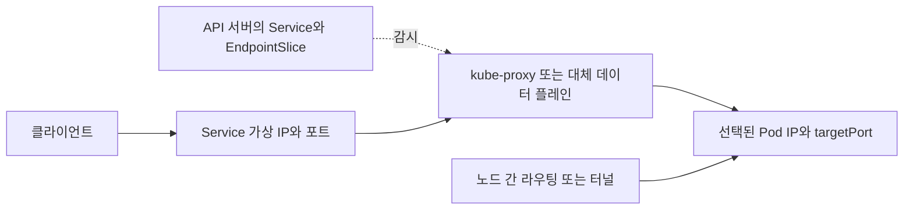

## 1. 제어 정보와 실제 패킷 경로를 구분한다

기준은 Kubernetes 1.34의 일반 Pod 네트워크다. CNI(Container Network Interface, 컨테이너 네트워크 인터페이스)는 네트워크 플러그인 연결 규약이며 구체적인 라우팅·터널·정책은 구현에 달린다. Kubernetes 네트워크 모델에서 Pod끼리 주소를 통해 통신할 수 있지만 NetworkPolicy(네트워크 정책), 외부 방화벽, 구현 설정이 허용한다는 전제가 있다. hostNetwork 등 예외도 별도로 본다.

Service는 변하는 백엔드 집합 앞의 안정된 접근점을 제공한다. Pod IP를 직접 호출할 수 있으면 Service 없이도 통신 가능하지만, 재생성으로 주소가 바뀌는 문제와 백엔드 발견을 애플리케이션이 떠안는다.



EndpointSlice는 패킷이 통과하는 프록시가 아니다. 백엔드 주소·포트·조건 등의 제어 정보이며 구현이 이를 규칙으로 반영한다. iptables 모드의 kube-proxy도 매 요청을 사용자 공간에서 직접 중계하는 서버로 생각하지 않는다. 대체 데이터 플레인은 kube-proxy 없이 Service 기능을 구현할 수 있다.

## 2. 일반 Service의 경로와 예외

Selector(선택 조건)에 맞는 Pod가 변경되면 컨트롤러가 EndpointSlice를 갱신한다. 가상 IP와 포트의 트래픽은 구현된 전달 규칙에 따라 적합한 백엔드로 간다. 연결 추적 때문에 HTTP 요청마다 백엔드가 균등하게 바뀐다고 보장할 수 없으며 긴 연결은 한 Pod에 부하를 집중시킬 수 있다.

```yaml
apiVersion: v1
kind: Service
metadata:
  name: card-api
spec:
  selector:
    app: card-api
  ports:
    - name: http
      port: 80
      targetPort: 8080
```

클라이언트는 Service 80 포트로 연결하고 백엔드 프로세스는 Pod에서 8080으로 실제 수신해야 한다. containerPort 선언만으로 소켓이 열리는 것은 아니다. 이름형 targetPort라면 Pod의 해당 이름과도 맞아야 한다.

| 경우 | 차이 | 확인 |
|---|---|---|
| 일반 ClusterIP | 안정된 가상 IP | 주소군·포트·Endpoint 조건 |
| Headless Service | clusterIP: None, 일반 VIP 전달 경로 없음 | DNS의 백엔드 응답과 클라이언트 선택 |
| Selector 없는 Service | 자동 Pod 선택에 의존하지 않음 | 수동 또는 별도 관리 EndpointSlice |
| ExternalName | DNS 이름 별칭 | 백엔드 Pod 프록시로 오해하지 않기 |

Readiness(트래픽 수신 준비)는 백엔드 선택에 영향을 주지만, API 상태 변경과 모든 데이터 플레인 규칙 반영이 동시인 것은 아니다. 종료 중 연결 처리, `publishNotReadyAddresses`, 로컬 트래픽 정책에 따라 단순히 ready Pod 목록만 보고 결론 내리기 어렵다.

## 3. 외부 노출 방식 선택

| 방식 | 주요 요구 | 필요한 구현 |
|---|---|---|
| LoadBalancer Service | 외부 주소에서 포트 기반 서비스 노출 | 환경의 LB 컨트롤러·로드밸런서 지원 |
| Ingress | 호스트·경로 기반 HTTP(S) 라우팅 | Ingress 컨트롤러와 해당 클래스 |
| Gateway API | Gateway/Route 역할 분리와 표현력 있는 라우팅 | 설치된 API와 기능을 지원하는 컨트롤러 |

Ingress는 Service 타입이 아니다. Gateway API의 지원 프로토콜과 기능은 Route 종류·버전·구현에 따라 다르므로 “항상 모든 L4/L7 기능을 제공한다”고 말하지 않는다. Ingress 리소스를 만든다고 실제 프록시가 자동 설치되지도 않는다.

외부 프록시가 Service VIP를 통해 가는지 Endpoint를 직접 사용하는지는 구현에 달린다. 인증서 종료 위치, 원본 클라이언트 IP 보존, 신뢰할 프록시 헤더, 비용과 운영 소유권을 함께 결정한다. 내부 Service가 정상이어도 외부 경로의 DNS·인증서·Listener·라우트가 잘못되면 접근은 실패한다.

## 4. 통신 실패를 비교 실험으로 좁힌다

```bash
kubectl get service card-api -o yaml
kubectl get endpointslices -l kubernetes.io/service-name=card-api -o yaml
kubectl get pods -l app=card-api -o wide
kubectl get networkpolicy
```

동일한 클라이언트 Pod·네임스페이스·주소군에서 비교한다. 다른 위치의 노트북에서 Pod IP가 안 된다는 사실은 클러스터 내부 경로 실패의 증거가 아니다.

1. DNS 이름이 어떤 주소와 주소군으로 해석되는지 확인한다.
2. Endpoint 주소·포트와 ready/serving/terminating 조건을 실제 Pod 수신 포트와 대조한다.
3. 같은 출발점에서 Pod IP와 Service IP를 각각 호출해 서비스 전달 계층과 Pod 경로를 분리한다.
4. 같은 노드와 다른 노드의 Pod 경로를 비교해 노드 간 라우팅·터널·MTU(최대 전송 단위)를 좁힌다.
5. 출발 Pod의 egress와 도착 Pod의 ingress 정책, 네트워크 구현의 집행 여부, 외부 방화벽을 확인한다.

> **실무 함정**
>
> NetworkPolicy는 이를 집행하는 구현이 필요하다. 여러 정책의 허용 규칙은 합쳐지며 기본 격리 여부와 양쪽 방향을 확인한다. 정책 객체 하나가 존재한다는 사실만으로 모든 트래픽이 막힌다고 판단하지 않는다.

## 참고 자료

- [Kubernetes 1.34 Service](https://v1-34.docs.kubernetes.io/docs/concepts/services-networking/service/)
- [Kubernetes 1.34 EndpointSlice](https://v1-34.docs.kubernetes.io/docs/concepts/services-networking/endpoint-slices/)
- [Kubernetes 1.34 NetworkPolicy](https://v1-34.docs.kubernetes.io/docs/concepts/services-networking/network-policies/)
- [Kubernetes 1.34 Gateway API](https://v1-34.docs.kubernetes.io/docs/concepts/services-networking/gateway/)

패킷 캡처·CNI별 장애 재현은 이 문서 검수와 별도다.
