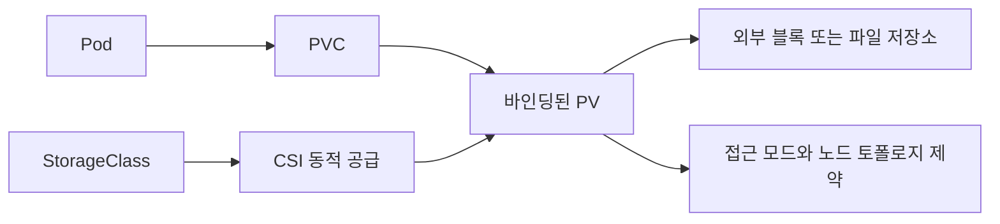

## 1. Pod와 저장소는 수명이 다르다

기준은 **Kubernetes 1.34와 CSI(Container Storage Interface, 컨테이너 저장소 인터페이스) 기반 영속 저장소**다. PVC(PersistentVolumeClaim, 영속 볼륨 요청)는 용량·접근 모드 등을 요청하고 PV(PersistentVolume, 영속 볼륨)는 공급된 저장소를 표현한다. StorageClass(저장소 클래스)는 프로비저너·정책·바인딩 시점 등을 정의한다.

Pod가 없어져도 PVC와 외부 저장소가 남아 있으면 새 Pod가 같은 요청을 통해 데이터를 사용할 수 있다. 이것은 저장 계층의 내구성·백업·복제를 자동으로 보장한다는 뜻이 아니다. `emptyDir`처럼 Pod 수명에 연결된 저장소와 구분한다.



| 대상 | 책임 | 보장하지 않는 것 |
|---|---|---|
| PVC | 요청과 PV 바인딩 | 애플리케이션 데이터 복제 |
| PV | 외부 볼륨 참조·접근/회수 정책 | 모든 노드에서 즉시 재연결 |
| StorageClass | 공급 정책과 바인딩 시점 | 드라이버 미지원 기능 |
| StatefulSet | 안정적인 Pod 식별·저장소 연결 | DB 리더 선출·데이터 동기화 |

## 2. RWO는 한 Pod라는 뜻이 아니다

| 접근 모드 | 의미 | 적용 주의 |
|---|---|---|
| ReadWriteOnce, RWO | 한 노드에서 읽기/쓰기 마운트 | 같은 노드의 여러 Pod가 접근할 수 있음 |
| ReadOnlyMany, ROX | 여러 노드에서 읽기 전용 마운트 | 드라이버 지원과 실제 권한 정책 확인 |
| ReadWriteMany, RWX | 여러 노드에서 읽기/쓰기 마운트 | 애플리케이션의 동시 쓰기 정합성은 별도 |
| ReadWriteOncePod, RWOP | 클러스터에서 한 Pod의 읽기/쓰기 사용 | CSI 볼륨과 필요한 드라이버 구성 확인 |

RWO를 여러 노드의 공유 디스크로 사용하면 다중 연결 오류나 마운트 대기가 생길 수 있다. 반대로 RWO를 한 Pod의 독점 락으로 믿으면 같은 노드에서 경쟁 쓰기가 발생할 수 있다. RWX도 같은 파일을 여러 DB 프로세스가 안전하게 갱신하게 해주지는 않는다.

> **면접 포인트**
>
> 접근 모드는 파일 권한·분산 락·DB 복제 프로토콜을 대체하지 않는다. 단일 작성자 제약이 필요하면 RWOP 지원과 애플리케이션의 소유권·장애 복구를 함께 검토한다.

## 3. Zone과 바인딩 시점

Zone(가용 영역)에 종속된 디스크는 해당 저장소가 지원하는 토폴로지에 맞는 노드가 필요하다. 새 Pod가 다른 Zone에 배치됐다고 데이터가 자동으로 복사되지 않는다. 로컬 PV는 특정 노드에 종속될 수 있어 같은 Zone의 다른 노드도 충분하지 않다.

StorageClass의 `Immediate`는 PVC 생성 시 공급·바인딩을 진행할 수 있다. `WaitForFirstConsumer`는 소비 Pod의 배치 조건을 고려할 때까지 바인딩·공급을 미뤄 영역 불일치를 줄인다. 저장소 용량 부족이나 다른 배치 제약을 해결하는 만능 옵션은 아니다.

```text
진단 순서:
PVC Pending -> StorageClass / 공급 이벤트 / 소비 Pod 대기 확인
Pod Pending -> PV nodeAffinity / Pod affinity / 가용 노드 자원 확인
Attach 실패 -> 이전 연결 상태 / 드라이버 / 외부 볼륨 상태 확인
Mount 실패 -> 파일시스템 / 권한 / 노드 및 드라이버 이벤트 확인
```

노드 장애 후에는 기존 작성자의 중단 확인, 이전 연결 해제, 새 연결·마운트, 애플리케이션 로그 복구까지 시간이 든다. 살아 있는 작성자를 확인하지 않고 강제로 새 인스턴스를 열면 저장 시스템이 동시 접근을 막더라도 애플리케이션의 분할 뇌 위험을 별도로 관리해야 한다.

## 4. StatefulSet의 복제 수는 데이터 복제 수가 아니다

이름 `orders-db`의 StatefulSet에 `data` 템플릿을 두면 보통 `data-orders-db-0`, `data-orders-db-1`처럼 Pod 식별자별 PVC가 생성된다. 같은 식별자의 대체 Pod는 기존 PVC를 다시 사용한다.

```yaml
# StatefulSet spec의 일부. 실제로는 serviceName·selector·Pod template도 필요하다.
replicas: 3
persistentVolumeClaimRetentionPolicy:
  whenDeleted: Retain
  whenScaled: Retain
volumeClaimTemplates:
  - metadata:
      name: data
    spec:
      accessModes: ["ReadWriteOnce"]
      resources:
        requests:
          storage: 20Gi
```

가상으로 3개 복제본이면 각각 최소 20Gi 요청이므로 총 요청은 60Gi다. 데이터가 세 PVC에 자동 복제되지는 않는다. DB 복제·쿼럼·초기 동기화·리더 교체는 애플리케이션이나 Operator(운영 제어기)가 담당한다. 위 예제의 StorageClass 생략은 클러스터 기본값에 의존하므로 운영에서는 실제 선택을 확인한다.

`volumeClaimTemplates`는 문서의 질문에서 말하는 템플릿에 대응하는 실제 필드명이다. 축소 후 다시 늘릴 때 기존 PVC를 재사용할 수 있지만 데이터의 시대와 클러스터 멤버십이 맞는지도 검사해야 한다.

## 5. 삭제·확장·백업은 각각 다른 정책이다

StatefulSet의 PVC 보존 정책과 PV의 Reclaim Policy(회수 정책)는 구분한다. `whenDeleted`/`whenScaled`는 해당 상황에서 PVC를 보존할지 결정한다. PVC가 삭제되면 PV의 `Retain`/`Delete` 및 공급자 동작에 따라 외부 저장소 수명이 달라진다. 기본 보존을 믿고 운영 삭제 경로 전체를 생략하지 않는다.

확장은 StorageClass의 허용과 드라이버·파일시스템 지원이 필요하며 PVC 요청을 늘리는 경로를 따른다. 마운트 상태 확장 가능 여부와 완료 상태를 확인한다. 용량 축소는 일반적인 PVC 확장 기능으로 지원되는 것으로 가정하지 않는다.

Crash-consistent Snapshot(장애 시점 수준 스냅샷)은 정상 커밋 경계에서의 애플리케이션 일관성을 항상 보장하지 않는다. DB 로그 복구·여러 볼륨의 동일 시점·외부 객체 저장소 참조를 고려한다. 필요한 경우 애플리케이션 백업 절차와 로그 보관을 함께 사용한다.

> **실무 함정 — 복제는 백업이 아니다**
>
> 실수로 삭제한 데이터가 복제본에도 반영될 수 있다. 별도 위치의 백업과 복원 테스트를 두고 RPO(복구 시 허용 데이터 손실)·RTO(복구 시간 목표)를 실제 복원으로 측정한다. Pod 재시작 성공만으로 저장소 복구를 검증했다고 말하지 않는다.

## 참고 자료

- [Kubernetes 1.34 Persistent Volumes](https://v1-34.docs.kubernetes.io/docs/concepts/storage/persistent-volumes/)
- [Kubernetes 1.34 StatefulSet](https://v1-34.docs.kubernetes.io/docs/concepts/workloads/controllers/statefulset/)
- [Kubernetes 1.34 StorageClass](https://v1-34.docs.kubernetes.io/docs/concepts/storage/storage-classes/)

이 예제는 개념 검수용이며 실제 CSI 드라이버의 장애·백업 복원 시험은 수행하지 않았다.
