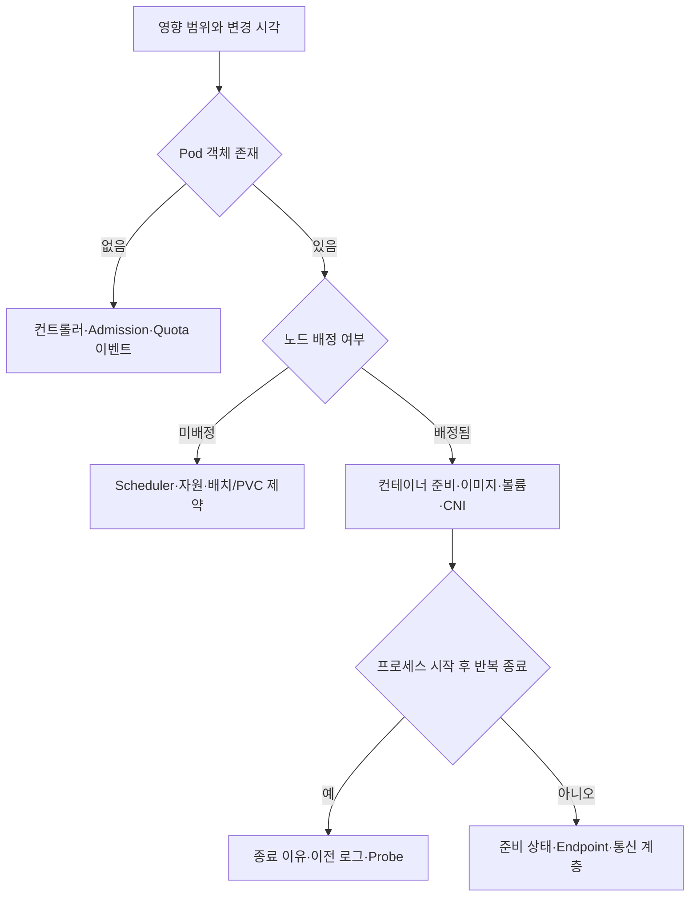

## 1. Phase와 화면의 STATUS는 같은 값이 아니다

기준은 Kubernetes 1.34다. Pod의 Phase(수명 단계)는 Pending, Running, Succeeded, Failed, Unknown 같은 상위 요약이다. `ContainerCreating`, `CrashLoopBackOff`, `ImagePullBackOff`는 컨테이너 상태나 kubectl 화면의 이유 표시이며 독립 Pod Phase가 아니다. Pending에는 스케줄링 대기뿐 아니라 컨테이너 준비 시간도 포함될 수 있다.



## 2. R1 — “Pending이면 서버를 늘리면 되나요?”

**답변 예시:** “먼저 spec.nodeName과 PodScheduled 조건, 이벤트를 봅니다. 미배정이면 요청 자원이 노드 Allocatable에 맞는지, Taint/Toleration·Affinity·Topology·PVC 바인딩 제약을 확인합니다. 이미 노드가 배정됐다면 이미지·볼륨·네트워크 준비 문제일 수 있습니다. Pod 자체가 없다면 ReplicaSet 이벤트와 Admission 거절부터 봅니다.”

```bash
kubectl describe deployment card-api
kubectl describe replicaset <replicaset-name>
kubectl describe pod <pod-name>
kubectl get pod <pod-name> -o yaml
kubectl get pvc
```

가상 노드 4개에 각각 CPU 1개씩 여유가 있어도 CPU 2개를 요청하는 Pod 하나를 쪼개 넣을 수는 없다. 총합 여유와 한 노드에 맞는지를 구분한다. 클러스터 확장도 맞는 노드 종류·영역·상한·공급이 있어야 진행된다.

| 증거 | 가설 | 다음 확인 |
|---|---|---|
| FailedScheduling, Insufficient cpu | 요청량을 수용할 노드 없음 | 노드별 요청 합계·확장 가능성 |
| untolerated taint | 허용되지 않은 노드 | Taint 목적과 Pod 정책 |
| volume node affinity conflict | 저장소 영역과 배치 충돌 | PV 토폴로지·StorageClass |
| Pod 없음, FailedCreate | Admission·Quota 등 생성 거절 | 컨트롤러 이벤트·정책 |
| nodeName 존재, 이미지 오류 | 노드 배정 후 준비 실패 | 이미지 주소·권한·레지스트리 |

**후속 압박:** “Toleration을 전부 허용하면 되죠?”

격리 목적의 노드나 장애 노드에 업무를 잘못 배치할 수 있다. 이벤트가 가리키는 의도를 확인하고 필요한 범위만 수정한다. Quota 거절을 Scheduler 자원 부족으로 혼동하지 않는다.

## 3. R2 — “CrashLoopBackOff에서 로그가 비어 있습니다”

**답변 예시:** “재시작 횟수, containerStatuses의 state와 lastState, 종료 코드와 이유를 봅니다. 현재 인스턴스가 아직 시작 중이면 현재 로그만으로 이전 실패를 알 수 없으므로 --previous도 수집합니다. 여러 컨테이너면 -c로 대상을 명시합니다. 로그가 없으면 실행 명령·설정·종료 신호·OOM·Probe 이벤트를 확인합니다.”

```bash
kubectl logs <pod-name> -c <container-name> --timestamps
kubectl logs <pod-name> -c <container-name> --previous --timestamps
kubectl describe pod <pod-name>
```

`--previous`는 보존된 이전 인스턴스 로그이며 모든 과거 재시작 로그를 복원하지 않는다. 이벤트·노드 로그·중앙 로그의 보존 시간을 확인한다. 토큰이나 환경 비밀을 진단 출력에 무분별하게 포함하지 않는다.

Exit Code 137만으로 OOM을 확정하지 않는다. 강제 종료도 같은 코드가 될 수 있으므로 종료 이유·메모리 시계열·노드 상태를 함께 본다. 프로세스가 정상 코드 0으로 바로 끝나도 `restartPolicy: Always`인 지속 서비스에서는 재시작이 반복될 수 있다.

Readiness 실패는 보통 트래픽 수신 준비를 내리는 것이며 그것만으로 컨테이너를 재시작하지 않는다. Liveness/Startup Probe 실패는 임계값에 따라 재시작을 유발할 수 있다. 느린 초기화를 Liveness 실패로 오인하면 시작을 끝내지 못하는 루프가 된다.

**후속 압박:** “Probe를 지우고 Limit을 올리면 끝 아닌가요?”

임시 완화와 원인 해결을 구분한다. 이전 정상 리비전과 설정 차이를 비교하고, 스키마·외부 계약과 롤백 호환성을 확인한다. 한 번에 한 가설을 바꾼 뒤 재시작·오류·지연·준비 시간을 측정한다.

## 4. R3 — “DNS는 되는데 Service 연결이 안 됩니다”

DNS 성공은 이름에서 주소를 얻었다는 뜻일 뿐 서버가 수신하거나 정책이 허용한다는 증거가 아니다. 같은 출발 Pod에서 다음 순서로 비교한다.

```bash
kubectl get service card-api -o yaml
kubectl get endpointslices -l kubernetes.io/service-name=card-api -o yaml
kubectl get pods -l app=card-api -o wide
kubectl get networkpolicy
```

**답변 예시:** “Service port/targetPort, selector, EndpointSlice 주소와 조건을 먼저 확인합니다. 동일 클라이언트에서 백엔드 Pod IP 직접 연결과 Service IP 연결을 비교합니다. Pod도 실패하면 수신 주소·포트·NetworkPolicy·CNI 경로를, Service만 실패하면 kube-proxy 또는 대체 규칙과 연결 추적을 봅니다. 같은 노드와 다른 노드 결과를 비교해 범위를 줄입니다.”

| 결과 | 다음 가설 | 주의 |
|---|---|---|
| Endpoint 없음 | selector·준비 상태·별도 관리 누락 | Headless/selector 없는 Service 차이 |
| Pod IP도 거절 | 수신 프로세스·포트·주소 | localhost만 바인딩했는지 |
| Pod IP도 시간 초과 | 정책·경로·방화벽 | 출발 egress와 도착 ingress 모두 |
| Pod 성공, Service 실패 | VIP 규칙·정책·주소군 | 항상 kube-proxy만 원인이라고 단정 금지 |
| 내부 성공, 외부 실패 | LB·Ingress/Gateway·TLS | 실제 프록시의 백엔드 연결 경로 확인 |

EndpointSlice는 제어 정보이며 패킷이 지나가는 서버가 아니다. 테스트 대상과 시점을 고정해야 갱신 중 Endpoint나 서로 다른 클라이언트 정책으로 잘못 비교하는 일을 줄인다.

## 5. 증거를 보존하고 복구 결과를 확인한다

> **면접 포인트**
>
> 정상 상태로 바뀐 Pod 수만 보지 말고 실제 요청 성공률·원래 지연·데이터 처리 누락을 확인한다. 한 Pod/노드/영역/전체 중 영향 범위를 기록하고 변경 시각, 리비전, 이벤트, 종료 이유, 연결 비교 결과를 담당 계층에 전달한다. 근거 없는 전체 재시작은 일시 회복과 함께 원인 증거를 지울 수 있다.

## 참고 자료

- [Kubernetes 1.34 Pod 수명](https://v1-34.docs.kubernetes.io/docs/concepts/workloads/pods/pod-lifecycle/)
- [Kubernetes 1.34 Pod 진단](https://v1-34.docs.kubernetes.io/docs/tasks/debug/debug-application/debug-pods/)
- [Kubernetes 1.34 Service](https://v1-34.docs.kubernetes.io/docs/concepts/services-networking/service/)
- [Kubernetes 1.34 Probe](https://v1-34.docs.kubernetes.io/docs/concepts/configuration/liveness-readiness-startup-probes/)

명령은 진단 예시이며 실제 클러스터 장애 주입 결과는 아니다.
