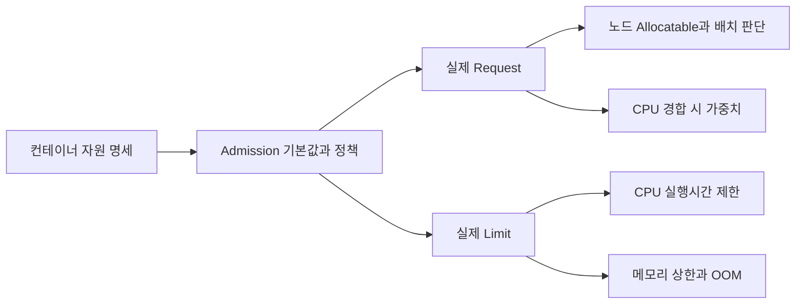

## 1. 배치 기준과 실행 제어를 구분한다

기준은 **Kubernetes 1.34, Linux의 일반 컨테이너별 자원 설정**이다. Pod 수준 자원, CPU Manager의 전용 CPU, MemoryQoS 등은 설정과 기능 상태를 별도로 확인한다. 아래 수치는 학습용이다.

Request(요청량)는 Scheduler(배치기)가 노드의 Allocatable(파드에 배정 가능한 자원)과 비교하는 값이다. 실제 사용량이 지금 낮다는 이유로 요청량 합계를 넘는 Pod를 배치하지 않는다. 실제 배치는 CPU·메모리 외에도 위치 제약·스토리지·확장 자원에 영향을 받는다.

Limit(제한량)은 실행 중 상한이다. CPU 요청 500m는 CPU 시간 0.5개에 해당하며 특정 코어 절반을 독점한다는 뜻이 아니다. 요청량은 CPU 경합 시 상대 가중치에도 영향을 주고, 여유가 있으면 요청보다 더 사용할 수 있다. CPU Limit이 있으면 그 상한이 추가된다.



| 설정 | 역할 | 실패 신호 |
|---|---|---|
| CPU Request | 배치·경합 가중치·사용률 기반 HPA의 분모 | Pending, CPU 경합, 예상과 다른 확장 |
| CPU Limit | CPU 시간 상한 | Throttling(실행 제한)과 지연 증가 |
| Memory Request | 배치와 메모리 압박 시 축출 판단 요소 | 과밀 배치·노드 압박 |
| Memory Limit | 커널의 메모리 상한 | OOM 종료 가능 |

Limit만 지정하고 Request를 생략하면 Admission(입장 처리) 기본값이 없는 경우 해당 Limit이 Request로 복사될 수 있다. 원본 YAML만 보지 말고 실제 생성된 Pod와 LimitRange 정책을 확인한다.

## 2. CPU 제한과 메모리 종료는 다르게 관측한다

CPU는 실행 시간을 지연시킬 수 있어 상한을 넘는 수요를 Throttling으로 제어한다. 노드 전체 CPU가 남아 있어도 컨테이너의 제한 시간 예산을 소진하면 지연될 수 있다. CPU Limit을 없애는 정책은 순간 부하에 유리할 수 있지만 이웃 작업과의 경합·조직 정책을 검토해야 한다.

메모리는 이미 사용한 페이지를 CPU 시간처럼 단순히 나중으로 미룰 수 없다. 회수가 충분하지 않아 제한을 만족하지 못하면 커널이 프로세스를 종료할 수 있다. Memory Limit은 순간 초과를 항상 사전에 차단하는 예약 장치가 아니며, `OOMKilled`와 노드 압박에 따른 Eviction(축출)은 서로 다른 경로다.

```yaml
# 지연 민감 API의 학습용 예. CPU Limit 부재는 모든 업무의 권장값이 아니다.
resources:
  requests:
    cpu: "500m"
    memory: "512Mi"
  limits:
    memory: "768Mi"
```

이 예는 일반 컨테이너별 QoS(Quality of Service, 서비스 품질 등급) 규칙에서 Burstable이다. CPU와 메모리의 Request/Limit이 모든 해당 컨테이너에서 설정되고 서로 같아야 Guaranteed 조건을 만족한다. 둘 다 전혀 없는 경우는 BestEffort다. 보조 컨테이너 설정도 확인한다.

> **실무 함정 — Guaranteed는 종료 면제권이 아니다**
>
> 메모리 상한 초과나 충분히 심한 노드 압박에서 종료될 수 있다. 일반적인 노드 압박 축출은 요청 초과 여부·Pod 우선순위·요청 대비 사용량 등을 고려하므로 등급 이름 하나로 정확한 순서를 단정하지 않는다.

## 3. 평균 Request가 노드를 과밀하게 만드는 예

가상 노드의 메모리 Allocatable이 8Gi이고 각 Pod가 512Mi를 요청하면 메모리 요청 합계만으로는 16개다. 이는 CPU·다른 파드·오버헤드를 제외한 상한 계산이다. 각 Pod가 동시에 768Mi 가까이 쓰면 총 12Gi 수요가 생긴다. 스케줄러는 Request 초과 사용까지 모두 미리 확보하지 않는다.

JVM(Java Virtual Machine, 자바 가상 머신) Heap을 768Mi 상한과 같게 두면 스레드 스택·직접 버퍼·메타데이터·네이티브 메모리의 여유가 사라진다. 메모리 기반 emptyDir와 페이지 캐시 등 자원 계정도 확인하고, 단일 RSS 지표만 컨테이너 전체 비용으로 동일시하지 않는다.

평균만이 아니라 시작 구간, 캐시 준비, GC(Garbage Collection, 가비지 수집), 동시 요청, 재시도 폭주를 포함해 측정한다. 높은 분위수도 관측하지 않은 최악 상황을 보장하지 않는다. Request를 높이면 과밀 위험을 줄일 수 있지만 배치 가능한 수와 비용이 달라진다.

## 4. HPA의 분모가 Request다

HPA(Horizontal Pod Autoscaler, 수평 파드 자동 확장)의 CPU 사용률 기반 지표는 요청량 대비 사용량을 이용한다. 가상의 Pod 4개가 각각 300m를 사용하고 Request가 500m면 사용률 60%다. 목표 60%에서는 단순 계산상 4개다. 같은 실제 사용량에 Request만 250m로 낮추면 120%가 되어 단순 계산은 8개다.

```text
단순화한 사용률 기반 계산:
desired = ceil(current_replicas × current_utilization / target_utilization)
4 × (120 / 60) = 8
```

실제 HPA에는 허용 오차·준비되지 않은 Pod·누락 지표·안정화 구간·증감 정책이 있다. 필요한 Request가 없으면 사용률을 정의하지 못하는 경우도 있다. 자원 요청 권고를 적용할 때 수평 확장 목표와 함께 검토한다. 절대값이나 외부 큐 지표를 쓰는 HPA는 이 분모 설명과 구분한다.

HPA가 복제 수를 늘려도 노드 여유가 없으면 Pending이 된다. 노드 확장 시간, 이미지 다운로드, 시작 피크, 한 노드 장애 때 재배치와 롤링 배포의 추가 Pod 공간까지 용량 계획에 포함한다.

## 5. 진단 순서와 변경 검증

```bash
kubectl describe pod <pod-name>
kubectl get pod <pod-name> -o yaml
kubectl describe node <node-name>
kubectl describe hpa <hpa-name>
kubectl top pod <pod-name> --containers
```

이 명령은 관측의 시작이다. `top`은 순간 요약이며 과거 피크·Throttling·재시작 직전 메모리를 충분히 보여주지 않는다. 실제 Pod의 기본값, 종료 이유와 이전 로그, 노드 압박 이벤트, CPU 제한 시간 지표, 메모리 시계열, HPA 조건을 연결한다.

| 증상 | 먼저 분리할 원인 | 변경 검증 |
|---|---|---|
| Pending | 요청량·위치 제약·가용 노드 | 장애/배포 중에도 배치 가능한가 |
| 지연 상승 | CPU 제한·경합·외부 대기 | 같은 부하에서 꼬리 지연과 제한 시간 |
| OOMKilled | 상한·누수·시작 피크·네이티브 사용 | 재시작 반복과 메모리 여유 |
| Evicted | 노드 압박·요청 초과·우선순위 | 이웃 Pod와 노드 전체 수요 |

> **면접 포인트**
>
> “Limit을 두 배로 올린다”보다 어떤 자원 계층에서 실패했는지 먼저 설명한다. 요청량·상한·복제 수·노드 여유를 함께 바꾸면 원인 추적이 어려우므로 가설별 변경과 동일 부하 검증을 남긴다. 이 카드의 설정은 실제 클러스터에서 부하 검증된 값이 아니다.

## 참고 자료

- [Kubernetes 1.34 자원 관리](https://v1-34.docs.kubernetes.io/docs/concepts/configuration/manage-resources-containers/)
- [Kubernetes 1.34 Pod QoS](https://v1-34.docs.kubernetes.io/docs/concepts/workloads/pods/pod-qos/)
- [Kubernetes 1.34 노드 압박 축출](https://v1-34.docs.kubernetes.io/docs/concepts/scheduling-eviction/node-pressure-eviction/)
- [Kubernetes 1.34 HPA](https://v1-34.docs.kubernetes.io/docs/tasks/run-application/horizontal-pod-autoscale/)
