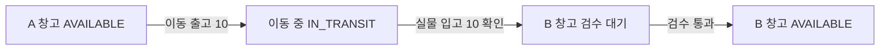

## 1. 원장은 수량과 원인을 함께 보존한다

Inventory Ledger(재고 원장)는 입고·예약·이동·출고·조정의 근거를 변경 이력으로 남긴다. 이 카드의 Double Entry(이중기입)는 **수량 이동에 대한 학습용 모델**이며 재무 회계 원장의 차변·대변 규칙을 그대로 주장하지 않는다.

동일 SKU·소유자·기준 단위의 이동은 출발 계정 음수와 도착 계정 양수로 기록한다. 합계 0만으로 정확성이 충분하지 않다. 잘못된 창고로 옮겨도 합계는 0이고, 중복 거래도 각각 균형을 이룰 수 있다. 유효한 계정·양수 이동량·중복 업무 키·재고 하한을 별도로 검사한다.

| 계정·수량 | 의미 | 주의 |
|---|---|---|
| AVAILABLE | 판매·예약 가능한 보유량 | 격리·예약분을 다시 포함하지 않음 |
| RESERVED | 주문에 점유된 보유량 | 예약 해제·확정의 경쟁 제어 |
| IN_TRANSIT | 창고 간 운송 중 | A에서도 B에서도 판매 가능으로 중복 계산 금지 |
| QUARANTINE | 검수·불량 판단 대기 | 실물은 있지만 판매 불가 |
| EXTERNAL / LOSS | 입출고·손실의 상대 계정 | 내부 On-hand 합계에 포함하지 않음 |

On-hand(현장 보유량)의 포함 계정과 소유권을 명시한다. AVAILABLE과 RESERVED 사이 이동은 물리 총량을 바꾸지 않는다. 고객 출고는 내부 보유량을 줄이지만 외부 상대 계정을 포함한 전체 기입은 균형을 유지할 수 있다.

## 2. A에서 B로 10개는 출고와 입고 두 사건이다



출발 때 A -10/B +10을 바로 기록하면 아직 도착하지 않은 상품을 B에서 판매할 수 있다. 각 사건은 같은 Journal ID(원장 거래 ID)의 두 기입으로 원자 처리하되, 실제 출고와 실제 입고는 서로 다른 업무 거래로 기록한다. 일부 8개만 도착하면 8개 입고와 남은 2개의 이동 중·분실 조사를 분리한다.

다음 PostgreSQL 스키마는 단일 SKU의 두 계정 이동을 **한 행**에 저장해 한쪽 기입만 저장되는 구조를 피하는 예다. 여러 차변·대변을 지원하는 범용 원장은 별도 게시 검증이 필요하다.

```sql
CREATE TABLE inventory_transfer (
  transaction_id UUID PRIMARY KEY,
  business_key TEXT NOT NULL UNIQUE,
  sku_id TEXT NOT NULL,
  owner_id TEXT NOT NULL,
  uom TEXT NOT NULL,
  from_account TEXT NOT NULL,
  to_account TEXT NOT NULL,
  quantity NUMERIC(18,3) NOT NULL CHECK (quantity > 0),
  occurred_at TIMESTAMPTZ NOT NULL,
  recorded_at TIMESTAMPTZ NOT NULL DEFAULT clock_timestamp(),
  reason TEXT NOT NULL,
  reverses_transaction_id UUID REFERENCES inventory_transfer(transaction_id),
  CHECK (from_account <> to_account)
);
CREATE VIEW inventory_entry AS
SELECT transaction_id, business_key, sku_id, owner_id, uom,
       from_account AS account, -quantity AS quantity_delta
FROM inventory_transfer
UNION ALL
SELECT transaction_id, business_key, sku_id, owner_id, uom,
       to_account AS account, quantity AS quantity_delta
FROM inventory_transfer;
```

하나의 업무 키를 각 Entry에 UNIQUE로 부여하면 두 번째 기입이 충돌한다. 업무 키는 위와 같이 거래 헤더에 두거나 Entry는 `(transaction_id, line_no)`로 구분한다. 같은 업무 키·다른 수량 요청은 성공한 중복으로 숨기지 말고 기존 요청과 비교해 거절한다.

이 최소 스키마는 음수 재고 방지·계정 유효성·쓰기 권한까지 구현하지 않는다. 실제 게시 경로는 계정 참조와 기준 단위를 검증하고, 잔액 조건부 갱신·원장 기록·Outbox를 같은 거래로 묶는다. 애플리케이션 역할의 직접 UPDATE/DELETE를 제한하고, 잘못된 게시도 감사 대상이다. 일반 CHECK 제약으로 다른 여러 행의 합계를 검증할 수 있다고 가정하지 않는다.

## 3. Snapshot 기준점은 단순 MAX ID가 아니다

Snapshot(잔액 스냅샷)은 `(sku, owner, location, bucket, uom)`별 잔액과 처리 기준점을 함께 저장한다. 정렬 가능한 UUID나 시각만으로 전체 커밋 순서를 만들 수 없다.

```text
T1: sequence 101을 할당받고 아직 미커밋
T2: sequence 102를 할당받고 먼저 COMMIT
Snapshot: 현재 보이는 행을 합산하고 watermark=102 저장
T1: 뒤늦게 COMMIT
증분 조회 WHERE sequence > 102: 101을 영원히 놓침
```

PostgreSQL Sequence(번호 생성기)는 롤백 때 번호를 되돌리지 않으며, 번호 할당 순서와 커밋 순서는 다를 수 있다. `occurred_at`도 늦게 수신된 실물 사건 때문에 기준점으로 안전하지 않다.

| 방법 | 안전한 처리 경계 | 비용·주의 |
|---|---|---|
| 게시 시 동기 잔액 갱신 | 원장과 잔액을 같은 DB 거래로 변경 | 인기 SKU의 잔액 행 경합 |
| 파티션별 순차 소비 | 로그의 확정된 소비 위치와 잔액을 같은 거래로 저장 | 파티션별 기준점 벡터, 재처리 중복 방지 |
| 일관 스냅샷+변경 캡처 | 스냅샷과 연결된 변경 로그 위치에서 이어받기 | 초기화·로그 보존·도구별 경계 확인 |

파티션별 순서도 관련 기입이 어떻게 게시됐는지 검토한다. 하나의 이동을 두 독립 파티션에 나눠 반영하면 잠시 한쪽만 보일 수 있다. 조회에 요구되는 원자성 범위를 정하고 거래 단위 투영이나 조정된 스냅샷으로 처리한다.

## 4. 실물 대사는 과거 사건과 관측 시점을 맞춘다

Reconciliation(대사)은 원장 합계·잔액·운영 투영·실사 결과를 같은 범위와 기준 시점으로 비교하는 과정이다. 실사 동안 이동이 계속되면 실사 시작/종료 사이 입출고를 반영하거나 해당 구간을 통제한다. 시스템 100개와 실물 98개라는 숫자만으로 곧바로 -2 조정을 게시하지 않는다.

1. 단위·포장 환산, 위치, 소유자, 로트, 미처리 스캔과 중복을 확인한다.
2. 실사 ID, 관측 시간, 담당자, 장비, 증빙과 차이 원인을 저장한다.
3. 승인된 조정 거래를 기존 거래 참조와 함께 게시한다. 원래 기입을 덮어쓰지 않는다.
4. 다시 대사해 차이가 해소됐는지 확인하고 이미 발행된 보고서의 개정 이력을 남긴다.

정정은 잘못된 A→B 거래를 B→A로 상쇄하고 올바른 이동을 새로 게시할 수 있다. 다만 이미 B 재고를 소비했다면 단순 역기입이 현재 가용량 제약과 충돌할 수 있다. 감사 정정과 실물·가용량 복구의 허용 절차를 구분한다. 과거에 발생한 사건을 오늘 기록하면 업무 발생 시각과 기록 시각을 모두 남긴다.

> **면접 포인트 — 원장이 곧 실물의 진실은 아니다**
>
> 원장은 “무엇을 기록했는지”를 검증 가능하게 한다. 누락 스캔·잘못된 식별·분실은 실사와 대사로 찾아야 한다. 균형 합계, 중복 업무, 음수 잔액, 오래된 이동 중 재고를 서로 다른 지표로 본다.

## 참고 자료

- [PostgreSQL 17 Sequence의 트랜잭션 특성](https://www.postgresql.org/docs/17/functions-sequence.html)
- [PostgreSQL 17 CHECK·UNIQUE 제약의 범위](https://www.postgresql.org/docs/17/ddl-constraints.html)
- [GS1 추적성: 식별과 이동 관계 기록](https://www.gs1.org/standards/gs1-global-traceability-standard/current-standard)

계정·이중기입·게시·Snapshot 선택지는 이 카드의 학습용 설계이며 GS1 표준 원장 스키마가 아니다.
