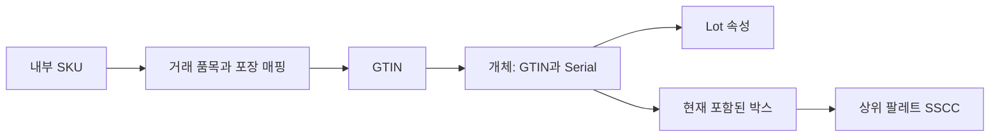

## 1. 식별 값과 표현 수단을 분리한다

SKU(Stock Keeping Unit, 내부 재고 관리 단위)는 회사가 품목을 관리하는 식별자다. Barcode(바코드)는 식별 값과 속성을 기계가 읽도록 표현하는 수단이며, 바코드 그림 자체가 상품의 영구 식별자는 아니다. GTIN(Global Trade Item Number, 국제 거래 품목 번호)은 GS1의 거래 품목 식별 키다.

| 구분 | 식별 범위 | 설계할 키 |
|---|---|---|
| SKU | 내부 판매·재고 품목 | 조직/테넌트 + 내부 ID |
| GTIN | 거래 품목·포장 수준 | 문자열로 보존한 표준 식별 값 |
| Lot/Batch(로트·배치) | 생산·처리 묶음 | 품목·발급 범위를 포함한 로트 키 |
| Serial(시리얼) | 개별 개체 | 표준 범위의 GTIN + 시리얼 등 |
| SSCC(Serial Shipping Container Code, 물류 단위 식별 코드) | 운송·보관을 위한 박스·팔레트·소포 | 물류 단위 키와 포함 관계 |

로트 문자열이나 시리얼 문자열만을 세계적으로 고유한 값으로 가정하지 않는다. 하나의 팔레트는 서로 다른 SKU·로트를 포함할 수 있으며, SSCC가 상품 GTIN을 대체하는 것도 아니다. Lot은 모든 Serial의 필수 부모라는 단일 계층보다 개체의 속성과 물류 포함 관계를 구분하는 편이 정확하다.



## 2. 한 번 스캔이 한 개를 뜻하지 않는다

학습용 예로 내부 SKU가 낱개 재고를 관리하지만 스캔 코드는 낱개·6입 상자·공급사 라벨로 여러 개일 수 있다. 상자를 스캔하면 기준 단위로 6개를 반영해야 한다. 거래 품목의 포장 수준과 환산을 무시하면 재고가 6배 차이 난다.

```text
barcode_mapping:
  issuer_namespace, identifier_type, identifier_value
  internal_sku_id, packaging_level, base_uom, units_per_scan
  valid_from, valid_to, mapping_revision, recorded_at

raw_scan:
  event_id, raw_payload, symbology, occurred_at, received_at
  resolved_identifier, mapping_revision, resolved_quantity
```

같은 코드가 중복 유효 기간에 서로 다른 SKU로 해석되지 않게 한다. 묶음 상품이 여러 SKU의 구성품이라면 단일 `units_per_scan`이 아닌 구성 명세와 개정판이 필요하다. 환산은 정수 개수뿐 아니라 중량·길이 단위의 정밀도도 다룬다.

표준 코드 재사용을 임의로 허용하는 정책을 만들지 않는다. 내부·공급사 코드의 변경이나 잘못된 매핑 정정은 발급 범위·표준 규칙에 맞추고, 과거 스캔에는 당시 적용한 매핑 개정판을 남긴다. 잘못된 매핑을 고쳤다고 과거 재고를 자동 재계산하면 중복 입고가 생길 수 있어 정정·대사가 필요하다.

## 3. GS1 데이터는 고정 길이 숫자 한 덩어리가 아니다

AI(Application Identifier, 응용 식별자)는 GS1 바코드 속성의 의미와 형식을 나타내는 접두어다. 대표적으로 01은 GTIN, 10은 배치/로트, 21은 시리얼, 00은 SSCC다. 이는 AI 인공지능이라는 뜻과 다르다.

```text
사람이 읽는 예시 표기:
(01)09506000134352(10)LOT-A(21)SER-0007

의미:
GTIN = 09506000134352
lot = LOT-A
serial = SER-0007
```

괄호는 사람이 읽는 표기이며 스캐너가 보내는 원문에 그대로 들어온다고 가정하지 않는다. 가변 길이 필드의 구분자와 심볼 종류를 지원하는 파서를 사용한다. 식별 값은 숫자 자료형 변환으로 선행 0을 잃지 않게 문자열로 저장한다. Check Digit(검사 숫자)은 입력 오류 검출을 도울 뿐 진품임을 증명하지 않는다.

원문 파싱, 표준 형식 검증, 내부 매핑, 현재 허용 업무 검증을 분리한다. 형식이 맞는 개체라도 이미 출고됐거나 다른 입고 문서에 등록됐다면 재입고 허용 정책을 따로 확인한다. 알 수 없는 코드를 임의의 기본 SKU로 처리하지 말고 예외 작업대로 보낸다.

## 4. 로트와 시리얼은 회수 범위와 작업 비용의 선택이다

가상의 로트 1,000개 중 문제가 있는 개체가 10개라고 하자. 로트만 추적하면 해당 로트와 연결된 출고 전체를 조사할 수 있다. 시리얼을 모든 필수 단계에서 기록했다면 특정 개체의 경로를 좁힐 수 있지만, 누락·잘못된 집계 관계가 있으면 정밀도가 떨어진다. 시리얼 추적 자체가 “항상 10개만 회수”를 보장하지 않는다.

| 선택 | 운영 부담 | 얻는 정보와 한계 |
|---|---|---|
| 로트 | 묶음 스캔·수량 확인 중심 | 묶음 단위 출처·출고 연결; 개별 위치는 불명확할 수 있음 |
| 시리얼 | 개별 식별·중복·누락 처리 | 개체별 이력; 잘못된 부모 관계와 누락 이동은 대사 필요 |
| 물류 단위 집계 | 포장 시 포함 목록 검증 | 이후 상위 단위 스캔으로 추적 가능하나 개봉·재포장 시 갱신 필수 |

선택은 제품 위험·회수 요구·거래처 계약과 스캔 비용에 따라 정한다. 일반 카드에서 특정 산업의 법적 추적 의무를 임의로 단정하지 않는다.

## 5. 합포장과 분할은 포함 관계의 사건이다

박스 B1의 개체 S1을 B2로 옮길 때 B1의 현재 목록만 덮어쓰면 과거 “어느 박스에 실렸나”를 잃는다. 분리와 추가 사건에 event ID, 발생·기록 시각, 작업자, 장소, 부모·자식, 정정 참조를 남긴다. GS1 EPCIS의 Aggregation(집계) 개념과 연결할 수 있으나 아래는 자체 모델 예다.

```text
09:00 ADD    parent=B1 child=S1
10:00 DELETE parent=B1 child=S1
10:00 ADD    parent=B2 child=S1
11:00 ADD    parent=P1 child=B2
```

같은 시각의 두 관계도 업무 거래 ID와 순서로 연결한다. 현재 포함 관계는 순환할 수 없고 하나의 개체가 동시에 두 물리 박스에 들어갈 수 없다는 제약을 둔다. 중복 스캔은 event ID뿐 아니라 작업 명령과 개체 상태도 검증한다. 수량 단위 비시리얼 상품은 포장 전후 수량 보존과 혼합 로트의 명세를 확인한다.

> **면접 포인트**
>
> 지연 수신·정정 때 발생 시각과 기록 시각을 구분한다. 원문·해석 개정판·포함 관계 이력을 보존해야 과거에 알았던 내용과 나중에 정정한 사실을 각각 재구성할 수 있다. 단순 `barcode → SKU` 테이블 하나로는 충분하지 않다.

## 참고 자료

- [GS1 응용 식별자](https://ref.gs1.org/ai/)
- [GS1 추적성 표준](https://www.gs1.org/standards/gs1-global-traceability-standard/current-standard)
- [GS1 SSCC](https://www.gs1.org/standards/id-keys/sscc)
- [GS1 EPCIS 2.0.1](https://ref.gs1.org/standards/epcis/2.0.1/)
