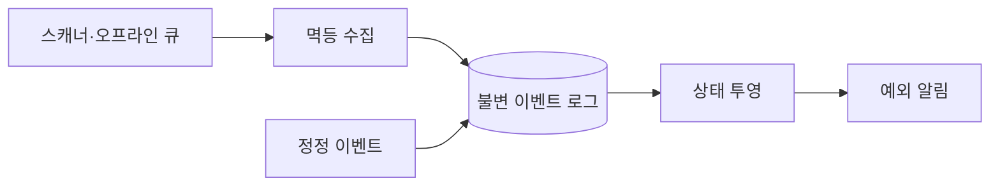

## 1. 원본과 현재 상태를 분리한다

단말은 안정적인 Event ID, 장치 시각, 수집 시각, 작업자와 위치를 보낸다. 원본 이벤트는 추가만 하고 현재 배송 상태는 규칙에 따라 다시 만들 수 있는 투영으로 관리한다.



| 이상 | 판별 단서 | 처리 |
|---|---|---|
| 중복 | 동일 Event ID | 한 번만 반영 |
| 역전 | 업무 단계·장치/수집 시각 | 보류 후 재정렬 |
| 누락 | 허용 상태 전이 위반 | 보정 작업 생성 |
| 오스캔 | 관리자 승인 | 취소·대체 이벤트 추가 |

```json
{"eventId":"device-7:8841","shipmentId":"S1","type":"LOADED","deviceAt":"...","ingestedAt":"..."}
```

> **운영 원칙** — 장치 시각만 신뢰하지 않는다. 시간대 오류와 시계 보정이 있으므로 업무 순서, 시설 이동 가능 시간, 수집 시각을 함께 사용한다.

## 2. 시각 세 개와 순번의 범위

다음은 가상 설계이며 특정 물류사의 운영 규칙이 아니다. `occurred_at`은 현장 발생 시각, `received_at`은 수집 시각, `recorded_at`은 서버가 내구성 있게 저장한 시각이다. 단말 시각은 오차가 있을 수 있고 오프라인 큐는 늦게 전송된다. 같은 시각 필드로 세 의미를 대신하지 않는다.

단말 순번은 `device_id + boot_id + sequence`처럼 재시작 후 재사용을 방지한다. 이는 **그 단말 내부의 순서**이지 화물 전체의 전역 순서가 아니다. 단말 두 대가 스캔한 사건은 시설 이동·업무 단계·신뢰할 수 있는 업무 버전과 함께 판단한다. 모든 입력을 단말 Timestamp로 정렬하면 완료 상태가 과거 집하로 되돌아갈 수 있다.

| 수신 사례 | 원본 이력 | 현재 상태 판단 |
|---|---|---|
| 같은 Event ID·같은 내용 | 중복 전달 기록 가능 | 효과 반복 안 함 |
| 같은 Event ID·다른 내용 | 충돌 증거 보존 | 자동 덮어쓰기 금지 |
| 완료 뒤 늦은 집하 | 늦은 원본 추가 | 완료를 과거 단계로 되돌리지 않음 |
| 완료 오스캔 정정 | 승인된 정정 추가 | 참조한 원본과 규칙을 재평가 |
| 불가능한 시설 이동 | 원본 보존·의심 표시 | 예외 큐와 현장 확인 |

## 3. 정정은 새 증거를 추가한다

아래 JSON은 앱 자체 이벤트 모델이며 GS1 EPCIS 표준 페이로드를 그대로 구현한 예제가 아니다. 잘못된 원본 ID, 정정 사유, 승인 주체, 대체 사건을 연결한다.

```json
{
  "eventId": "correction-42",
  "shipmentId": "S1",
  "type": "SCAN_CORRECTED",
  "correctsEventId": "device-7:boot-3:8841",
  "reason": "WRONG_SHIPMENT",
  "approvedBy": "operator-18",
  "replacementEventId": "device-7:boot-3:8848",
  "ruleVersion": 3
}
```

원본 UPDATE로 내용을 없애면 과거 고객 알림·정산·운영 판단의 근거가 사라진다. 정정도 누가 어떤 권한으로 했는지 남기고 동일 정정의 재전달을 중복 적용하지 않는다. 승인되지 않은 외부 입력이 과거 사건을 취소할 수 없게 한다.

## 4. Shadow 투영을 검증하고 교체한다

1. 화물·시간 범위와 원본 로그의 체크포인트를 고정한다. 투영 규칙 버전도 함께 기록한다.
2. 같은 원본과 정정을 새 투영에 재생한다. 알림·정산·외부 호출 소비자는 재생에서 분리한다.
3. 현재 상태뿐 아니라 참조 Event ID, 적용·보류 수, 버전 공백을 비교한다.
4. 체크포인트 이후 유입을 따라잡는다. 기존 투영과 같은 기준점인지 확인한 뒤 읽기 대상 버전을 원자적으로 교체한다.
5. 이전 투영을 보존해 되돌릴 수 있게 하고 차이를 원본 삭제로 맞추지 않는다.

가정: 대상 120만 건, 측정 재생 속도 2,000건/초면 초기 재생은 약 10분이다. 그동안 초당 200건이 추가되면 12만 건이 더 쌓인다. 따라잡기 단계에는 새 유입을 뺀 순처리율과 여유 시간을 반영한다. 처리 이벤트 수만 같아도 결과는 다를 수 있으므로 상태 차이를 검증한다.

> **검수 기준 — 2026-09-12**: 원본 보존·정정·재생 절차를 가상 구현으로 구체화했다. [GS1 EPCIS 2.0.1](https://ref.gs1.org/standards/epcis/2.0.1/)의 발생 시각·기록 시각·오류 선언 개념을 참고하되 실제 표준 연동은 스키마 적합성을 별도로 검증한다.


## 5. 재처리 안전성

투영은 Event ID와 버전을 기록해 멱등하게 갱신한다. 규칙 변경 시 특정 화물 범위만 Shadow 투영으로 재생하고 결과 차이를 확인한 뒤 교체한다.

> **면접 포인트** — 이상 이벤트를 억지로 정상 순서에 끼워 넣기보다 원본 보존, 예외 큐, 승인, 재투영의 감사 가능한 흐름을 설계한다.
