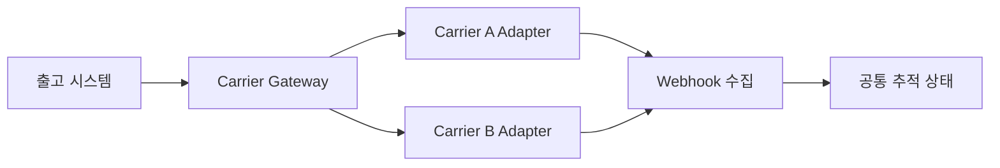

## 1. 내부 계약을 안정시킨다

주문 시스템은 운송사별 필드와 상태를 직접 알지 않는다. Gateway가 주소, 서비스 등급, 라벨, 취소, 추적을 공통 명령으로 받고 Adapter가 외부 계약으로 변환한다.



| 경계 | 핵심 장치 | 목적 |
|---|---|---|
| 라벨 요청 | 내부 멱등 키·외부 참조 | 중복 송장 방지 |
| 상태 변환 | 원본+공통 상태 동시 저장 | 정보 손실 추적 |
| Webhook | 서명·중복 제거·Inbox | 위조·재전송 대응 |
| 정산 | 청구서와 예상 운임 대사 | 과금 오류 탐지 |

```text
internal_status = map(carrier, carrier_status)
store carrier_payload, mapping_version, occurred_at, received_at
```

> **실무 함정** — Timeout 직후 새 요청 번호로 재시도하면 송장이 둘 생길 수 있다. 동일 참조로 조회하거나 결과 미상 상태를 운영 큐로 보낸다.

## 2. 요청 계약과 결과 불명 상태

가상 모델에서 출고 명령마다 `shipment_id + label_revision`을 내부 업무 키로 둔다. 같은 라벨 재시도는 같은 키, 주소 변경으로 새 라벨을 만드는 것은 새 revision(개정 번호)이다. 주소·박스·서비스 등급의 정규화된 요청 지문을 저장해 같은 키에 다른 내용을 보내지 못하게 한다.

```text
POST /label-requests
  shipment_id, revision, address, parcel, service_level

GET /label-requests/{operation_id}
  status: PENDING | SUCCEEDED | FAILED | UNKNOWN
  carrier_reference, tracking_number, label_reference
```

내부 DB에는 명령과 발행 대기 기록을 함께 저장한다. Worker가 운송사를 호출하고 결과를 별도 트랜잭션으로 저장한다. 운송사가 멱등 키를 지원하면 안정된 같은 키를 전달한다. 지원하지 않으면 가맹점 참조로 조회 가능한지 확인한다. 두 기능 모두 없고 결과가 불명확하면 자동 재발급을 멈추고 대사 대상으로 보낸다.

| 상황 | 재시도 판단 |
|---|---|
| 연결 전 확정 실패 | 계약·예산 안에서 재시도 |
| 요청 후 응답 Timeout | 접수 여부 불명, 같은 참조 조회·대사 |
| 성공 후 로컬 저장 실패 | 외부 참조로 기존 라벨 회수 |
| 같은 키의 주소 변경 | 기존 요청과 충돌, 명시적 개정 필요 |
| 대체 운송사 전환 | 기존 접수·취소 가능성 확인 후 새 명령 |

## 3. 상태 축약과 Webhook 저장

운송사의 `DELIVERY_ATTEMPTED`, `ADDRESS_ISSUE`, `HELD_AT_DEPOT`를 모두 내부 `EXCEPTION`으로 묶으면 고객 안내에 필요한 이유가 사라진다. 공통 단계와 원본 코드·사유·발생 시각·수신 시각·매핑 버전을 함께 보존한다. 모르는 코드는 임의로 배송 중에 넣지 않고 UNKNOWN_MAPPING으로 격리한다.

Webhook(외부 이벤트 통지)의 서명 검증은 공급자 규격에 따라 수행하고, 필요한 원본 바이트를 파싱 전에 검증한다. 검증된 이벤트를 Inbox에 내구성 있게 저장한 후 성공 응답을 보낸다. 저장 전에 성공 응답하면 이후 장애에서 이벤트가 사라질 수 있다. 무거운 상태 계산은 비동기로 수행한다.

## 4. Polling과 대사를 함께 운영한다

진행 중 운송장과 결과 불명 요청에 조회 예산을 우선 배정한다. 공급자의 호출 제한·페이지 크기·재시도 대기·조회 이력 보존을 확인한다. 오래된 완료 건은 낮은 빈도로 확인하되 정정 가능 기간에는 재조회 대상으로 유지한다.

가정: 진행 중 10만 건을 5분마다 개별 조회하면 약 333요청/초가 필요하다. 허용량이 50요청/초라면 단순 Polling(주기 조회)은 불가능하다. 배치 조회 지원, 우선순위별 주기, Webhook과 변화 시점 조회를 조합한다. 배치당 100건이면 산술상 약 3.3요청/초지만 실제 공급자가 그 API와 크기를 지원할 때만 유효하다.

정산 대사는 “요청한 라벨 수”가 아니라 실제 발급·취소·집하·청구 식별자를 연결한다. 누락 Webhook을 Polling으로 채웠다고 실제 물건의 위치까지 증명되는 것은 아니다. 현장 스캔·운송사 사건·금액 차이의 증거를 보존한다.

> **검수 기준 — 2026-09-12**: 운송사와 수치는 가상이다. [Stripe Webhook 문서](https://docs.stripe.com/webhooks)의 서명·중복·순서·재전송 사례를 외부 API 설계 참고로 사용하며, 운송사가 같은 계약을 제공한다고 가정하지 않는다. [멱등 요청 계약](https://docs.stripe.com/api/idempotent_requests) 역시 실제 운송사별 지원을 확인해야 한다.


## 5. 격리와 전환

운송사별 Rate Limit, Circuit Breaker, 자격 증명과 지표를 분리한다. 장애 시 서비스 가능 지역과 마감 시간까지 고려해 대체 운송사를 고르며 이미 발급한 라벨의 취소 가능성을 확인한다.

> **면접 포인트** — Adapter 패턴에서 멈추지 말고 결과 미상, 상태 대사, 계약 버전, 운임 정산까지 수명주기를 닫는다.
