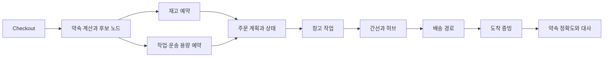

## 1. 요구와 보장 범위를 고정한다

특정 기업의 내부 구현이 아닌 **학습용 익일·당일 배송망**이다. 재고·출고·간선·허브·라스트마일을 종단 약속으로 연결한다. SLO(Service Level Objective, 서비스 수준 목표)는 최초 확정 배송 구간 안의 도착률로 정의하고, 취소·미완료·부분 배송의 분모 규칙을 명시한다. 빠른 배송을 구매 화면에 표시한 것과 실제 예약이 확정된 것을 구분한다.

가상의 요구는 권역별 당일 배송, 품목별 분할 허용 여부, 결제 중 짧은 임시 예약, 최초 약속 변경 이력 보존이다. 실물 집하 후 취소는 역물류로 처리한다. 허용 중간 상태와 수동 운영 절차도 기능 요구다.

## 2. 같은 단위로 용량을 계산한다

가상 센터의 마감까지 남은 시간이 30분이고 주문당 평균 2개 품목이라고 하자. 아래 값은 대기 주문을 아직 차감하지 않은, 같은 잔여 구간의 작업량이다.

| 구간 | 측정된 잔여 처리량 | 주문 환산 |
|---|---|---:|
| 피킹 | 품목 1,200개 | 평균 2개 가정 시 600건 |
| 패킹 | 소포 500개 | 주문당 소포 1개면 500건 |
| 간선 | 남은 적재 구간 | 이 주문 구성에서 450건 상당 |
| 라스트마일 | 잔여 서비스 시간·동선 | 이 목적지 구성에서 400건 상당 |

단순 비교에서는 최대 400건이지만 실제로 모든 주문이 서로 다른 SKU·중량·부피·목적지를 가진다. “Stop(방문 지점) 400개=주문 400건”도 같은 주소 묶음과 서비스 시간에 따라 달라진다. 각 제약에 주문의 수요량을 별도로 배분하고 이미 예약된 작업을 차감한다. 평균 2개라는 가정은 품목 구성이 바뀌면 다시 계산한다.

주문이 900건 유입되면 500건을 기존 약속에 억지로 넣지 않는다. 대체 센터·더 늦은 배송 구간·주문 제한을 후보로 제시한다. 센터 추가가 해결책이 되려면 해당 센터의 재고와 운송편까지 실제로 가능해야 한다.

## 3. 경로상의 선후 관계로 날짜를 계산한다



`max(재고 준비, 피킹 완료, 간선 도착, 배송 ETA)`만으로 시간을 계산하면 앞 단계 지연이 출발편을 놓치는 효과를 숨긴다. 각 단계의 완료를 다음 단계의 입력으로 전달해야 한다.

```text
ready = max(공급 사용 가능 시각, 주문 처리 가능 시각)
packed = earliest_feasible_pick_pack_finish(ready, remaining_capacity)
departure = next_departure_after_loading(packed, dock_calendar)
hub_ready = unload_and_sort(arrive(departure), hub_capacity)
delivery_window = feasible_route_window(hub_ready, destination, route_capacity)
```

가상으로 패킹이 13:50에 끝나고 적재 15분, 간선 출발 14:00이면 그 편을 탈 수 없다. 패킹 완료 시각만 14:00보다 빠르다고 수락하면 안 된다. 창고 현지 시간대·마감 포함 여부·공휴일을 캘린더에 넣는다. 구간별 p95를 더해 종단 p95라고 부를 수도 없다. 같은 날 날씨·혼잡으로 지연이 상관될 수 있으므로 실제 종단 분포와 실패 시나리오를 평가한다.

## 4. API와 상태 모델

```text
POST /promise-quotes
  draft_id, lines[sku, qty, uom], destination, split_policy
  -> quote_id, plan_revision, delivery_windows, expires_at

POST /orders
  request_id, quote_id, draft_hash
  -> order_id, status

plan_leg:
  plan_id, revision, leg_no, resource_id, time_bucket,
  demand_vector, hold_id, hold_state
```

`request_id`는 중복 주문을 막고 같은 키·다른 요청은 거절한다. 조회 견적만으로 재고를 확보한 것은 아니다. 확정에는 각 자원 Hold(임시 예약)를 확인한다. 분리된 서비스는 한 번의 DB 거래로 묶을 수 없으므로 예약 Saga(단계별 거래와 보상), 자원 사전 할당 등 일관성 전략을 명시한다.

부분 예약 성공은 `RESERVING`으로 유지하고 기한 안에 완성하거나 해제한다. 결제 결과가 불명확한 동안 TTL(Time to Live, 유효 기간) 만료를 실패로 간주하지 않는다. 결제 조회·대사와 예약의 조건부 전이를 연결한다. 상태 변경과 다음 명령은 Outbox(발행 의도 저장)로 연결하고 소비자는 중복을 처리한다.

## 5. 마감 직전 배분과 장애 대응

먼저 온 주문·유료 서비스·상품 특성 등 우선순위를 업무 정책으로 정한다. 이미 확정한 약속을 보호하면서 신규 수락을 제한한다. 가까운 센터만 선택하면 그 센터의 도크·패킹 병목을 악화시킬 수 있다. 가능 후보를 제약으로 거른 뒤 비용·지연 위험을 비교하고 재계획 횟수를 제한한다.

| 장애 | 즉시 보호 | 복구·고객 처리 |
|---|---|---|
| 패킹 설비 중단 | 해당 시간 구간 신규 수락 축소 | 대체 라인·센터의 실제 여유 확인 |
| 재고 차이 | 영향 SKU·위치 예약 제한 | 대체 재고, 실사, 약속 변경 선택지 |
| 간선 취소 | 해당 편에 의존한 계획 식별 | 다음 편·대체편 재예약과 도착 재계산 |
| 운송 응답 지연 | 기존 명령 ID 유지·상태 불명 | 조회·대사 후 확정, 중복 라벨/배차 방지 |
| 현장 통신 단절 | 승인된 작업 범위로 운영 | 단말 작업 ID·순번 동기화와 예외 대사 |

영향 권역만 제한하려면 주문 계획이 어떤 자원·편·버전에 의존하는지 역조회할 수 있어야 한다. 전체 빠른 배송을 끄는 것보다 세분화된 제어는 유용하지만, 의존성이 불명확한 상태에서 부분 영향만 있다고 낙관하지 않는다.

## 6. 비용과 품질의 검증

빠른 배송률만 목표로 두면 작은 소포 분할, 낮은 차량 적재율, 긴급 보충과 초과 작업이 늘 수 있다. 주문당 전체 비용·오배송·파손·재배송·작업 부하·원래 약속 준수율을 함께 본다. 작업 안전·온도·적재 한계는 비용 점수로 상쇄할 수 없는 제약이다.

> **면접 포인트**
>
> 수요 재생 실험에서 평시뿐 아니라 마감 직전 폭증·간선 한 편 취소·재고 부족을 넣는다. 수락률만 보지 말고 수락한 약속의 실제 이행 가능성과 거절·재약속 고객 경험을 확인한다. 이 카드의 수치는 학습용이며 운영 처리량 측정 결과가 아니다.

## 참고 자료

- [Oracle 공급과 배송 약속](https://docs.oracle.com/en/cloud/saas/supply-chain-and-manufacturing/25c/fascp/overview-of-global-order-promising.html)
- [OR-Tools 시간창 경로 제약](https://developers.google.com/optimization/routing/vrptw)
- [OR-Tools 차량 용량 제약](https://developers.google.com/optimization/routing/cvrp)
