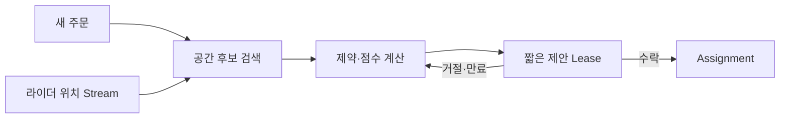
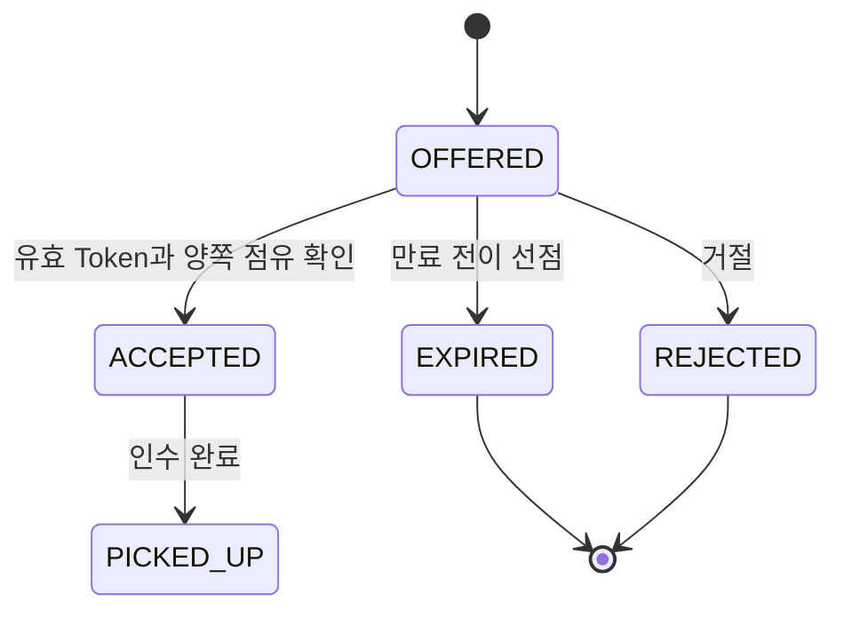

## 1. 빠른 후보와 정교한 점수를 분리한다

실제 기업 구현을 단정하지 않고 실시간 배차 문제를 모델링한다. 위치 Cell로 가까운 후보를 빠르게 줄인 뒤 도착 예상, 적재 여유, 약속 위반 위험, 이동 방향을 점수화한다.



| 단계 | 지연 목표 | 정확성 요구 |
|---|---|---|
| 후보 검색 | 매우 짧음 | 일부 여유 있는 Recall |
| ETA·점수 | 짧음 | 최신 도로·준비 시간 반영 |
| 제안 | 제한 시간 | 한 주문의 단일 확정 |
| 재배차 | 이벤트 기반 | 취소 비용·공정성 고려 |

```text
score = pickup_eta + delivery_lateness_penalty + detour_cost + fairness_penalty
assignment succeeds only if order_version and rider_capacity still match
```

> **실무 함정** — 위치 업데이트마다 전역 최적화를 다시 하면 계산과 배차 흔들림이 커진다. 의미 있는 이벤트와 재최적화 최소 간격을 둔다.

## 2. 공간 후보의 누락과 과다를 분리한다

작은 Cell(공간 격자)은 한 셀의 후보 수를 줄이지만 반경 검색에 여러 이웃 셀을 조회해야 한다. 큰 셀은 조회 셀 수가 줄어도 거리와 무관한 후보를 많이 가져온다. 셀 경계 양쪽의 가까운 기사를 놓치지 않도록 겹치는 셀을 모두 찾고 실제 거리·도로 ETA(Estimated Time of Arrival, 도착 예상 시간)로 다시 거른다.

가정: 한 주문마다 500명 전원에게 경로 계산을 요청하면 주문 100건/초에서 초당 5만 번 계산한다. 공간·상태 필터로 30명으로 줄이면 초당 3,000번이다. 이 계산은 병목 후보를 찾는 예시이며 셀 크기의 정답은 아니다. 후보 Recall(실제 가능한 후보를 포함하는 비율), 오래된 위치 비율, 계산 시간으로 선택한다.

위치 업데이트는 기사별 순번·수집 시각을 함께 저장한다. 단절로 오래된 위치라면 “가까움”을 확정 근거로 사용하지 않는다. 후보 탐색의 최신성보다 최종 배차 확정의 정합성을 더 엄격하게 유지한다.

## 3. 제안 점유와 최종 확정은 별개다

아래는 기사당 하나의 활성 제안만 허용하는 가상 정책이다. 실제 묶음 배달에서는 기사 전체가 아니라 남은 용량의 슬롯을 예약할 수도 있다. 주문의 버전만 검사하면 같은 기사에게 다른 주문 두 개가 동시에 제안될 수 있다.

```text
short transaction:
    lock order and rider rows in consistent order
    verify order is unassigned and expected order version matches
    verify rider has capacity and no active offer under this policy
    reserve offer for BOTH order and rider, with token and expires_at
    persist notification command
commit

on acceptance:
    transactionally verify token, state, expiry and both reservations
    consume reserved capacity and confirm assignment exactly once
```



만료 처리와 수락은 같은 상태 조건으로 경쟁한다. 이미 EXPIRED인 제안의 늦은 수락은 새 제안을 훼손하지 못하도록 Token을 확인한다. 기사에게 보내는 알림은 트랜잭션 밖에서 전달하지만, 알림 명령은 함께 저장해 커밋 후 종료에도 재시도한다. 여러 DB에 주문·기사 상태가 나뉘면 위 트랜잭션을 가정할 수 없으므로 예약 프로토콜이나 데이터 소유 경계를 다시 설계해야 한다.

## 4. 불가능한 해를 점수로 숨기지 않는다

적재 한도, 인수 전 배달 금지, 근무 가능 시간 같은 Hard Constraint(필수 제약)를 먼저 적용한다. 그 다음 추가 이동, 지각 위험, 음식 보관 시간과 기회 편차를 Soft Cost(조정 가능한 비용)로 비교한다. 시간과 거리와 금액을 단위 변환 없이 더하지 않는다.

```text
cost_in_seconds = extra_travel_seconds
                + 3 * predicted_late_seconds
                + 2 * extra_food_holding_seconds
                + fairness_penalty_seconds
```

가상 후보 A가 `(60, 0, 20, 10)`이면 비용은 110초, B가 `(20, 40, 10, 0)`이면 160초다. 이동만 보면 B지만 지각 비용까지 보면 A가 선택된다. 가중치는 예시이며 사용자 약속·품질·기사 기회 분포를 실제 데이터로 평가해 정한다.

차량 경로 문제의 시간 창과 미배정 벌점은 구현 가능한 출발점이지만, 모든 주문을 무조건 배정하는 것이 정답은 아니다. 허용 제약을 만족하는 해가 없으면 미배정·지연 안내·운영 개입으로 드러낸다. 재최적화는 이득이 작은 변경으로 기사의 경로가 계속 흔들리지 않도록 최소 개선폭·주기·인수 이후 변경 제한을 둔다.

> **검수 기준 — 2026-09-12**: 배차 정책·수치는 가상이다. [OR-Tools 시간 창](https://developers.google.com/optimization/routing/vrptw)과 [미방문 벌점](https://developers.google.com/optimization/routing/penalties)을 참고해 제약·목적 함수를 구분했다. 동시 제안의 DB 모델은 이 카드의 자체 설계 예제다.


## 5. 실패 처리와 지표

제안은 만료되는 Lease로 만들고 확정은 주문·라이더 버전 조건부 갱신으로 처리한다. 배차 시간뿐 아니라 약속 위반, 취소, 공차 거리, 라이더별 기회 편차를 함께 본다.

> **면접 포인트** — 지리 검색, 최적화 알고리즘, 동시성 제어, 사람에게 미치는 품질 지표를 한 흐름으로 연결한다.
