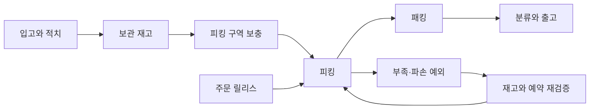

## 1. 면접 조건: 평균 속도보다 흐름을 설명한다

가상의 풀필먼트 센터에서 주문이 피킹·패킹·분류·출고를 거친다. WIP(Work in Process, 공정 안의 미완료 작업)와 완료 처리량을 주문·품목·소포 중 어떤 단위로 측정하는지 먼저 합의한다. 입고·적치는 출고의 공급 경로이지만 모든 주문이 주문 접수 이후 새 입고를 거치는 직렬 공정은 아니다.



| 라운드 | 제시 상황 | 답변에 포함할 것 |
|---|---|---|
| R1 병목 | 주문 증가, 출고 처리량 정체 | 단위·구간별 유입/완료·대기·재작업 |
| R2 Wave | 피킹 생산성 개선, 배송 지연 증가 | 묶음 대기와 하류 순간 부하 |
| R3 예외 | 실물 부족, 자동 작업 재시도 | 중복 제어·소유자·재합류 조건 |

## 2. R1 — “인력을 어디에 더 넣겠습니까?”

**질문:** 주문은 시간당 1,200건이다. 피킹은 시간당 3,000품목, 패킹은 900소포, 출고는 1,100소포를 처리한다. 어느 곳이 병목인가?

**답변 예시:** “주문당 평균 2품목·1소포라는 가정이면 피킹은 1,500주문/시간, 패킹은 900주문/시간입니다. 같은 시간대의 실제 처리율이라면 패킹을 우선 의심하겠습니다. 유입 1,200에 완료 900이 지속되면 미완료 주문이 시간당 약 300건 증가합니다. 다만 가동 중 속도와 교대 전체의 실효 속도를 섞지 않고, 상품 구성·재작업·설비 대기도 확인하겠습니다.”

900이 작업 중 생산성인지 휴식·중단을 포함한 실효 생산성인지 구분한다. 이미 실효치라면 Availability(가동률)를 다시 곱해 이중 차감하지 않는다. 주문 분할이 늘어 소포/주문 비율이 바뀌면 패킹 환산도 바뀐다.

```text
같은 범위와 단위의 근사:
WIP 변화/시간 = 유입률 - 완료율
안정 상태 평균 WIP = 평균 처리량 × 평균 체류 시간
예: 900건/시간 × 20/60시간 = 평균 300건
```

Little의 법칙을 계속 큐가 증가하는 과부하 구간에 대입해 고정 대기 시간을 예측하지 않는다. 위 300건은 안정 상태의 평균 예시이며 p95나 최대 지연이 아니다.

**후속 압박:** “패킹 앞에 물건이 없는데 패킹 완료율이 낮으면요?”

낮은 완료율만으로 패킹 능력이 부족하다고 볼 수 없다. 공급이 없는 Starvation(작업 공급 부족), 하류가 막힌 Blocking(진행 차단), 설비 장애·인력 부족·라벨 재작업을 분리한다. 피킹의 작업 완료와 실물 인계 완료가 다른지도 확인한다.

| 신호 | 가설 | 확인 |
|---|---|---|
| 패킹 앞 WIP와 대기 상승 | 패킹 병목 | 작업 중 속도·중단·상품 구성 |
| 피킹 작업은 많지만 완료 부족 | 보충·동선·결품 | 위치별 부족·보충 대기 |
| 패킹 완료 후 체류 상승 | 분류·출고 제한 | 편별 출차 마감·도크 점유 |
| 재작업 증가 | 품질 결함 | 라벨·상품·수량 오류 원인 |

## 3. R2 — “피킹은 빨라졌는데 주문이 왜 늦죠?”

Wave(작업 파동)는 묶어서 이동·설비 효율을 높이지만 묶음이 찰 때까지의 대기와 하류에 한꺼번에 도착하는 부하가 생긴다. 피킹 완료 시간만 최적화하면 마감이 가까운 주문도 큰 묶음의 마지막 작업을 기다릴 수 있다.

**답변 예시:** “30분마다 Wave를 여는 단순 정책에서 균등하게 도착하는 주문은 릴리스만 평균 약 15분 기다릴 수 있습니다. 이는 균등 유입 가정이고 프로모션 폭증에는 달라집니다. 피킹 시간 3분을 줄였어도 추가 대기 10분이면 종단 시간은 악화됩니다. 작은 Wave·마감 임박 주문의 별도 릴리스·하류 WIP 상한을 비교하겠습니다.”

보충이 끝나야 수행 가능한 할당을 먼저 풀어 현장에 일을 쌓지 않는다. Oracle WMS의 보충 연계 Wave처럼 실제 제품에서도 피킹과 보충 의존성을 관리하지만, 여기의 임계값과 릴리스 정책은 자체 설계 예다.

**후속 압박:** “그러면 한 주문씩 바로 내리면 되죠?”

작은 묶음은 대기를 줄일 수 있지만 이동·설비 전환·소포 분류 비용이 커질 수 있다. 주문 유형별로 크기와 최대 대기 시간을 함께 제한하고, 시간 내 출고 비율·오류·총 작업 시간을 동일 주문 구성에서 비교한다.

## 4. R3 — “장부 3개인데 위치에는 1개뿐입니다”

Short Pick(피킹 수량 부족)은 재고 2개를 즉시 삭제하거나 같은 작업을 무한 재시도할 문제가 아니다. 실제 1개를 피킹했는지, 다른 토트에 있는지, 보충 중인지, 단위 환산이 틀렸는지부터 확인한다.

```text
NORMAL -> SHORT_REVIEW
SHORT_REVIEW -> REASSIGNED -> PICKING
SHORT_REVIEW -> WAIT_REPLENISHMENT -> PICKING
SHORT_REVIEW -> CUSTOMER_DECISION -> PARTIAL_OR_CANCEL

예외 레코드:
exception_id, order_line_id, task_id, task_version, reservation_id,
expected_qty, confirmed_picked_qty, observed_qty, uom,
location_id, reason, owner, next_check_at, evidence_ref
```

이미 피킹한 1개는 실물 토트와 주문 할당에 유지하고 부족분 2개의 대체 예약만 처리한다. 예외에서 돌아올 때 기존 예약·주문 취소 여부·기존 작업 버전을 재검증한다. 이전 단말의 늦은 성공이 오면 새 작업 완료로 중복 반영하지 않게 명령 ID와 허용 상태를 검사한다.

**답변 예시:** “부족분에 대한 예외를 담당자와 확인 기한이 있는 큐에 격리하겠습니다. 정상 주문을 보호하면서 대체 위치 예약·보충·고객의 부분 출고 선택을 진행합니다. 복구 후에는 미완료 수량과 유효 예약만으로 새 작업을 만들고, 이미 완료된 피킹을 다시 시키지 않습니다. 원장 조정은 실사·승인으로 별도 게시합니다.”

> **면접 포인트 — 예외 큐는 완료 상태가 아니다**
>
> 예외 이관으로 정상 흐름의 리드타임만 좋아 보일 수 있다. 전체 주문 체류 시간·오래된 미해결 예외·재합류 실패·재발률을 함께 측정한다. 담당자 부재·단말 오프라인·중복 스캔도 검증 시나리오에 포함한다.

## 참고 자료

- [Oracle 26A 보충과 피킹 Wave](https://docs.oracle.com/en/cloud/saas/warehouse-management/26a/owmol/workflow-of-replenishment-with-picking-wave.html)
- [Oracle 26A 보충 개념](https://docs.oracle.com/en/cloud/saas/warehouse-management/26a/owmol/overview-of-replenishment.html)
- [Oracle 25D Pick Cart와 부족 처리](https://docs.oracle.com/en/cloud/saas/warehouse-management/25d/owmol/pick-cart.html)

운영 수치와 예외 상태 모델은 학습용이다. 실제 인력·생산성을 주장하는 기업 사례가 아니다.
