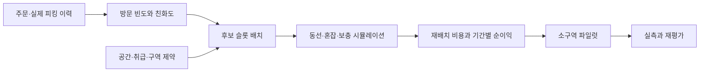

## 1. 슬롯 배치는 제약을 만족하는 총 작업 비용 문제다

Slotting(슬로팅)은 상품을 어떤 피킹 위치에 얼마나 배치할지 정하는 작업이다. ABC 분석의 기준은 출고 수량, 주문 빈도, 피킹 방문 횟수, 매출 등으로 달라지므로 “A급=매출 상위”를 동선 최적화에 그대로 쓰지 않는다. 이 카드에서는 **피킹 방문 수**를 출발점으로 삼는다.

가상의 A급 상품을 모두 출고구 옆 한 통로에 모으면 거리는 짧아져도 동시 작업자가 몰린다. 대기·카트 교행·보충 장비 간섭을 포함한 피킹 시간은 오히려 늘 수 있다. 주문당 낱개 수량보다 방문 횟수가 동선과 더 직접 연결되는 경우도 있다.

| 입력 | 제약 또는 비용 | 확인할 것 |
|---|---|---|
| 상품 크기·중량 | 슬롯 용적·하중·장비 | 낱개와 포장 단위 환산 |
| 보관 조건 | 온도·혼재 금지·취급 | 비용 점수로 위반을 허용하지 않기 |
| 작업 접근 | 높이·동선·통로 점유 | 현장 안전 규칙과 작업 방법 |
| 피킹 빈도 | 이동·탐색·집기 시간 | 행사·요일·품절 때문에 관측이 왜곡되는지 |
| 보충 | reserve→pick face 이동 | 보충 단위·빈도·피킹 방해 |

Pick Face(전방 피킹 위치)를 작게 잡으면 가까운 곳에 더 많은 SKU를 놓을 수 있지만 보충 횟수가 증가한다. 보충은 Reserve Storage(예비 보관 위치)에서 피킹 위치로 옮기는 별도 작업이며 무료가 아니다.

## 2. 상품 친화도는 실제 함께 피킹하는 단위에서 계산한다

Affinity(친화도)는 함께 주문되는 상품의 관계다. 가상 1,000주문에서 A는 200주문, B는 100주문, 둘 다 포함된 주문은 60개라면 공동 출현 비율은 0.06, 독립 가정 대비 Lift(상대 동시 출현)는 `0.06 / (0.2 × 0.1) = 3`이다. 방향별 조건부 확률은 `P(B|A)=0.3`, `P(A|B)=0.6`으로 다르다.



Lift가 높아도 공동 주문이 2건뿐이면 효과 추정이 불안정하다. 최소 관측량과 최근 기간·행사 여부를 함께 본다. 같은 주문이어도 온도대가 달라 다른 작업자가 피킹한다면 가까이 놓는 후보가 유효하지 않을 수 있다. Batch Picking(묶음 피킹)에서는 한 주문 기준 친화도보다 실제 배치 구성과 경로의 방문 절감 효과를 다시 평가한다.

인접 배치가 왕복을 줄이는지, 이미 지나가는 동선이라 차이가 없는지, 인기 조합이 한 통로를 과부하시키는지 확인한다. 단순히 모든 고친화 상품 쌍의 거리를 최소화하면 슬롯 용량과 혼잡을 놓친다.

## 3. 이득과 비용은 같은 단위·평가 기간으로 비교한다

```text
기간 순이득(작업초)
= 기간 피킹 작업초 절감
- 기간 추가 보충 작업초
- 기간 추가 혼잡·재작업초
- 1회 재배치 작업초
```

거리(m)에서 비용(원)을 직접 빼지 않는다. 이동 거리 절감은 실제 통행 속도·탐색·대기를 반영한 시간으로 환산하거나 모두 금액으로 환산한다. 피킹 시간 실측에 이미 혼잡이 포함돼 있다면 혼잡 페널티를 또 빼지 않는다.

가상의 하루 2,000회 피킹에서 회당 4초를 절감하면 8,000초다. 추가 보충 10회×180초=1,800초, 별도로 모델링한 혼잡 1,200초라면 하루 순절감은 5,000초다. 재배치가 20,000초면 손익분기점은 4일이고 10일 평가의 순이득은 30,000초다. 수요가 3일 뒤 끝나는 행사라면 이 가정에서는 손해다.

| 후보 | 장점 | 비교해야 할 비용 |
|---|---|---|
| A급 집중 | 짧은 평균 이동 | 피크 통로 혼잡·잦은 보충 |
| 구역 분산 | 동시 작업 분산 | 일부 이동 증가·다중 위치 관리 |
| 큰 피킹 면적 | 보충 빈도 감소 | 슬롯 점유로 다른 상품 동선 증가 |
| 친화 상품 인접 | 공동 방문 절감 가능 | 주문 구성 변화·제약 충돌 |

## 4. 재배치도 재고 이동 거래다

추천 배치를 바로 현재 위치 마스터에 덮어쓰면 현장 실물과 시스템이 어긋난다. 새 위치 용량과 상품 조건을 확인하고, 진행 중 피킹·보충 작업과 충돌하지 않는 시간에 이동 명령을 만든다. 출발 스캔·이동 중·도착 확인을 남기고 중복 완료가 수량을 두 번 옮기지 않게 한다.

```text
slotting_plan: plan_id, revision, horizon, assumptions, approved_by
move_task: task_id, plan_id, sku, lot, uom, qty,
           source_location, target_location, status, task_version
state: PLANNED -> CLAIMED -> IN_TRANSIT -> RECEIVED
```

일부만 이동됐으면 남은 작업과 두 위치의 실제 가용량을 유지한다. 오래된 단말 작업은 버전·상태로 거절하고 실물은 대사한다. 변경을 되돌리는 경우도 이전 마스터를 복원하는 것이 아니라 새 이동 작업이다.

## 5. 파일럿과 재계산

같은 주문 구성·물량·인력 조건을 맞춰 주문당 피킹 시간, 보충 작업초, 통로 대기, 오류와 이동 미완료를 비교한다. 전후 비교만으로 행사 종료나 작업자 숙련 효과를 슬로팅 성과로 계산하지 않는다. 비슷한 구역을 비교하거나 기간을 교차해 보되 공용 통로의 상호 간섭을 고려한다.

효과가 작은 배치는 유지하고 충분한 예상 순이득·최소 유지 기간이 있는 경우에만 바꾸는 정책이 가능하다. 너무 긴 유지 기간은 수요 변화에 늦게 대응하므로 예외 조건을 둔다.

> **면접 포인트**
>
> 최단 거리보다 “제약을 지키며 평가 기간 동안 총 작업을 얼마나 줄이는가”로 답한다. 안전·상품 보관 규칙은 최적화 점수에 흡수하지 않고 먼저 검사한다. 예측 순이득과 실제 피킹·보충·이동 비용을 별도로 기록해 다음 추천을 개선한다.

## 참고 자료

- [Microsoft Dynamics 365 슬롯 계획과 보충 작업](https://learn.microsoft.com/en-us/dynamics365/supply-chain/warehousing/warehouse-slotting)
- [Oracle 26A 보충 개념](https://docs.oracle.com/en/cloud/saas/warehouse-management/26a/owmol/overview-of-replenishment.html)

친화도 계산·기간 순이득·이동 상태 모델은 학습용 설계이며 특정 제품의 최적화 알고리즘을 재현하지 않는다.
