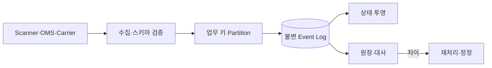

## 1. 업무 단위별 질서를 만든다

전역 순서는 불필요하고 비싸다. Shipment, Inventory Item, Order처럼 상태 전이가 직렬화되어야 하는 키를 정하고 같은 키를 같은 Partition으로 보낸다. Producer Sequence와 Event ID로 재전송을 판별한다.



| 압박 질문 | 답변의 핵심 | 위험한 답변 |
|---|---|---|
| 중복이면 | Inbox·업무 멱등 키 | Broker가 제거한다 |
| 순서가 바뀌면 | 전이 검증·보류·Version | Timestamp 정렬만 한다 |
| 소비가 실패하면 | Retry Budget·격리·재처리 | 무한 재시도 |
| 투영이 틀리면 | 원본 재생·대사 | 수동 UPDATE |

```text
partition_key = business_entity_id
if a single authority assigns per-entity business versions:
    apply only when event.version == projection.version + 1
else:
    validate transition and reconcile gaps; device sequences are not global versions
```

> **면접 전략** — 전달 보장 이름보다 중복·누락·역순 예시 하나를 끝까지 추적해 어느 저장소가 진실의 원본인지 밝힌다.

## 2. 라운드 1 — Partition Key만 같으면 순서가 맞나

면접 상황: 같은 화물이 창고 스캐너, 기사 앱, 운송사 Webhook에서 갱신된다. 상태 투영의 키는 `shipment_id`로 시작한다. 재고 원장은 `warehouse_id + sku`, 주문 화면은 `order_id`처럼 다른 업무 경계를 가질 수 있다. 하나의 키가 모든 불변식을 직렬화해주지는 않는다.

같은 화물의 로그는 한 파티션 안에서 순서가 있지만, 여러 Producer(생산자)가 보내는 사건의 **업무 발생 순서**와 같다는 보장은 없다. `device_sequence=18`과 다른 단말의 `device_sequence=9`는 크기만 비교할 수 없다. Event ID는 중복 판단, 단말 순번은 단말별 누락, 서버의 업무 버전은 상태 적용 순서에 사용한다.

> **압박 질문** — `event.version == projection.version + 1`의 버전을 누가 발급하나요? 답변에 단일 업무 Writer나 조정 주체가 없다면 여러 단말이 독립 발급한 숫자를 전역 버전처럼 취급한 것이다.

## 3. 라운드 2 — 완료 뒤 집하가 도착했다

가상 입력을 순서대로 설명한다.

| 도착 순서 | 사건 | 해야 할 판단 |
|---|---|---|
| 1 | 배송 완료 E30 | 증거·전이 조건 확인 후 완료 반영 |
| 2 | 오프라인 집하 E10 | 원본에 추가하되 현재 상태를 집하로 되돌리지 않음 |
| 3 | E30 재전달 | 같은 내용이면 효과 반복 안 함 |
| 4 | E30과 같은 ID, 다른 화물 | 충돌 격리·원본 증거 보존 |
| 5 | 승인된 완료 취소 정정 C1 | 원본 참조·정정 권한 확인 후 재투영 |

“가장 큰 Timestamp만 유지”하면 시계 오차·정정·예외 흐름을 잃는다. “완료보다 낮은 상태는 전부 버린다”도 원본 감사와 실제 오스캔 정정을 불가능하게 한다. 원본 저장과 현재 상태 판단을 분리해야 한다.

## 4. 라운드 3 — 원장과 조회가 어긋났다

먼저 진실의 원본과 비교 시점을 정한다. 생산자가 아직 보내지 않은 원본 누락, Broker 유입 후 미처리, 업무 규칙 오류, 조회 캐시 지연을 구분한다. 서로 다른 체크포인트의 값을 비교하면 정상 지연도 장애처럼 보인다.

```text
choose entity scope and stable source checkpoint
compare raw events, corrections, projection version and rule version
replay into shadow projection WITHOUT external notifications
compare missing IDs, duplicates, state differences and unresolved gaps
catch up to the cutover checkpoint
switch read version atomically; retain rollback target
```

재생 도중 새 이벤트가 들어오는 상황까지 설명한다. 오류를 발견했다고 운영 DB의 현재 상태만 UPDATE하면 다음 재생에서 다시 잘못될 수 있다. 원본이 잘못됐으면 승인된 정정, 투영 규칙이 잘못됐으면 버전 수정과 재생으로 해결한다.

가정: 지연 이벤트 90만 건, 유입 1,000건/초, 성공 처리 2,500건/초이면 순처리 1,500건/초로 약 10분에 따라잡는다. 재시도와 느린 키 때문에 실제 성공 처리율이 낮아질 수 있다. 성공 처리율이 유입 이하라면 기다리는 것만으로 해소되지 않는다.

## 5. 답변 평가와 장애 주입

| 확인 항목 | 기대 답변 |
|---|---|
| 수집 저장 직후 종료 | 내구성 있는 이벤트 재개, 중복 무해 |
| DB 반영 후 Offset 커밋 전 종료 | Inbox·업무 변경 원자 커밋으로 반복 효과 차단 |
| 키 하나의 독약 메시지 | 재시도 예산·키별 격리·순서 공백 정책 |
| 재생 중 알림 소비 | 외부 효과 분리, 원래 고객 알림 반복 방지 |
| 규칙 버전 변경 | 비교 기준·되돌릴 투영 버전 보존 |

> **검수 기준 — 2026-09-12**: 입력·수치·운영 절차는 가상 면접 문제다. [Kafka 4.1 Design](https://kafka.apache.org/41/design/design/)의 소비 위치·처리 보장과 [GS1 EPCIS 2.0.1](https://ref.gs1.org/standards/epcis/2.0.1/)의 이벤트·정정 개념을 참고한다.


## 6. 현장 단절을 포함한다

오프라인 단말은 안정적인 로컬 ID와 큐를 사용하고 복구 후 Batch 전송한다. 지연 허용 시간을 넘은 이벤트는 자동 적용보다 예외 큐와 대사로 보낸다.

> **면접 포인트** — 파이프라인 처리량뿐 아니라 실제 배송 상태의 정확성과 감사 가능성을 함께 설계한다.
