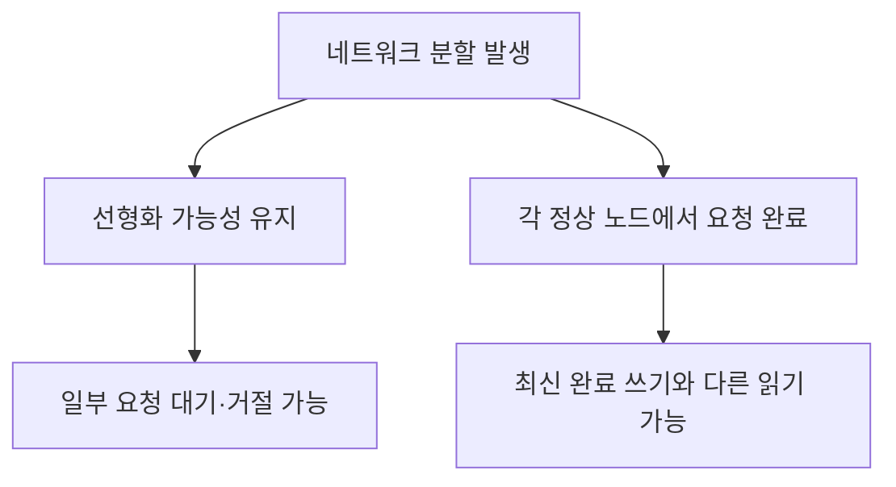
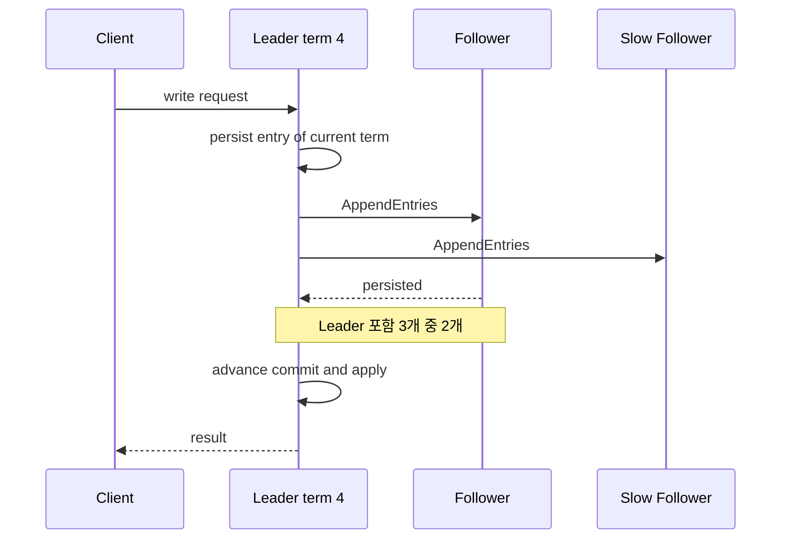
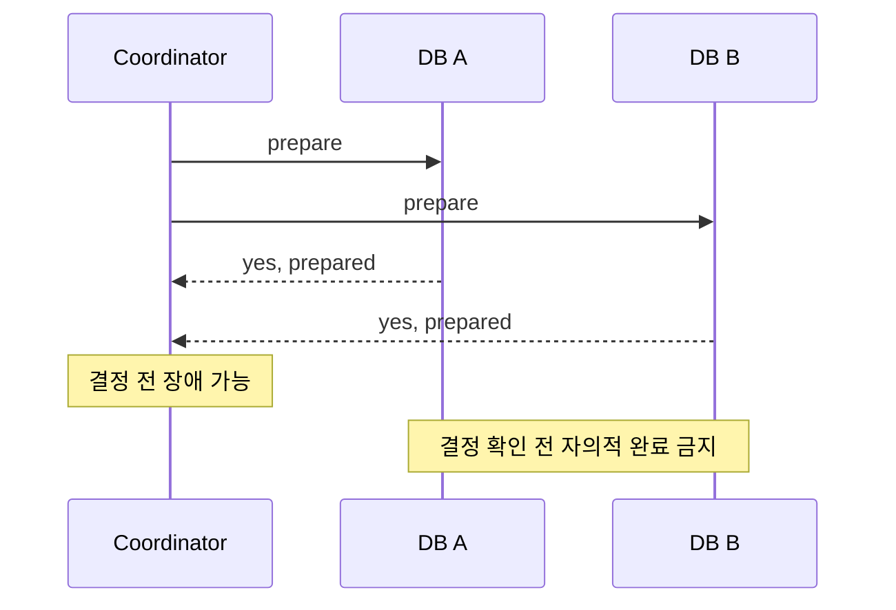

> **검수 기준 — 2026-09-12**
>
> CAP 원 논문, Raft 확장 논문, Transaction Commit 논문을 기준으로 보장 조건을 구분한다. 재고·배송 사례와 지연 수치는 가상 설계다. 제품을 고정된 CP/AP로 분류하거나 복제본 개수만으로 최신 읽기를 단정하지 않는다.

## 1. CAP는 분할 중의 선택이다

CAP(Consistency, Availability, Partition Tolerance: 일관성·가용성·분할 내성)는 네트워크가 분할될 수 있는 모델에서 선형화 가능한 읽기·쓰기와 모든 정상 노드의 요청 완료를 함께 보장할 수 없다는 결과다.

- C는 Linearizability(선형화 가능성)다. 연산이 호출과 응답 사이 한 순간에 실행된 것처럼 설명되고, 실제 시간의 선후 관계를 지킨다. 모든 복제본이 매 순간 같은 메모리 값을 가진다는 뜻은 아니다.
- A는 실패하지 않은 노드가 받은 요청이 결국 연산을 완료하는 조건이다. 읽기·쓰기마다 오류만 보내는 방식으로 충족하지 못하며, 실무의 “월 성공률 99.9%”와도 다르다.
- P는 노드 집합 사이 메시지가 전달되지 않는 실행을 허용한다. 그런 실행을 가정한 질문에서 “P를 안 고른다”는 답은 해결이 아니라 실패 모델을 바꾸는 것이다.


```mermaid
flowchart TD
    P[네트워크 분할 발생] --> C[선형화 가능성 유지]
    P --> A[각 정상 노드에서 요청 완료]
    C --> W[일부 요청 대기·거절 가능]
    A --> S[최신 완료 쓰기와 다른 읽기 가능]
```

가상의 창고 예약은 과판매를 피하기 위해 필요한 조정 노드에 도달하지 못하면 확정을 보류할 수 있다. 배송 위치 화면은 마지막 수신 시각을 표시하며 일부 지연을 허용할 수 있다. 같은 서비스에도 서로 다른 계약이 있다. 단, 재고 보장은 강한 읽기 하나가 아니라 조건 검사·갱신의 원자성과 중복 예약 방지를 함께 요구한다.

## 2. PACELC와 실제 요청 계약

PACELC는 분할 시(P) 가용성(A)과 일관성(C), 평상시(E) 지연(L)과 일관성(C)의 절충을 생각하는 틀이다. “DynamoDB는 항상 AP”처럼 제품명 하나로 결론내리지 않는다. 일관된 읽기 지원 범위, 읽기 대상, 쓰기 확인, 복제·리더 전환 구성을 확인한다.

| 요구 | 필요한 확인 | 비용·남는 문제 |
|---|---|---|
| 완료된 쓰기 이후 최신 읽기 | 선형화 가능한 읽기 경로 | 리더 유효성·상태 적용 대기 |
| 내가 쓴 결과 재조회 | 세션이 본 버전 이상의 읽기 | 복제본 이동·장애 전환 |
| 읽기 역행 방지 | 읽은 버전 하한 유지 | 고정 복제본 장애 후 라우팅 |
| 최종 수렴 | 변경 전달·충돌 해결·복구 | 수렴 시간·중간 불일치 |

Read-your-writes(자기 쓰기 읽기)를 위해 잠시 리더로 보낼 수 있지만, 리더가 바뀌거나 확인받은 쓰기가 유실될 수 있는 복제 모델이면 추가 검증이 필요하다. 단순 Sticky Routing(고정 라우팅)을 영구 보장으로 설명하지 않는다.

## 3. Quorum 교집합의 조건

고정된 N개 복제본에서 쓰기 확인 집합 W와 읽기 응답 집합 R을 고른다고 하자. `W + R > N`이면 두 집합에 최소 한 노드가 겹친다. 이것은 집합의 성질이며, 반환할 최신 버전 판정이나 동시 쓰기 해결까지 자동으로 제공하지 않는다.

```text
N = 5
write set = {1, 2, 3}
read set  = {3, 4, 5}
intersection = {3}

W = 1, R = 1:
write set = {1}, read set = {5}
intersection may be empty
```

쓰기 이후 읽기라면, 겹친 노드가 확인한 값을 내구성 있게 보존하고 읽기에 제공해야 한다. 읽기 측도 버전·동시 충돌·미완료 쓰기를 올바르게 판단해야 한다. 임시 대체 노드에 쓰는 Sloppy Quorum(느슨한 정족수), 멤버십 변경, 복구로 값이 되돌아가는 경우는 이 단순 계산의 전제를 다시 확인해야 한다.

| N=5 | W=3, R=3 | W=1, R=1 |
|---|---|---|
| 집합 교차 | 같은 구성에서 보장 | 보장 안 됨 |
| 응답 수 | 각 연산에 3개 필요 | 각 연산에 1개 필요 |
| 분할 | 3개에 도달하지 못하는 쪽은 해당 연산 불가 | 각 쪽이 독립 응답할 수 있으나 불일치 가능 |
| 지연 | 필요한 응답을 기다림 | 더 적은 응답으로 완료 가능 |
| 동시 쓰기 | 별도 버전·충돌 규칙 필요 | 별도 버전·충돌 규칙 필요 |

가상 응답 지연이 1, 2, 4, 8, 20ms이고 다섯 노드에 동시에 요청한다면 세 번째 응답까지 기다리는 데 4ms, 첫 응답만이면 1ms다. 이것은 네트워크 응답만의 예제이며 디스크·조정·클라이언트 구간이 더해진다.

> **실무 함정** — W=R=1이라고 자동으로 최종 수렴하는 것도 아니다. Anti-entropy(복제본 대사)와 충돌 해결 같은 복구 경로가 있어야 수렴을 기대할 수 있다.

## 4. Raft는 과반수 외에도 규칙이 있다

Raft는 복제 로그의 순서를 합의한다. Term(임기)이 더 높은 메시지를 보면 이전 리더가 물러나지만, 단절된 이전 리더가 새 임기를 아직 모를 수 있다. 서로 자신이 리더라고 생각하는 순간 자체를 없애는 것이 아니라 올바른 커밋·읽기 규칙으로 잘못된 결과가 성공하지 않게 한다.


```mermaid
sequenceDiagram
    participant C as Client
    participant L as Leader term 4
    participant F as Follower
    participant X as Slow Follower
    C->>L: write request
    L->>L: persist entry of current term
    L->>F: AppendEntries
    L->>X: AppendEntries
    F-->>L: persisted
    Note over L,F: Leader 포함 3개 중 2개
    L->>L: advance commit and apply
    L-->>C: result
```

리더는 **현재 임기의 엔트리**가 과반수에 복제됐다는 조건으로 커밋 인덱스를 전진시킨다. 이전 임기 엔트리를 단순히 세어 “지금 과반수에 있으니 커밋”하면 안 된다. 현재 임기 엔트리가 커밋되면 그 앞 로그도 함께 확정될 수 있다. 선거는 후보 로그가 충분히 최신인지 검사하고 임기·투표·로그의 필요한 상태를 영속화한다.

선형화 가능한 읽기는 리더라고 믿는 노드의 로컬 값을 바로 반환하는 것과 다르다. 리더 권한을 과반과 확인하거나 안전한 Lease 조건을 사용하고, 필요한 커밋 인덱스까지 상태 머신이 적용됐는지 확인해야 한다.

3노드의 과반은 2, 5노드는 3이다. 투표 노드 4개는 3개와 마찬가지로 1개 실패만 허용하지만 복제·운영 비용은 더 든다. 다만 실제 배치는 장애 도메인·구성 변경·비투표 복제본까지 포함해 판단한다.

## 5. 2PC는 언제 기다리는가

2PC(Two-Phase Commit, 2단계 커밋)는 참가자들이 준비 상태를 기록한 뒤 코디네이터의 공통 결정을 따르게 한다. 참가자가 YES를 보낸 뒤 결정이 불명확하면 임의로 롤백할 수 없으므로 복구까지 자원을 유지하며 기다릴 수 있다.


```mermaid
sequenceDiagram
    participant C as Coordinator
    participant A as DB A
    participant B as DB B
    C->>A: prepare
    C->>B: prepare
    A-->>C: yes, prepared
    B-->>C: yes, prepared
    Note over C: 결정 전 장애 가능
    Note over A,B: 결정 확인 전 자의적 완료 금지
```

코디네이터를 영속 로그·복제로 복구하는 구현도 있으므로 “2PC면 항상 단일 프로세스가 영구 SPOF”라고 단정하지 않는다. 원자 커밋과 트랜잭션 격리도 다른 성질이다. 모든 참가자가 프로토콜에 참여하는지, 준비 동안 잠금·연결을 얼마나 유지하는지 확인한다. 일반 PG HTTP API는 DB의 prepare/commit 참가자가 아니다.

## 6. Saga가 추가하는 책임

Saga(사가)는 업무를 여러 로컬 커밋으로 나누고 실패한 경로를 보상한다. 보상은 DB 롤백처럼 과거를 없애는 일이 아니라 환불·예약 해제 같은 **새 업무 동작**이다. 이미 배송한 물건은 상태 값만 되돌려 회수되지 않는다.

| 가상 주문 단계 | 실패 처리 | 주의점 |
|---|---|---|
| 예약 생성 | 만료·취소로 수량 해제 | 한 번만 복원 |
| 결제 요청 | 확정 실패 시 예약 해제 | 타임아웃은 결과 불명 |
| 결제 성공 후 출고 실패 | 재시도 또는 환불 | 고객에게 중간 상태 안내 |
| 보상 자체 실패 | 지속 재시도·대사·운영 개입 | 종료 상태를 거짓으로 기록하지 않음 |

Outbox와 소비자 멱등성으로 전달·재시도를 연결하되 진행 상태·기한·보상 결과를 영속화한다. 중간 예약을 다른 주문이 볼 수 있으므로 격리 정책도 설계한다. 2PC를 못 쓰는 외부 시스템, 긴 업무 시간, 서비스 자율성이 Saga를 선택할 근거이고, 단순한 한 DB의 원자 변경까지 Saga로 쪼갤 필요는 없다.

> **면접 포인트** — 기존 질문의 “2PC 대신 Saga”도 결론을 미리 정하지 말고 검토한다. 필요한 불변식, 참가자 지원, 준비 시간, 중간 상태 허용과 보상 가능성으로 선택을 설명한다.

## 참고

- [Gilbert·Lynch CAP 원 논문](https://groups.csail.mit.edu/tds/papers/Gilbert/Brewer6.pdf)
- [Raft 확장 논문](https://raft.github.io/raft.pdf)
- [Gray·Lamport: Consensus on Transaction Commit](https://lamport.azurewebsites.net/video/consensus-on-transaction-commit.pdf)
- [Saga 패턴](https://microservices.io/patterns/data/saga.html)
- [Cassandra의 복제·일관성](https://cassandra.apache.org/doc/latest/cassandra/architecture/dynamo.html)
