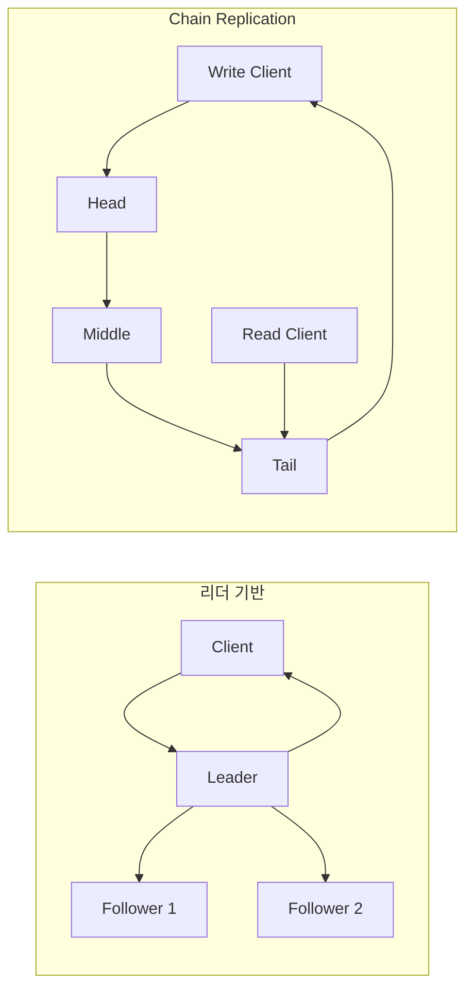

## 1. 복제는 순서와 확인 규칙이다

복제본을 세 대 둔다고 일관성이 자동으로 생기지 않는다. 누가 쓰기 순서를 정하고, 어느 복제본까지 반영됐을 때 성공으로 응답하며, 읽기가 어떤 버전을 반환할지 프로토콜로 정해야 한다.



| 방식 | 쓰기 순서 | 기본 읽기 위치 | 강점 | 주요 위험 |
|---|---|---|---|---|
| 리더 기반 | 리더 로그 순서 | 리더 또는 복제본 | 일반적이고 운영 경험 풍부 | 리더 병목·복제 지연 읽기 |
| Chain Replication | Head→…→Tail | Tail | 파이프라인 처리와 강한 읽기 규칙 | Tail 읽기 병목·체인 재구성 |
| CRAQ | 체인 전파 | 모든 노드 가능 | 읽기 확장성과 강한 일관성 조합 | Dirty 읽기의 Tail 확인 비용 |

## 2. CRAQ의 Clean과 Dirty

CRAQ(Chain Replication with Apportioned Queries, 조회를 분담하는 체인 복제)는 각 노드가 객체 버전을 저장한다. Tail까지 확정된 버전은 Clean, 아직 체인을 통과 중인 최신 버전은 Dirty다. 노드가 Clean 객체를 읽으면 즉시 응답하고, Dirty라면 Tail에 현재 확정 버전을 물어 그 버전을 반환한다.

```text
write(v2): Head -> Middle(v2=dirty) -> Tail(v2=commit)
ack(v2):   Tail -> ... -> Head, 각 노드는 v2를 clean 처리
read:      clean이면 로컬 응답, dirty이면 Tail의 확정 버전 확인
```

> **실무 함정** — 정상 경로 QPS만 비교하면 안 된다. 노드 제거 중 미완료 쓰기를 어느 이웃이 이어받는지, 새 노드가 Snapshot과 변경분을 어떻게 따라잡는지 정의되지 않으면 장애 순간에 중복 적용이나 유실이 생긴다.

## 3. 버전별 읽기 결과를 따라가 본다

가상의 객체 `shipment/7`에 버전 1이 확정되어 있다. Middle(중간 노드)은 버전 2를 받았지만 Tail(체인 끝 노드)에는 아직 도착하지 않았다. Middle이 최신 로컬 값 2를 바로 주면 아직 확정되지 않은 쓰기를 읽게 된다. Tail에 확정 버전을 물어 1을 받아 그 로컬 버전을 반환한다.

| Middle의 상태 | Tail의 확정 버전 | 강한 읽기 결과 |
|---|---:|---|
| v1 Clean(확정), 이후 쓰기 없음 | 1 | 로컬 v1 |
| v1 보관, v2 Dirty(미확정) | 1 | 확인 후 v1 |
| v2 Dirty, 확인 응답만 지연 | 2 | 확인 후 v2 |
| v2 Dirty, Tail에 연결 불가 | 확인 불가 | 타임아웃·실패 또는 명시적 약한 읽기 계약 |

Dirty 여부는 그 객체의 더 최신 미확정 쓰기를 인지했는지와 연결된다. 과거 Clean 버전이 하나 있다는 이유로 Tail 확인을 생략하지 않는다. 메타데이터 질의가 필요하므로 쓰기가 잦으면 읽기의 추가 왕복과 Tail 집중이 늘어난다.

## 4. 지연과 처리량을 나눠 계산한다

가정: 데이터 노드 사이 편도 전파가 각각 2ms이고 체인이 세 노드다. Head(시작 노드)에서 Tail까지 전파만 4ms이며 디스크·클라이언트 왕복·확인 전파는 별도다. 파이프라인은 여러 요청을 겹쳐 처리할 수 있지만 첫 요청이 체인을 통과하는 지연 자체를 없애지는 않는다.

리더 기반 복제가 병렬로 두 복제본에 쓰기를 보낸다면 확인 조건에 따라 느린 노드 전부를 기다리지 않을 수 있다. 반면 체인에서는 경로의 느린 노드가 뒤 노드 전파에 영향을 준다. “세 복제본이라 같은 비용”으로 계산하지 않는다.

## 5. 재구성 중에도 같은 규칙을 지킨다

| 사건 | 복구 중 확인할 것 |
|---|---|
| Head 종료 | 미확인 요청을 클라이언트가 재시도할 ID·새 Head의 로그 |
| Middle 종료 | 앞 노드가 아직 뒤에 전달하지 못한 갱신의 재전송 |
| Tail 종료 | 새 Tail의 버전·확정 상태와 기존 미완료 요청 |
| 새 노드 추가 | 기존 데이터 복사 중 발생한 변경까지 따라잡은 시점 |
| 네트워크 분할 | 단일 멤버십 결정·이전 구성의 쓰기 차단 |

Membership(구성원 목록)을 관리하는 주체와 장애 감지 오판도 실패 모델에 포함한다. 서로 다른 노드가 임의로 “옆 노드를 제거했다”고 결정하면 체인이 둘로 갈라질 수 있다. 재구성 권한·세대 번호·재전송 규칙을 원 프로토콜과 함께 구현해야 한다.

## 6. 선택 기준

- 쓰기 순서와 범용 운영 도구가 필요하면 리더 기반 제품을 검토한다. 여러 객체의 트랜잭션 기능은 복제 토폴로지가 아니라 제품의 별도 동시성 제어·커밋 기능으로 확인한다.
- 읽기는 Tail로 충분하고 대량 객체 쓰기를 파이프라인화하려면 Chain Replication을 검토한다.
- 읽기 비중이 높고 여러 복제본에서 강한 읽기를 제공해야 한다면 CRAQ의 추가 메타데이터와 확인 비용을 비교한다.

> **면접 포인트** — “복제 3개” 대신 쓰기 성공 시점, 읽기 위치, RPO(Recovery Point Objective, 복구 시점 목표), 장애 감지 오판 시 동작을 순서대로 설명해야 한다.

## 참고

- [Chain Replication 논문](https://www.cs.cornell.edu/fbs/publications/ChainReplicOSDI.html)
- [CRAQ 원 논문](https://www.usenix.org/legacy/event/usenix09/tech/full_papers/terrace/terrace.pdf)

> **검수 기준 — 2026-09-12**: 원 논문의 객체 단위 강한 읽기를 설명한다. 여러 객체의 원자 트랜잭션을 보장한다는 뜻은 아니다. 숫자는 가상 지연 계산이며 특정 제품 성능이 아니다.
