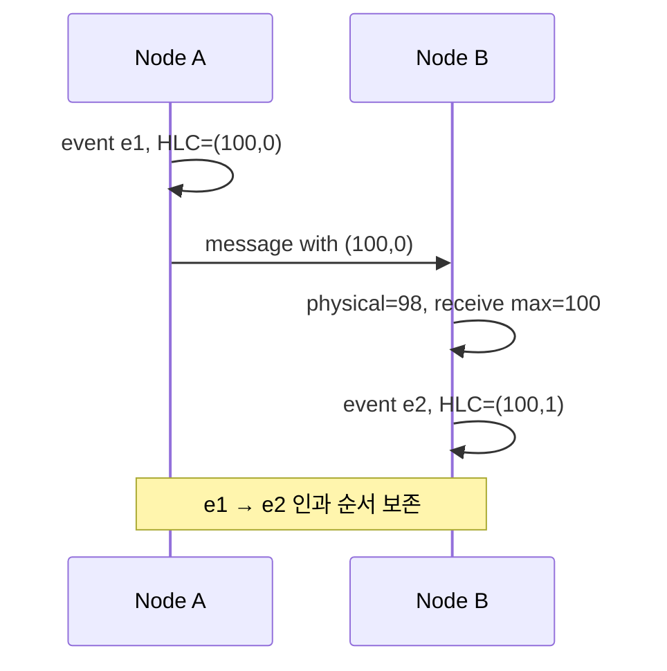

## 1. 벽시계는 정확한 전역 순서가 아니다

NTP(Network Time Protocol, 네트워크 시간 동기화 프로토콜) 보정, VM(Virtual Machine, 가상 머신) 정지, 하드웨어 편차 때문에 서로 다른 노드의 `now()`는 어긋나거나 뒤로 갈 수 있다. 따라서 단순 Timestamp 비교는 인과관계를 잃을 수 있다. 분산 시계 설계는 필요한 보장이 “인과 순서”인지 “실제 시간과 일치하는 트랜잭션 순서”인지 먼저 구분한다.



| 방식 | 표현 | 제공하는 핵심 | 비용·제약 |
|---|---|---|---|
| 물리 시계 | 단일 Timestamp | 사람이 이해하기 쉬운 시간 | Skew·역행·동률 |
| Lamport Clock | 논리 Counter | 인과관계가 있으면 순서 증가 | 실제 시간과 거리 표현 불가 |
| HLC | 물리값+논리 Counter | 물리 시간 근접성과 인과 순서 | 완전한 동시성 판별은 아님 |
| TrueTime 계열 | `[earliest, latest]` 구간 | 제한된 시간 불확실성 노출 | 시계 인프라와 대기 비용 |

## 2. HLC 갱신 규칙

HLC(Hybrid Logical Clock, 하이브리드 논리 시계)는 로컬 물리 시간, 현재 HLC, 수신 HLC의 최대 물리값을 선택하고 동률일 때 논리 카운터를 증가시킨다. 물리 시계가 뒤로 가도 HLC가 감소하지 않게 만든다.

다음 구현은 수신 전 로컬 값을 보존하고 네 경우를 나눈다. 단일 노드 내 동시 호출은 직렬화한다고 가정한다. 수치 범위·재시작 시 저장·원격 시계 검증은 별도 운영 책임이다.

```python
def local_event(local, wall):
    old_time, old_counter = local
    new_time = max(wall, old_time)
    counter = old_counter + 1 if new_time == old_time else 0
    return new_time, counter


def receive_event(local, remote, wall):
    lt, lc = local
    rt, rc = remote
    new_time = max(wall, lt, rt)
    if new_time == lt == rt:
        counter = max(lc, rc) + 1
    elif new_time == lt:
        counter = lc + 1
    elif new_time == rt:
        counter = rc + 1
    else:
        counter = 0
    return new_time, counter
```

| 로컬 HLC | 수신 HLC | 물리 시각 | 수신 후 HLC |
|---|---|---:|---|
| (100, 2) | (100, 5) | 99 | (100, 6) |
| (105, 4) | (100, 8) | 99 | (105, 5) |
| (100, 2) | (105, 8) | 99 | (105, 9) |
| (100, 2) | (105, 8) | 110 | (110, 0) |

카운터는 항상 두 카운터의 최댓값에 1을 더하는 것이 아니다. 실제 물리 시간이 둘보다 앞서면 0으로 시작한다. 이 예제에서 순서는 `(물리값, 논리값)`의 사전식 비교다. 인과관계가 있으면 값이 증가하지만, 값이 작다고 두 사건이 인과관계라는 역명제는 성립하지 않는다.

## 3. LWW가 버리는 정보를 확인한다

가상 예제: 창고 A의 시계가 5초 빠르고 B는 정상이다. A가 수량 10을 기록한 뒤 B에서 더 늦게 수량 9를 입력해도, 물리 Timestamp만 비교하는 LWW(Last Write Wins, 마지막 쓰기 우선)는 A를 남길 수 있다. 이것은 “실제로 나중 쓰기”가 아니라 “Timestamp가 큰 쓰기”를 선택한 결과다.

HLC를 도입해도 서로 통신하지 않은 동시 차감을 합산하거나 초과판매를 막아주지는 않는다. 재고는 조건부 상태 전이나 충돌 없는 연산 모델이 필요하다. 동시 업데이트의 의미를 보존해야 한다면 단순 덮어쓰기 대신 버전 벡터·명시적 병합·직렬화 중 요구에 맞는 모델을 선택한다.

## 4. TrueTime과 Commit Wait

TrueTime은 현재 시각을 점이 아니라 불확실성 구간으로 제공한다. 트랜잭션 Commit Timestamp 이후가 실제로 지났다고 확신할 때까지 기다리는 Commit Wait를 통해, 먼저 완료된 트랜잭션이 나중 트랜잭션보다 앞선 순서로 관찰되게 한다.

가정: 선택한 커밋 Timestamp가 104ms이고, 현재 TrueTime 구간이 `[100, 106]ms`다. 시스템은 구간의 하한이 104ms를 **넘었다고 확인**하기 전에는 Commit Wait(커밋 대기)를 끝낼 수 없다. 고정 4ms를 자면 충분하다는 뜻이 아니라 시계 API의 하한으로 판단한다. 불확실성·시간 동기화 상태와 다른 커밋 작업의 중첩에 따라 실제 지연은 달라진다.

Spanner의 외부 일관성은 TrueTime 하나가 아니라 트랜잭션 타임스탬프 배정·동시성 제어·복제·Commit Wait가 결합된 성질이다. 선행 트랜잭션이 완료된 뒤 시작한 트랜잭션의 순서와 실제 시간을 맞춘다.

> **실무 함정** — HLC Timestamp가 있다고 충돌이 사라지는 것은 아니다. 동시에 발생한 업데이트의 병합 정책, Tie-breaker, 보존할 인과 메타데이터를 별도로 정해야 한다.

## 5. 선택 기준

- 이벤트 정렬과 버전 비교에 물리 시간 근접성이 필요하면 HLC를 검토한다.
- 진짜 동시성을 구분해야 하면 Vector Clock 같은 더 큰 메타데이터가 필요할 수 있다.
- 외부 일관성이 필요하면 제한된 시계 불확실성과 합의·Commit Wait가 결합된 시스템 비용을 받아들여야 한다.

> **면접 포인트** — “시계를 동기화한다”는 답보다 허용 Skew, 시간 역행, 인과관계, 동률 처리와 사용자에게 필요한 일관성 수준을 분리해 설명한다.

## 참고

- [Cloud Spanner: TrueTime and external consistency](https://docs.cloud.google.com/spanner/docs/true-time-external-consistency)

- [HLC 원 논문: Logical Physical Clocks and Consistent Snapshots in Globally Distributed Databases](https://cse.buffalo.edu/tech-reports/2014-04.pdf)

> **검수 기준 — 2026-09-12**: HLC 수신의 네 분기, 시계 역행, LWW 손실과 Commit Wait의 조건을 검수했다. 숫자는 동작 설명용이며 구현별 지연 보장이 아니다.
