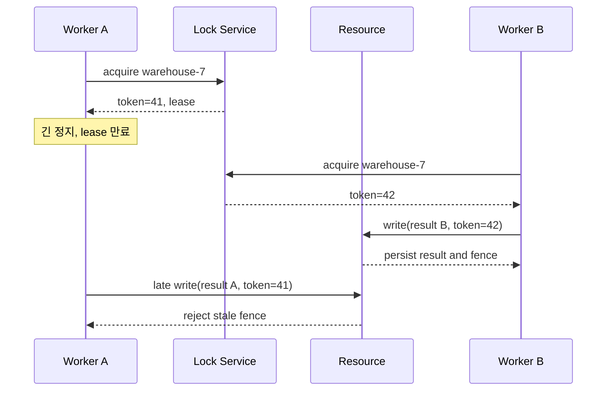

> **검수 기준 — 2026-09-12**
>
> 아래 창고 집계 작업은 가상 설계다. Lease(임대 기간)는 자원 회수를, Fencing Token(이전 소유자의 쓰기를 차단하는 순번)은 저장소에서 오래된 쓰기 거부를 담당한다. 둘은 같은 보장이 아니다.

## 1. 보호할 불변식을 먼저 쓴다

창고별 재고 집계를 두 Worker(작업 프로세스)가 동시에 덮어쓰는 상황을 생각하자. 목표는 “락을 한 명만 보유한다”가 아니라 **새 소유자의 결과를 받아들인 저장소가 이전 소유자의 결과로 되돌아가지 않는다**다. 잠깐 중복 실행되어도 결과가 같은 캐시 재계산과, 중복 출고처럼 되돌릴 수 없는 작업은 요구가 다르다.

다음 실패를 가정한다. 프로세스가 임의 시간 멈출 수 있고, 요청과 응답이 지연·유실될 수 있으며, 락 서비스 일부 노드가 중단될 수 있다. 소유자의 시계나 정상 실행 시간만으로 안전성을 증명하지 않는다.



## 2. 끝단에서 원자적으로 검사한다

락 서비스는 같은 자원에 대해 새 소유자가 더 큰 Token을 받게 해야 한다. Token을 임의 UUID로 만들면 이전·이후를 비교할 수 없다. 발급 상태가 장애 복구 때 뒤로 돌아가거나, 두 리더가 같은 순번을 발급하지 않도록 합의와 영속성 조건을 정한다.

아래는 **소유권당 한 번의 집계 결과만 저장하는** PostgreSQL 예시다. `warehouse_summary` 행이 미리 존재하고 `last_fence`가 초기화되어 있다고 가정한다. 매개변수는 애플리케이션 바인딩 값이다.

```sql
UPDATE warehouse_summary
SET result_json = :result,
    last_fence = :fence
WHERE warehouse_id = :warehouse_id
  AND last_fence < :fence
RETURNING warehouse_id, last_fence;
```

영향받은 행이 0개면 성공으로 처리하지 않는다. 이미 반영된 동일 요청인지, 더 최신 소유자가 반영했는지, 보호할 행이 없는지를 확인한다. `last_fence` 검사와 본문 쓰기를 별도 요청으로 분리하면 검사 직후 다른 소유자가 끼어들 수 있다.

같은 Lease 동안 여러 변경을 허용하려면 `<`만으로는 부족하다. 소유권 Token 비교와 별개로 작업 ID 또는 소유권 내부 순번을 저장해야 한다. `incoming >= last_fence`는 동일 Token의 중복·순서 역전을 막아주지 않는다.

> **실무 함정** — 저장소가 Token 42를 아직 받지 않았다면 41을 수락할 수도 있다. Fencing은 벽시계 기준 만료 즉시 차단이 아니라, **저장소가 관측한 더 높은 세대 이후의 오래된 쓰기 차단**이다. 만료 후 모든 쓰기를 금지해야 한다면 권한 확인과 변경을 같은 직렬화 경계에 넣어야 한다.

## 3. 만료·재시도·복구 계약

가정: 작업 p99가 4초이고 Lease를 10초로 설정했다. 12초 정지 후 재개하는 경우는 여전히 가능하다. Lease를 길게 하면 오탐 만료는 줄어도 실제 장애 시 회수가 늦어진다. 갱신 실패 후 새 작업을 시작하지 않되, 이미 날아간 요청은 취소할 수 없다고 보고 저장소 검증을 유지한다.

| 장애 지점 | 판단 | 복구 |
|---|---|---|
| 획득 응답 유실 | 소유권 불명 | 요청 ID로 확인하거나 안전하게 포기 |
| 갱신 응답 유실 | 유효 기간 불명 | 새 작업 중단, 자원에서 Fence 확인 |
| 쓰기 성공 후 응답 유실 | 결과 불명 | 저장된 작업 ID·결과 조회 |
| 락 서비스 과반 중단 | 새 소유권 발급 불가 가능 | 재시도 예산·업무 지연 허용 판단 |
| 외부 API가 Token 미지원 | 오래된 호출 차단 불가 | 상대의 멱등 키·상태 확인 또는 설계 변경 |

측정할 것은 획득 지연, 갱신 실패율, 만료 후 재개 횟수, Fence 거부 수, 보호 자원별 대기 시간이다. 락 재획득에 성공했다고 이전 작업을 무조건 재실행하지 않는다.

## 4. 락이 필요 없는 설계와 비교한다

| 선택 | 좋은 적용 조건 | 남는 책임 |
|---|---|---|
| 조건부 UPDATE·고유 제약 | 재고 한 행·업무 키 중복 방지 | 영향 행 수 확인, 트랜잭션 범위 |
| 버전 기반 낙관적 갱신 | 충돌이 드문 편집 | 충돌 후 새 값으로 재계산 |
| 키별 단일 Writer | 운송장 단위 순차 반영 | 재배정 시 이전 Writer 차단·중복 처리 |
| Lease + Fencing | 여러 프로세스의 자원 소유권 | 발급 순번·자원 검증·복구 계약 |

> **면접 포인트** — 중복 출고를 막으려면 출고 명령의 업무 키와 상태 전이를 보호해야 한다. 분산 락을 추가하는 것만으로 운송사 API의 중복 효과가 사라지지 않는다.

## 참고

- [Martin Kleppmann: How to do distributed locking](https://martin.kleppmann.com/2016/02/08/how-to-do-distributed-locking.html) — 정지한 소유자와 Fencing의 적용 경계.
- [PostgreSQL 17: Transaction Isolation](https://www.postgresql.org/docs/17/transaction-iso.html) — 조건부 갱신의 동시성 동작.
