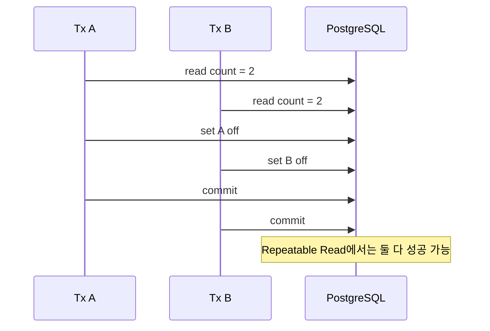

> **검수 기준 — 2026-09-12**
>
> PostgreSQL 17을 기준으로 설명한다. Snapshot Isolation(스냅샷 격리)과 다른 DBMS의 REPEATABLE READ를 동일시하지 않는다. 아래 당직 예제는 동시성 재현용 가상 업무다.

## 1. 행 충돌이 없어도 업무 규칙은 깨진다

업무 불변식은 “같은 팀에 당직자가 최소 한 명 남는다”다. A와 B가 모두 당직 중이고, 두 트랜잭션이 각각 두 명을 읽은 뒤 자기 행만 해제하면 어떻게 될까?



이것이 Write Skew(쓰기 편향)다. 같은 행을 덮어쓰는 Lost Update(갱신 유실)와 구별한다. PostgreSQL REPEATABLE READ는 반복 조회 결과가 바뀌는 Phantom Read(팬텀 읽기)는 막지만, 이처럼 서로 다른 행을 변경해 생기는 직렬화 이상은 허용할 수 있다.

## 2. 두 세션으로 실패를 재현한다

연습 DB에 초기 데이터를 만든다.

```sql
CREATE TABLE duty_roster (
    team_id integer NOT NULL,
    doctor_id integer PRIMARY KEY,
    on_call boolean NOT NULL
);
INSERT INTO duty_roster VALUES (7, 1, true), (7, 2, true);
```

다음 순서로 두 연결을 번갈아 실행한다. `doctor_id`와 `team_id`를 실제 업무에서는 매개변수로 전달한다.

| 순서 | 세션 A | 세션 B |
|---|---|---|
| 1 | BEGIN ISOLATION LEVEL REPEATABLE READ | BEGIN ISOLATION LEVEL REPEATABLE READ |
| 2 | 팀 7의 당직 COUNT 조회 → 2 | 팀 7의 당직 COUNT 조회 → 2 |
| 3 | 2 > 1일 때 doctor 1 해제 | 2 > 1일 때 doctor 2 해제 |
| 4 | COMMIT | COMMIT |

```sql
-- 세션 A: 위 순서에 맞춰 문장별 실행. 세션 B는 doctor_id = 2.
SELECT count(*) FROM duty_roster WHERE team_id = 7 AND on_call;
-- 애플리케이션은 조회 결과가 1보다 클 때만 아래 UPDATE를 실행한다.
UPDATE duty_roster SET on_call = false
WHERE team_id = 7 AND doctor_id = 1 AND on_call;
```

초기 상태로 되돌리고 두 BEGIN을 SERIALIZABLE로 바꿔 같은 순서를 실행한다. 둘 다 같은 초기 상태를 읽고 쓰려고 하면 하나가 직렬화 실패로 중단될 수 있다. 재시도는 새 트랜잭션으로 COUNT부터 다시 시작하므로, 한 명만 남았음을 읽으면 해제를 거절한다.

> **실무 함정** — `SELECT count(*)` 결과를 무시하고 무조건 UPDATE하는 코드는 SERIALIZABLE에서도 잘못됐다. 격리는 올바른 직렬 프로그램의 동시 실행을 보호하며, 빠진 업무 조건을 만들어주지 않는다.

## 3. Predicate Lock과 SSI의 역할

SSI(Serializable Snapshot Isolation, 직렬화 가능한 스냅샷 격리)는 읽기·쓰기 의존성을 추적해 직렬 실행과 양립하지 않을 위험이 있는 실행을 중단한다. PostgreSQL의 Predicate Lock(조건 읽기 추적 잠금)은 읽은 조건에 영향을 줄 쓰기를 감지하는 용도이며, InnoDB Gap Lock처럼 삽입을 대기시키는 잠금과 다르다. 모든 읽기·쓰기 충돌을 곧바로 중단시키는 것도 아니다.

| PostgreSQL 17 수준 | 조회 기준 | 이 예제의 책임 |
|---|---|---|
| READ COMMITTED | 문장마다 새 스냅샷 | 별도 직렬화 경계가 필요 |
| REPEATABLE READ | 트랜잭션의 첫 일반 문장 시점 스냅샷 | Write Skew에 취약 |
| SERIALIZABLE | 스냅샷 + 의존성 감시 | 직렬화 실패 전체 재시도 |

당직자 행만 잠그는 방식은 새 당직자 추가·팀 이동처럼 집합을 바꾸는 모든 경로를 함께 검토해야 한다. 대안은 팀별 가드 행을 두고 **READ COMMITTED에서 모든 변경 경로가 먼저 그 행을 `FOR UPDATE`로 잠근 뒤 다음 문장으로 당직 집합을 조회**하는 것이다. 팀 단위 경합이 늘고 우회 경로가 생기면 규칙이 깨진다는 비용이 있다.

## 4. 재시도는 트랜잭션 밖에서 통제한다

```text
for attempt in 1..max_attempts:
    try:
        begin a NEW serializable transaction
        read current duty count
        if count <= 1: reject business request
        otherwise update my duty and commit
        return result
    catch SQLSTATE 40001:
        rollback
        if retry budget exhausted: return retryable failure
        wait bounded backoff with jitter
```

`40001`은 PostgreSQL 직렬화 실패 코드다. 실패한 UPDATE만 다시 실행하지 않는다. 입력을 결정한 조회·계산까지 새 스냅샷에서 반복해야 한다. 외부 알림은 로컬 트랜잭션의 Outbox(발행 대기함)에 기록하고 커밋 이후 전달해 재시도 중의 중복 부작용을 분리한다.

가정: 요청 100건 중 10건이 첫 시도에서 실패하고 재시도는 모두 성공하면 DB 실행은 110회다. 실제로 재시도끼리 재충돌하면 이보다 늘어난다. 최대 시도 수, 총 시간 예산, 팀별 중단율, 대기 시간과 사용자에게 보이는 실패율을 함께 측정한다.

> **면접 포인트** — 물류센터에서 “가용 작업자 최소 한 명” 같은 집합 규칙도 같은 문제다. 단일 재고 행의 조건부 감소와 여러 행에 걸친 불변식을 구분하고, 규칙을 지키는 코드·격리 수준·재시도까지 연결한다.

## 참고

- [PostgreSQL 17: Transaction Isolation](https://www.postgresql.org/docs/17/transaction-iso.html) — REPEATABLE READ와 SERIALIZABLE의 차이 및 전체 재시도.
