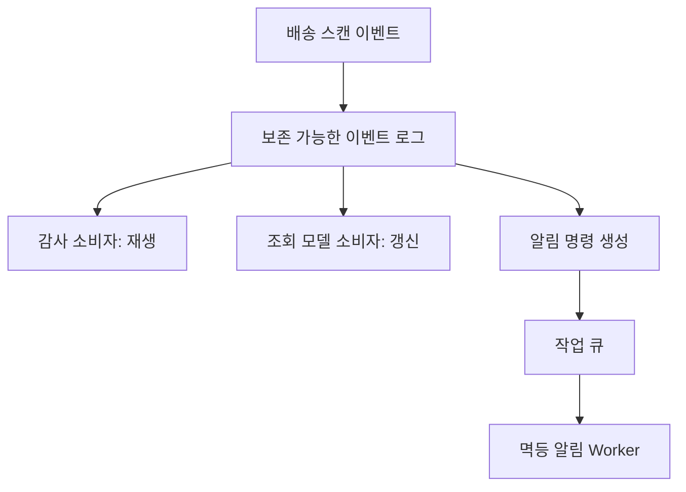

> **검수 기준 — 2026-09-12**
>
> Kafka 4.1의 일반 Consumer Group(소비자 그룹), RabbitMQ 4.1의 Queue·Stream, Amazon SQS의 Standard·FIFO를 구분한다. 용량 수치는 제품 한도가 아닌 가상 부하 시험의 가정이다.

## 1. 같은 배송 이벤트에도 소비 목적이 다르다

배송 스캔 이벤트를 감사팀은 7일 뒤 다시 읽고, 고객 알림은 한 번 성공하면 끝내고, 운영팀은 지역과 오류 유형별로 나누려 한다. 제품부터 고르면 이 세 요구가 섞인다.

Event Log(이벤트 로그)는 보존 기간 안에서 소비 위치를 옮겨 다시 읽는 모델이다. Work Queue(작업 큐)는 Worker에 미완료 작업을 배분하는 모델이다. 재생 가능하다는 것은 영구 보관이나 외부 부작용의 안전한 재실행을 뜻하지 않는다.



## 2. 제품명이 아니라 기능 범위를 비교한다

| 선택 | 보존·재생 | 순서 범위 | 주의점 |
|---|---|---|---|
| Kafka 일반 Consumer Group | 보존된 로그와 Offset(소비 위치) | 파티션 내 로그 순서 | 업무 처리의 완료 순서는 소비자 책임 |
| RabbitMQ Queue | ACK(처리 확인) 이후 일반적으로 제거 | 큐·소비 설정에 의존 | 재전달·병렬 소비가 처리 순서를 바꿀 수 있음 |
| RabbitMQ Stream | 보존 정책 안에서 재생 | 스트림 내 순서 | 일반 큐와 다른 보존·소비 모델 |
| SQS Standard | 작업 처리·삭제 중심 | 최선 노력 순서 | 중복 전달과 역전 허용 |
| SQS FIFO | 작업 처리·삭제 중심 | Message Group ID별 | 같은 그룹의 긴 작업이 뒤를 막음 |

RabbitMQ 전체를 “재생 불가”로 묶거나 SQS 전체를 “순서 보장”으로 묶지 않는다. RabbitMQ Exchange(교환기)의 라우팅이 필요하면 큐 유형과 Binding(연결 규칙)을 별도로 선택한다. SQS의 Visibility Timeout(메시지 비노출 시간)은 처리 중 재노출을 지연시키며, 업무 성공을 보장하는 타이머가 아니다.

## 3. 용량 추정의 단위를 맞춘다

가정: 피크 유입 6,000건/초, 재시도 배수 1.2, 같은 페이로드와 내구성 설정으로 측정한 파티션당 지속 처리 900건/초다. 일반 Consumer Group에서 목표 병렬 소비자 수는 12개다.

```text
attempt_rate = 6000 * 1.2 = 7200 attempts/s
partitions_for_rate = ceil(7200 / 900) = 8
initial_partitions = max(8, 12) = 12

backlog = 3_600_000 messages
new_arrival_rate = 6000 messages/s
successful_service_rate = 9000 messages/s
recovery_time = backlog / (successful_service_rate - new_arrival_rate)
              = 1200 s = 20 min
```

처리율과 파티션 개수를 바로 비교하면 단위가 맞지 않는다. 파티션당 처리율은 평균 메시지 크기, 복제, 압축, DB 쓰기 지연까지 포함해 측정한다. 위 복구 계산은 성공 처리율이 유입보다 크고 재시도 비용이 이미 처리율에 반영된 경우다. 실제 피크 분포와 여유 용량을 반영해 부하 시험으로 보정한다.

운송장 하나에 이벤트가 몰리는 Hot Key(특정 키 집중)가 있으면 파티션을 늘려도 그 키의 병목은 그대로다. 키를 쪼개면 순서를 합치는 책임이 생기므로 먼저 업무 순서의 최소 단위를 정한다.

## 4. 전달 순서와 업무 순서를 구분한다

`shipment_id`로 같은 파티션·그룹에 넣어도 생산자 둘이 12번 이벤트를 11번보다 먼저 보내면 업무 순서가 자동 복원되지 않는다. 이벤트에 업무 버전을 넣고 소비자가 마지막 적용 버전과 비교한다. 버전 공백을 기다릴지, 원장을 조회할지, 오래된 이벤트를 무시해도 되는지 업무 계약을 정한다.

실패 메시지를 DLQ(Dead Letter Queue, 처리 실패 격리 큐)로 보내고 뒤의 메시지를 계속 적용하면 순서 요구를 깨뜨릴 수 있다. 결제·출고 상태처럼 의존성이 있으면 해당 키를 멈추거나 상태를 재구성한 뒤 재개한다. 독립 알림이라면 실패 작업만 격리할 수 있다.

> **실무 함정** — Kafka 트랜잭션의 exactly-once 보장 범위와 외부 DB·HTTP 부작용은 다르다. SQS FIFO도 소비자의 외부 결제를 원자적으로 커밋해주지 않는다. 커밋 후 확인 응답이 유실되는 경우를 반드시 설계한다.

## 5. 교체 가능한 경계를 정한다

애플리케이션에는 업무 이벤트 스키마, 키, 버전, 재시도 가능 오류를 명시한다. 어댑터가 ACK·Offset·재생 API를 다루되 중요한 기능까지 감추지는 않는다. “send와 receive만 공통화”하면 재생·라우팅·순서를 다시 구현하는 비용이 생긴다.

면접에서는 “감사 로그는 보존·다중 재생, 알림은 독립 작업 처리”처럼 요구와 선택을 연결한다. 두 제품을 동시에 운영하는 비용이 크다면 하나로 시작하되, 필요한 기능과 현재 허용하는 제약을 문서화한다.

> **운영 점검** — 가장 오래된 미처리 메시지의 나이, 성공 처리율, 재전달률, 키별 정체, 보존 만료까지 남은 시간을 본다. 메시지 개수만으로 사용자 지연을 판단하지 않는다.

## 참고

- [Kafka 4.1 Design](https://kafka.apache.org/41/design/design/) — 소비 위치와 전달·처리 보장 범위.
- [RabbitMQ 4.1 Queues](https://www.rabbitmq.com/docs/4.1/queues), [Streams](https://www.rabbitmq.com/docs/4.1/streams) — 큐와 로그형 스트림의 차이.
- [SQS Standard](https://docs.aws.amazon.com/AWSSimpleQueueService/latest/SQSDeveloperGuide/standard-queues.html), [FIFO delivery logic](https://docs.aws.amazon.com/AWSSimpleQueueService/latest/SQSDeveloperGuide/FIFO-queues-understanding-logic.html) — 전달 중복과 메시지 그룹 순서.
